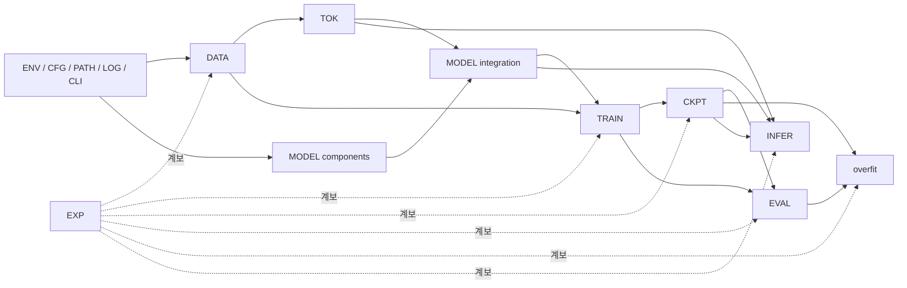

# DohaLM 핵심 개발 기능명세서

## 1. 문서 정보

| 항목 | 내용 |
|---|---|
| 문서 상태 | `implemented` |
| 마지막 검토일 | 2026-07-24 |
| 선행 문서 | [시스템 아키텍처](./system-architecture.md), [모델 아키텍처](./model-architecture.md), [개발 로드맵](../quality/development-roadmap.md), [Definition of Ready](../governance/definition-of-ready.md), [ADR-002](../decisions/ADR-002-tiny-model-architecture.md), [ADR-003](../decisions/ADR-003-tokenizer-method.md), [ADR-004](../decisions/ADR-004-data-governance.md), [ADR-005](../decisions/ADR-005-evaluation-and-experiment-policy.md), [ADR-006](../decisions/ADR-006-development-quality-gates.md) |
| 후속 문서 | Phase 2~6 구현 작업, 구현별 테스트, 최소 로컬 추론 설계 |
| 구현 전 필수 여부 | Phase 1~6 핵심 기능 구현 전 예 |

- [확정] 이 문서는 환경·설정·데이터·토크나이저·모델·학습·체크포인트·평가·로컬 추론·실험의 기능 경계와 구현 계약을 정의한다.
- [확정] 문서 생명주기 상태 `implemented`와 아래 개별 기능 상태는 서로 다른 축이다.
- [확정] Phase 0 기능은 실제 코드와 Gate 1 검증 근거가 있어 `verified`로 표시한다.
- [확정] Phase 1 DATA-001~016은 Gate 2에서 `verified`됐다. Phase 2는 synthetic tokenizer smoke만 구현됐고 승인 corpus·운영 16,000 후보는 미구현이며, 그 이후 기능은 `review` 또는 `planned`다.
- [제외] FastAPI, Next.js, DB, 사용자 계정, 대화 기록 저장, 배포, 운영 모니터링과 Leaderboard 제출 기능은 이 문서 범위가 아니다.

## 2. 기능 상태와 필드 적용 규칙

| 상태 | 의미 |
|---|---|
| `planned` | 기능 후보나 세부 계약이 아직 계획 단계임 |
| `review` | 입력·출력·오류·테스트 계약이 작성됐으나 구현·검증 전임 |
| `implemented` | 코드 구현은 완료됐으나 필수 검증이 남음 |
| `verified` | 구현과 필수 테스트·실제 검증이 완료됨 |
| `blocked` | 선행 조건 미충족으로 구현 또는 검증을 진행할 수 없음 |
| `deprecated` | 대체 기능이 존재해 신규 사용하지 않음 |

각 영역의 `공통 계약`과 해당 영역의 `기능별 계약` 한 행을 결합하면 다음 필드가 모두 성립한다.

| 필드 | 기록 위치 |
|---|---|
| 기능 ID·기능명 | 기능별 계약 |
| 영역·목적·Phase·Gate·선행 조건 | 공통 계약, 필요한 경우 기능별 행에서 보완 |
| 입력·출력·처리 규칙·오류 조건 | 기능별 계약 |
| 설정 항목·산출물·보안·라이선스 | 공통 계약과 기능별 행 |
| 필수 테스트·완료 기준 | 기능별 계약 |
| 현재 상태·관련 문서 | 공통 계약, 기능별 상태 예외 |

- [확정] 공통 계약을 상속하지 않는 예외는 기능 행에 명시한다.
- [확정] 오류는 [오류 분류](#17-오류-분류와-처리-계약)의 범주를 사용하고 숫자형 오류 코드는 이번 단계에서 정하지 않는다.
- [확정] 산출물 본체와 비밀정보는 [산출물 및 설정 정책](../governance/artifact-and-configuration-policy.md)에 따라 Git 추적 여부를 결정한다.

## 3. 공통 모델·하드웨어 불변 조건

| 항목 | 기준 |
|---|---|
| 하드웨어 | 단일 `RTX 3060 Ti 8GB` |
| 모델 | `DohaLM-Tiny`, Decoder-only Transformer |
| Layer / Hidden / Head / Head Dimension | 6 / 384 / 6 / 64 |
| FFN / Context / Vocabulary | 1,536 / 256 / 16,000 |
| Normalization / Position | Pre-LayerNorm / 학습형 absolute positional embedding |
| Linear / LM Head bias | Linear bias 사용 / LM Head bias 미사용 |
| Weight tying | Token Embedding–LM Head 공유 |
| Precision | FP16 mixed precision |
| 예상 파라미터 | 16,889,856 |

- [검증 필요] Dropout 확률과 파라미터 초기화 방식은 미결정이다.
- [검증 필요] micro-batch, accumulation, checkpointing 기본값, learning rate, warmup, weight decay, token budget과 저장·평가 주기는 실측 전 확정하지 않는다.
- [확정] `DohaLM-Small` 상세 구조는 이 명세에서 확정하지 않는다.

## 4. Phase 0 환경 기능

### 4.1 공통 계약

| 필드 | 내용 |
|---|---|
| 영역·목적 | 환경: 실행 가능성과 재현 정보를 민감정보 없이 진단 |
| Phase / Gate | Phase 0 / Gate 1 |
| 선행 조건 | 저장소 root, 지원 Python, 선택 기능에는 PyTorch·Git·NVIDIA 도구 |
| 설정 항목 | `requires-python >=3.10,<3.13`; 별도 실행 설정 없음 |
| 산출물 | 메모리 내 primitive 보고서와 CLI YAML·JSON; 기본 파일 생성 없음 |
| 보안·라이선스 | 사용자명·호스트명·실행 파일 전체 경로·credential 제외 |
| 현재 상태 | `verified` — Gate 1, `tests/test_environment.py`, `tests/test_cli.py` |
| 관련 문서 | [재현성 정책](../quality/reproducibility-policy.md), [테스트 체크리스트](../quality/testing-checklist.md) |

### 4.2 기능별 계약

| 기능 ID | 기능명 | 입력 | 출력 | 처리 규칙·오류 조건 | 필수 테스트 | 완료 기준 |
|---|---|---|---|---|---|---|
| ENV-001 | Python 지원 버전 검사 | `sys.version_info` | `bool` | 3.10 이상 3.13 미만만 참; 범위 밖은 진단 실패 | CLI 환경 진단 | 지원·비지원 경계와 종료 코드 확인 |
| ENV-002 | PyTorch 환경 수집 | import 가능한 `torch` | 버전·CUDA build·cuDNN·dtype field | 값은 primitive로 정규화; import·probe 실패는 field-local error | 실제·fake PyTorch 수집 | 필수 field와 오류가 직렬화 가능 |
| ENV-003 | CUDA 사용 가능 여부 확인 | `torch.cuda` | availability·device count | CUDA 부재는 명시 값; 필수 환경 진단과 smoke 결과를 구분 | CUDA 없음 fake와 실제 환경 | availability 의미가 숨겨지지 않음 |
| ENV-004 | GPU 정보 수집 | CUDA device 0, `nvidia-smi` | GPU명·총 MiB·Driver | 장치·명령 실패는 해당 field error; 다른 field 유지 | CPU-only 오류·실제 GPU | 이름·메모리·Driver 또는 명시 오류 |
| ENV-005 | Git 상태 수집 | repository root | commit·branch·dirty | Git 명령 실패는 field별 오류; SHA·branch는 문자열 | Git 실패 monkeypatch | 세 field가 독립적으로 보고됨 |
| ENV-006 | CPU smoke | 작은 CPU tensor | `{success,error}` | 생성·합계·해제; 예외를 오류 문자열로 반환 | 실제 PyTorch CPU | 합계 3.0, success true |
| ENV-007 | CUDA smoke | CUDA 가용 환경 | `{success,skipped,error}` | tensor 생성·연산·동기화·해제·cache 정리; 부재는 skipped | CUDA 부재·RTX 3060 Ti 실행 | 실제 기준 GPU에서 성공 또는 명시적 비가용 |
| ENV-008 | YAML·JSON 직렬화 안전성 | 환경 보고 전체 | 동등한 YAML·JSON object | `None/str/bool/int/float/list/dict`만 허용; 알 수 없는 타입은 field error | `TorchVersion` 유사 객체·실제 PyTorch | 두 형식 parse 결과가 원 보고서와 동일 |

## 5. Phase 0 설정 기능

### 5.1 공통 계약

| 필드 | 내용 |
|---|---|
| 영역·목적 | 설정: YAML을 검증·병합하고 실제 적용값을 명시 |
| Phase / Gate | Phase 0 / Gate 1 |
| 선행 조건 | UTF-8 YAML, 모델·실행 schema, 저장소 내부 상대경로 정책 |
| 설정 항목 | `MODEL_SCHEMA`, `RUN_SCHEMA`, `TINY_INVARIANTS`, CLI `--set`, `--allow-incomplete` |
| 산출물 | 메모리 내 resolved config 또는 YAML·JSON 출력; 원본 설정 불변 |
| 보안·라이선스 | secret marker 값 마스킹; 절대·상위 경로 차단 |
| 현재 상태 | `verified` — `tests/test_config.py`, `tests/test_cli.py` |
| 관련 문서 | [개발 규칙](../governance/development-rules.md), [ADR-002](../decisions/ADR-002-tiny-model-architecture.md) |

### 5.2 기능별 계약

| 기능 ID | 기능명 | 입력 | 출력 | 처리 규칙·오류 조건 | 필수 테스트 | 완료 기준 |
|---|---|---|---|---|---|---|
| CFG-001 | YAML 설정 읽기 | 파일 경로 | 최상위 `dict` | UTF-8 `safe_load`; 읽기·YAML·비-mapping 오류는 `ConfigError` 계열 | 정상·오류 YAML | 원본을 변경하지 않고 명시 오류 |
| CFG-002 | 모델 설정 validation | model mapping·source | 성공 또는 validation error | 필수·unknown·type·bool-as-int·Tiny 불변값·head 산식·dropout 범위 검사 | Tiny·누락·타입·unknown·불변값 | 승인 Tiny만 통과 |
| CFG-003 | 실행 설정 validation | run mapping·완전성 flag | 성공 또는 validation error | nullable·양수·budget 상호배타·내부 상대경로 검사 | 미완성·budget·경로 오류 | 실행 전 미정값과 잘못된 값 차단 |
| CFG-004 | 설정 병합 | model, 선택 run mapping | `model`/`run` 복사본 | 입력을 deep copy하고 모델→run 구조로 결합 | override 통합 | 입력 object 불변, 결과 schema 유효 |
| CFG-005 | CLI override | `key=value` 목록 | dotted-key mapping·적용 결과 | YAML scalar parse; 중복·빈 key·없는 경로 차단; override 후 재검증 | parser·unknown override | 명시 key만 변경되고 재검증 통과 |
| CFG-006 | resolved config 생성 | model/run 경로·override·완전성 | 최종 적용 mapping | load→초기 검증→override→최종 검증 순서 | resolved snapshot | 실제 적용값과 미완성 상태가 명시됨 |
| CFG-007 | 비밀정보 마스킹 | 중첩 dict/list | 마스킹 복사 구조 | password·api key·access token·secret·credential key를 `***`로 대체 | 중첩 secret test | 비밀 원문 미출력, 비밀 아닌 값 보존 |
| CFG-008 | Small 실행 차단 | `configs/small.yaml` | `DisabledConfigError` | `config_status: disabled`를 schema 검사보다 먼저 차단 | Small CLI·unit test | Small 상세 구조 미승인 상태에서 실행 불가 |

## 6. Phase 0 경로·로깅·CLI 기능

### 6.1 PATH 공통 계약

| 필드 | 내용 |
|---|---|
| 영역·목적 | 경로: CWD와 무관한 저장소 경계·산출물 정책 제공 |
| Phase / Gate | Phase 0 / Gate 1 |
| 선행 조건 | `.git`과 `pyproject.toml`이 있는 저장소 |
| 설정 항목 | 표준 논리 경로 mapping과 허용 `.gitkeep` 목록 |
| 산출물 | 절대 `Path` 또는 조회 보고서; 조회만으로 디렉터리 생성 금지 |
| 보안·라이선스 | 절대경로 입력·`..`·저장소 이탈 차단 |
| 현재 상태 | `verified` — `tests/test_paths.py`, `tests/test_cli.py` |
| 관련 문서 | [저장소 구조](./repository-structure.md), [산출물 정책](../governance/artifact-and-configuration-policy.md) |

| 기능 ID | 기능명 | 입력 | 출력 | 처리 규칙·오류 조건 | 필수 테스트 | 완료 기준 |
|---|---|---|---|---|---|---|
| PATH-001 | 저장소 루트 탐색 | 선택 시작 경로 | root `Path` | 상위 방향에서 두 표식 탐색; 실패는 `RuntimeError` | CWD 변경 | 실제 root 일치 |
| PATH-002 | 표준 경로 해석 | 저장소 상대경로 | 정규화된 `Path` | Windows/POSIX 구분자 지원; 절대·상위 이동 차단 | 경계·구분자 test | root 밖 결과가 없음 |
| PATH-003 | 작업 디렉터리 독립성 | 임의 CWD | 동일 root·project paths | 모듈 위치와 명시 시작점으로 탐색 | 임시 CWD | CWD에 따라 결과가 변하지 않음 |
| PATH-004 | 추적 산출물 위반 검사 | Git index | 위반 상대경로 정렬 목록 | data/checkpoints/logs/artifacts/experiments 추적 파일에서 허용 자리 파일 제외 | 현재 index | Gate 1 위반 0건, Git 실패 명시 |
| PATH-005 | 디렉터리 비생성 조회 | root | path·exists·is_directory mapping | `logs/artifacts/experiments` 포함 상태만 조회 | 임시 저장소 | 조회 후 새 경로가 생기지 않음 |

### 6.2 LOG 공통 계약

| 필드 | 내용 |
|---|---|
| 영역·목적 | 로깅: 한글·실험 문맥을 보존하고 비밀과 handler 중복 방지 |
| Phase / Gate | Phase 0 / Gate 1 |
| 선행 조건 | Python logging; file 사용 시 쓰기 가능한 승인 경로 |
| 설정 항목 | `level`, `log_file`, `experiment_id`, `logger_name` |
| 산출물 | console record, 선택 UTF-8 log file |
| 보안·라이선스 | password·API key·token·secret·credential·Bearer 값 마스킹 |
| 현재 상태 | `verified` — `tests/test_logging.py` |
| 관련 문서 | [실험 관리](../training/experiment-management.md), [테스트 전략](../quality/test-strategy.md) |

| 기능 ID | 기능명 | 입력 | 출력 | 처리 규칙·오류 조건 | 필수 테스트 | 완료 기준 |
|---|---|---|---|---|---|---|
| LOG-001 | Console logging | level·logger name·message | configured logger·stderr record | propagate false, timestamp·level·name 포함 | console-only·중복 test | 파일 없이 console handler 1개 |
| LOG-002 | File logging | 승인 file path | UTF-8 log file | 명시 경로일 때만 parent 생성; 파일 오류 전파 | 임시 file | 읽기 가능한 UTF-8 기록 |
| LOG-003 | UTF-8 한글 로그 | 한글 message | 보존된 한글 | formatter·FileHandler UTF-8 | 한글 round-trip | replacement·손상 없음 |
| LOG-004 | 중복 handler 방지 | 동일 logger 재구성 | 최신 DohaLM handler 집합 | marker handler 제거·close 후 재생성 | 두 번 설정 | 동일 handler 중복 없음 |
| LOG-005 | 비밀정보 마스킹 | render된 message | 마스킹 message | key-value와 Bearer 패턴 치환; 비밀 원문 금지 | secret fixture | 파일·console에 secret 미노출 |

### 6.3 CLI 공통 계약

| 필드 | 내용 |
|---|---|
| 영역·목적 | CLI: Phase 0 진단·설정·경로 기능의 사용자 진입점 |
| Phase / Gate | Phase 0 / Gate 1 |
| 선행 조건 | `python -m src.cli.main` 또는 설치된 `dohalm` entry point |
| 설정 항목 | subcommand와 `--json`, `--cuda-smoke`, `--model`, `--run`, `--set`, `--allow-incomplete` |
| 산출물 | stdout YAML/JSON, 간결한 stderr, 종료 코드 0 또는 2 |
| 보안·라이선스 | config 출력 secret 마스킹; 정상 진단 traceback 금지 |
| 현재 상태 | `verified` — `tests/test_cli.py`, Gate 1 실제 CLI |
| 관련 문서 | [README](../../README.md), [테스트 체크리스트](../quality/testing-checklist.md) |

| 기능 ID | 기능명 | 입력 | 출력 | 처리 규칙·오류 조건 | 필수 테스트 | 완료 기준 |
|---|---|---|---|---|---|---|
| CLI-001 | help | `-h/--help` | 명령 목록·설명 | argparse 도움말 후 정상 종료 | 실제 help | environment/config/paths 노출 |
| CLI-002 | environment | 기본 명령 | YAML 환경·CPU smoke | 필수 probe·Python·CPU 실패 시 2 | YAML parse | traceback 없이 parse 가능 |
| CLI-003 | environment `--json` | JSON flag | 동등한 JSON | YAML과 의미 동일 | JSON parse | primitive report 유지 |
| CLI-004 | environment `--cuda-smoke` | smoke flag·선택 JSON | CUDA smoke 포함 보고 | smoke 실패·비가용은 2, 원인 보존 | CPU-only·실제 CUDA | RTX 3060 Ti 실제 성공 근거 |
| CLI-005 | config validate | model/run/override | `{valid,model,run}` | 완전성 기본 강제; 설정 오류는 2 | Tiny·미완성·Small | 승인 설정만 0 |
| CLI-006 | config resolve | model/run/override | 마스킹 resolved config | `--allow-incomplete`는 점검용; secret 미출력 | incomplete snapshot | 최종 적용값 parse 가능 |
| CLI-007 | paths | 선택 JSON | path 상태·위반 목록 | 디렉터리 비생성; 위반 있으면 2 | 다른 CWD | root 기준 결과 일치 |
| CLI-008 | 오류 종료 코드 | 사용자·설정·직렬화 오류 | stderr `오류: ...`, code 2 | 광범위 traceback 대신 간결 메시지; 오류 숨김 금지 | serialization·config 오류 | 예상 오류가 code 2와 원인 제공 |

## 7. Phase 1 데이터 최소 파이프라인

### 7.1 공통 계약

| 필드 | 내용 |
|---|---|
| 영역·목적 | 데이터: 승인된 입력을 원본 불변·계보·누수 방지 조건으로 정제·분할 |
| Phase / Gate | Phase 1 / Gate 2 |
| 선행 조건 | Gate 1, ADR-004, registry 목적별 승인 또는 아래 synthetic fixture |
| 설정 항목 | parser·normalization·dedup·split·risk policy version; 구체 계약은 [Phase 1 데이터 계약](../data/phase1-data-contract.md), 미결정 설정값은 해당 문서 참조 |
| 산출물 | versioned manifest·checksum·cleaned record·split·통계·격리 기록; 실제 본체 Git 제외 |
| 보안·라이선스 | 미승인·PII·민감정보 차단, 제한 원문 로그 최소화, 원본 read-only |
| 현재 상태 | `verified` — Gate 2, revision `c9ea945062796c1193b070cc09c00fdab0942a08`, 전체 75개 테스트와 실제 CLI validate/build |
| 관련 문서 | [Phase 1 데이터 계약](../data/phase1-data-contract.md), [데이터 전략](../data/data-strategy.md), [전처리](../data/preprocessing.md), [분할·누수](../data/data-split-and-leakage-policy.md), ADR-004 |

### 7.2 최소 허용 fixture

- [확정] 외부 학습 데이터가 아닌 테스트 전용 synthetic 또는 프로젝트가 직접 작성한 UTF-8 text·JSONL만 허용한다.
- [확정] 10~100 record, 개인정보·민감정보·실제 credential·제3자 저작물 없음, Git에서 검토 가능한 소형 크기여야 한다.
- [확정] fixture에는 정상·빈 문서·잘못된 schema·exact duplicate·split 누수 후보와 명시적 기대 결과를 포함할 수 있다.
- [확정] fixture를 토크나이저 품질 판단이나 모델 학습 데이터로 사용하지 않는다. Phase 6 overfit fixture는 별도 승인·계보를 갖는다.
- [확정] fixture의 schema·크기·금지 정보와 필수 검증 사례는 [Phase 1 데이터 계약](../data/phase1-data-contract.md)을 따른다. 현재 fixture는 `tests/fixtures/data/`에 있으며 합성 test-only 자료로 검증됐다.

### 7.3 기능별 계약

아래 DATA-001~016 각 기능의 concrete schema, checksum, artifact, 오류와 Gate 2 검증 기준은 [Phase 1 데이터 계약](../data/phase1-data-contract.md)을 공통으로 적용한다. [확정] DATA-001~016은 전체 75개 테스트와 실제 CLI validate/build, 원본 불변·결정론·atomic write 재검증을 통과해 기능 상태가 `verified`다.

| 기능 ID | 기능명 | 입력 | 출력 | 처리 규칙·오류 조건 | 필수 테스트 | 완료 기준 |
|---|---|---|---|---|---|---|
| DATA-001 | 입력 파일 탐색 | 승인 root·registry | 정렬된 상대경로 목록 | root 이탈·접근 실패·미승인 경로 차단 | CWD·traversal fixture | 허용 파일만 결정론적 열거 |
| DATA-002 | 지원 입력 형식 판별 | file bytes·경로 | format·parser 결과 | `.txt`·`.jsonl`만 허용; 확장자와 parse 모두 검사, 자동 추정 금지 | text/JSONL/error | 두 형식만 처리하고 손상·미지원 명시 실패 |
| DATA-003 | 원본 불변 검사 | 처리 전후 원본 metadata | 불변 결과 | byte·mtime 후보와 checksum 비교; 원본 쓰기 금지 | read-only fixture | 원본 checksum 불변 |
| DATA-004 | checksum 생성 | file/record bytes | `sha256:<hex>` file/raw/normalized digest | SHA-256; file checksum은 decode·정규화 전 raw bytes; 읽기 실패·불일치 차단 | 반복·변경 fixture | 같은 bytes·canonical record는 같은 digest |
| DATA-005 | source manifest 생성 | registry·파일 목록·checksum | versioned `source-manifest.json` | [Phase 1 데이터 계약](../data/phase1-data-contract.md)의 필수 schema·상대 POSIX 경로·count 검사 | schema validation | 모든 입력·산출물 역추적 가능 |
| DATA-006 | record schema validation | parsed record | canonical record 또는 오류 | ID·text·source 등 승인 schema 검사; unknown 정책 명시 | 정상·누락·타입 | 잘못된 record가 조용히 통과하지 않음 |
| DATA-007 | 텍스트 정규화 | 원문 text·rule version | normalized text·변환 metadata | UTF-8 BOM 제거, LF, NFC, 줄 끝 공백·말단 빈 줄 처리의 고정 순서 | golden fixture | 같은 rule로 결정론적이며 원문 연결 |
| DATA-008 | 빈 문서 제거 | canonical record | 유지/제외와 사유 | 정규화 후 빈 text 제외; ID·통계 보존 | 공백·빈 fixture | 빈 문서 0, 제외 계보 존재 |
| DATA-009 | 중복 탐지 | file/raw/normalized checksums | exact duplicate mapping·대표 | Phase 1은 file/raw/normalized exact 중복만 처리; near 제외 | exact duplicate fixture | 결정론적 대표와 모든 중복 mapping 보존 |
| DATA-010 | 문서 그룹 ID 생성 | source·parent·duplicate 정보 | 안정 group ID | 같은 문서 파생본을 같은 그룹; 규칙 version 기록 | chunk/thread fixture | split 경계를 넘지 않는 안정 ID |
| DATA-011 | deterministic split | group records·seed·ratio policy | `train`·`validation`·`test` records | SHA-256 group 배정; 비율·seed 값은 설정, 기존 version 덮어쓰기 금지 | 같은 seed·입력 순서 변경 | 같은 입력·설정 동일 결과 |
| DATA-012 | split leakage 검사 | split mapping·fingerprints | pass/fail 보고 | group ID·normalized checksum·record ID·source record 교차; near·semantic은 Phase 1 제외 | 직접 누수 fixture | 직접 누수 0, 발견 시 전체 실패 |
| DATA-013 | 정제 통계 생성 | 단계별 결과 | count·length·exclusion 통계 | 분모·단위·version 기록; 원문 노출 금지 | 집계 test | 단계 합계와 제외 사유 일치 |
| DATA-014 | 처리 계보 기록 | input/output/config/code IDs | lineage manifest | source→clean→split 연결; 필드 누락 실패 | round-trip lookup | output에서 source 역추적 가능 |
| DATA-015 | 승인되지 않은 데이터 차단 | dataset ID·version·purpose status | 허용 또는 `DATA_ERROR` | 특정 version·목적이 `approved`가 아니면 실제 처리 금지; synthetic fixture는 test-only 명시 | status matrix | 미승인 실제 데이터 소비 0 |
| DATA-016 | 개인정보·민감정보 격리 | record·risk policy | restricted reference·제외 결과 | 고위험 원문 일반 로그 금지; 탐지 도구·임계치 [검증 필요] | 비식별 synthetic fixture | 위험 record가 일반 output에 없음 |

## 8. Phase 2 토크나이저

### 8.1 공통 계약

| 필드 | 내용 |
|---|---|
| 영역·목적 | 토크나이저: 승인 corpus로 SentencePiece Unigram 16,000 vocabulary 직접 학습 |
| Phase / Gate | Phase 2 / Gate 3 |
| 선행 조건 | Gate 2, approved corpus, preprocessing·license manifest, ADR-003 |
| 설정 항목 | Unigram, vocab 16,000, ADR-003 special ID 0~7, NFC 입력+identity normalization; coverage·byte fallback [검증 필요] |
| 산출물 | `.model`, `.vocab`, mapping, trainer args, corpus fingerprint, 평가·hash |
| 보안·라이선스 | 승인 corpus만 사용; artifact 공개 조건 별도 검토; 원문 Git 제외 |
| 현재 상태 | `review`; TOK-010의 byte fallback 채택 여부는 `planned` |
| 관련 문서 | [Phase 2 토크나이저 상세 계약](../training/phase2-tokenizer-contract.md), [토크나이저 설계](../training/tokenizer-design.md), [ADR-003](../decisions/ADR-003-tokenizer-method.md) |

### 8.2 기능별 계약

| 기능 ID | 기능명 | 입력 | 출력 | 처리 규칙·오류 조건 | 필수 테스트 | 완료 기준 |
|---|---|---|---|---|---|---|
| TOK-001 | corpus 입력 검증 | Phase 1 manifest·`train.jsonl` | 승인 `text_normalized` stream | license·approval·PII·checksum·fingerprint·split 검사 | invalid corpus·validation/test 입력 | 승인·계보 없는 입력 거부 |
| TOK-002 | SentencePiece 학습 | corpus·trainer config | model·vocab 후보 | Unigram 직접 학습; 완성 토크나이저 대체 금지; trainer 실패 보존 | 소형 fixture smoke | 재현 정보와 산출물 생성 |
| TOK-003 | vocab size 16,000 검증 | model | piece count | special token 포함 정확히 16,000 아니면 실패 | count regression | count 일치 |
| TOK-004 | special token ID 검증 | model·mapping | ID 검증 보고 | `<pad>`~`<\|end\|>` ID 0~7, role token 단일 ID | ID·single-piece | 문자열·ID 정확히 일치 |
| TOK-005 | encode | text | ID sequence `[T]` | 각 ID 0..15,999; 조용한 truncation 금지 | 한국어·혼합문자 | 결정론적 유효 ID |
| TOK-006 | decode | ID sequence | text | 범위 밖 ID·손상 artifact 오류; special 처리 명시 | normal·special | normalization 범위 내 의미 보존 |
| TOK-007 | round-trip 검사 | versioned text fixture | 비교 결과 | `decode(encode())`와 정규화 기대값 비교 | 문자군 fixture | 승인 표본 모두 판정 기록 |
| TOK-008 | tokenizer fingerprint | model·vocab·mapping·config·corpus fingerprints | `sha256:<64 lowercase hex>` | canonical 결정론 필드만 사용; 시각·절대경로·사용자 정보 제외 | mutation·경로 test | 동일 bundle 동일 fingerprint |
| TOK-009 | 한국어 분할 통계 | 승인 표본·tokenizer | 문자당 token·길이·vocab 사용 | 유형별 분포·256 초과 비율; 임계치 [검증 필요] | 통계 집계 | 분모·표본·version 완전 |
| TOK-010 | unknown·fallback 통계 | 혼합 문자 표본 | unk·fallback 비교 | unknown 비율 기록; byte fallback on/off는 후보이며 채택 임의 금지 | rare/emoji/한자 | 비교 근거 생성, 상태 `planned` |
| TOK-011 | tokenizer artifact 저장 | verified bundle | 8개 필수 versioned artifact·hash | staging 검증 후 atomic publish, overwrite·부분 artifact 차단 | save/load·failure injection | 새 process에서 동일 mapping·fingerprint |
| TOK-012 | tokenizer 변경 호환성 검사 | 두 tokenizer bundle·checkpoint metadata | compatible/conditionally_compatible/breaking | vocab·ID·normalization·fallback·fingerprint 차이를 자동 호환으로 보지 않음 | mismatch matrix | 비호환 checkpoint load 차단 근거 |

## 9. Phase 3 모델 구성요소

### 9.1 공통 계약

| 필드 | 내용 |
|---|---|
| 영역·목적 | 모델: DohaLM-Tiny 구성요소를 PyTorch로 직접 구현 |
| Phase / Gate | Phase 3 / Gate 4 |
| 선행 조건 | Gate 1, ADR-002, 승인 Tiny config; 통합 전 tokenizer 계약 필요 |
| 설정 항목 | 6/384/6/64/1,536/256/16,000, Pre-LN, learned absolute, linear bias, tied head |
| 산출물 | model modules와 state; 이 문서 작업에서는 생성하지 않음 |
| 보안·라이선스 | 외부 완성형 GPT model class 사용 금지 |
| 현재 상태 | `implemented` — MODEL-001~015 구성요소와 단위 테스트 구현, Gate 4는 `planned` |
| 관련 문서 | [모델 아키텍처](./model-architecture.md), [모델 구성요소](./model-components.md), [ADR-002](../decisions/ADR-002-tiny-model-architecture.md), [구성요소 테스트](../quality/model-component-testing.md) |

### 9.2 기능별 계약

| 기능 ID | 기능명 | 입력 | 출력 | 처리 규칙·오류 조건 | 필수 테스트 | 완료 기준 |
|---|---|---|---|---|---|---|
| MODEL-001 | 모델 config 객체 | validated mapping | immutable/validated config | Tiny 불변값과 head 산식 검사; dropout·초기화 미정 차단 또는 명시 | config round-trip | 모든 module이 같은 config 사용 |
| MODEL-002 | Token Embedding | `input_ids [B,T]` long | `[B,T,384]` | ID 0..15,999; 범위·dtype·shape 오류 | shape·ID | `16,000×384` parameter |
| MODEL-003 | Positional Embedding | position `0..T-1` | `[T,384]` 또는 broadcast | `T<=256`; offset·초과 오류 | 경계 shape | `256×384` parameter |
| MODEL-004 | Causal Mask | T·dtype·device | broadcastable `[1,1,T,T]` | `j>i` 차단, scores 후 softmax 전; FP16 안전값 | 미래 불변성·NaN | 미래 probability 0 |
| MODEL-005 | QKV projection | `[B,T,384]` | `[B,T,1152]` | 하나 또는 동등한 linear, bias 사용; 잘못된 D 오류 | shape·parameter | Q/K/V 각각 `[B,6,T,64]` 가능 |
| MODEL-006 | Multi-Head Causal Self-Attention | normalized `[B,T,384]`·masks | `[B,T,384]` | scale `sqrt(64)`, causal·padding 결합; mask broadcast 오류 차단 | shape·mask·backward | 미래 차단·finite gradient |
| MODEL-007 | Attention output projection | merged `[B,T,384]` | `[B,T,384]` | bias 사용; head 결합 순서 보존 | shape·bias | residual 호환 shape |
| MODEL-008 | Feed-Forward Network | `[B,T,384]` | `[B,T,384]` | 384→1,536→384, GELU, 두 linear bias; dropout [검증 필요] | shape·backward | finite output·gradient |
| MODEL-009 | Pre-LayerNorm block | `[B,T,384]` | attention/FFN normalized branches | LN affine; Post-LN 금지 | 호출 순서 | `x+sub(LN(x))` 유지 |
| MODEL-010 | Decoder block | hidden·masks | `[B,T,384]` | attention residual 후 FFN residual; shape 변화 차단 | residual·mask | 한 block forward/backward |
| MODEL-011 | Final LayerNorm | 6 blocks 출력 | `[B,T,384]` | affine weight+bias; LM Head 직전 1회 | parameter·shape | 768 parameter |
| MODEL-012 | LM Head | normalized hidden | logits `[B,T,16000]` | bias 없음; embedding weight 사용 | shape·bias absence | 추가 output weight 0 |
| MODEL-013 | Weight tying | embedding·LM Head | 동일 Parameter alias | 값 복사만으로 구현 금지; save/load 후 alias 검사 | storage alias | 동일 parameter storage |
| MODEL-014 | dtype·device 이동 | module·tensor target | 일관 module/tensors | index long 유지; mixed precision 경계 기록; device mismatch 오류 | CPU/CUDA·autocast | 의도된 dtype/device, finite |
| MODEL-015 | 입력 오류 검증 | IDs·mask·shape·config | 명시 `MODEL_ERROR` | empty/잘못된 rank·T>256·ID 범위·mask 불일치 차단 | invalid matrix | 잘못된 broadcast·조용한 절단 없음 |

## 10. Phase 4 모델 통합

### 10.1 공통 계약

| 필드 | 내용 |
|---|---|
| 영역·목적 | 모델 통합: 6개 block, loss와 최소 생성 경로 연결 |
| Phase / Gate | Phase 4 / Gate 5 |
| 선행 조건 | Gate 3·4, tokenizer ID 계약, 모든 component test |
| 설정 항목 | Tiny config 전체; loss `ignore_index` 값·padding mask dtype [검증 필요] |
| 산출물 | 통합 model state·logits·loss·검증 보고 |
| 보안·라이선스 | prompt·fixture에 민감정보 금지 |
| 현재 상태 | `implemented` — 전체 forward·shifted loss·greedy generation과 합성 CPU/CUDA 검증 완료, Gate 5는 `planned` |
| 관련 문서 | [모델 아키텍처](./model-architecture.md), [모델 통합](./model-integration.md), [통합 테스트](../quality/model-integration-testing.md), [토크나이저 설계](../training/tokenizer-design.md), [Definition of Done](../governance/definition-of-done.md) |

### 10.2 기능별 계약

| 기능 ID | 기능명 | 입력 | 출력 | 처리 규칙·오류 조건 | 필수 테스트 | 완료 기준 |
|---|---|---|---|---|---|---|
| MODEL-101 | 전체 forward | IDs `[B,T]`, 선택 masks/labels | logits와 선택 loss | embedding→6 blocks→final LN→tied head; T<=256 | 통합 shape | 계약대로 순서·shape 유지 |
| MODEL-102 | logits 출력 | valid IDs | `[B,T,16000]` | 모든 위치 출력; NaN/Inf 오류 | shape·finite | dtype/device와 V 일치 |
| MODEL-103 | target shift | token block `[B,T+1]` | input/labels `[B,T]` | dataloader 또는 trainer 한 곳만 책임; 이중 shift 차단 | alignment fixture | 다음 token 정렬 정확 |
| MODEL-104 | Cross-Entropy loss | logits·labels | scalar mean | 유효 target NLL 평균; 빈 유효 target 오류 | 수동 계산 비교 | 집계 계약 일치 |
| MODEL-105 | loss mask | shifted targets·role/pad metadata | ignore labels·valid count | SFT assistant와 pretrain 유효 위치 구분; 값·위치 [검증 필요] | mask alignment | 제외 token 기여 0 |
| MODEL-106 | padding mask | valid-token mask | attention key mask | causal mask와 결합; 자료형·broadcast [검증 필요] | padded vs unpadded | pad key 영향 차단 |
| MODEL-107 | parameter count | integrated model | integer·breakdown | unique tied parameter 기준 `16,889,856`; mismatch Gate 실패 | exact regression | 예상값 정확히 일치 |
| MODEL-108 | forward·backward | 작은 batch·loss | finite gradients | loss backward, 주요 parameter gradient 존재; anomaly 명시 | CPU 후 CUDA/FP16 | finite update 가능 |
| MODEL-109 | deterministic generation smoke | fixed prompt·seed·greedy config | finite token sequence | 최대 길이·EOS/END 종료; 품질 합격 의미 아님 | repeated greedy | 같은 조건 같은 output |
| MODEL-110 | checkpoint load 전 shape compatibility | checkpoint metadata·model config | 허용/거부 보고 | architecture/vocab/context/bias/tying 비교 후 state materialize | mismatch matrix | 불일치가 명시적으로 차단 |

## 11. Phase 5 학습

### 11.1 공통 계약

| 필드 | 내용 |
|---|---|
| 영역·목적 | 학습: 데이터 batch에서 재개 가능한 FP16 causal LM update 수행 |
| Phase / Gate | Phase 5 / Gate 6 |
| 선행 조건 | Gate 2·5, 승인 data/tokenizer/model, resolved run config |
| 설정 항목 | AdamW, Phase 5 smoke linear warmup+linear decay; 운영 pretraining scheduler와 batch·LR·warmup·decay·budget·interval·clip [검증 필요] |
| 산출물 | metric·log·checkpoint 요청·환경·실패 기록 |
| 보안·라이선스 | 승인 dataset만 사용; sample·로그 원문 최소화; 장시간 실행 별도 승인 |
| 현재 상태 | `implemented` — 합성 token 전용 Trainer Foundation·CPU/CUDA FP16 smoke 구현·검증; 실제 corpus 사전학습과 Gate 6은 `planned` |
| 관련 문서 | [Trainer Foundation](../training/trainer-foundation.md), [Trainer 테스트](../quality/trainer-testing.md), [사전학습 계획](../training/pretraining-plan.md), [GPU 메모리 전략](../training/gpu-memory-strategy.md), [ADR-005](../decisions/ADR-005-evaluation-and-experiment-policy.md) |

### 11.2 기능별 계약

| 기능 ID | 기능명 | 입력 | 출력 | 처리 규칙·오류 조건 | 필수 테스트 | 완료 기준 |
|---|---|---|---|---|---|---|
| TRAIN-001 | Dataset | tokenized manifest·split | indexed sample·ID metadata | fingerprint·split·tokenizer 호환 검사; 원본 누락 오류 | indexing·lineage | 같은 index 같은 logical sample |
| TRAIN-002 | DataLoader | Dataset·sampler config | deterministic batch iterator | worker seed·shuffle·resume position 기록; worker 수 미정 | seed·resume fixture | 순서 재현·누락/중복 없음 |
| TRAIN-003 | batch 구성 | sample list | IDs·labels·masks `[B,T]` | context<=256, padding·shift 한 번; 빈 batch 차단 | shape·alignment | model contract 충족 |
| TRAIN-004 | optimizer 생성 | model params·resolved config | AdamW | parameter group에 bias/LN decay 정책 기록; 값 미정 차단 | group coverage | 모든 trainable parameter 정확히 1회 |
| TRAIN-005 | scheduler 생성 | optimizer·budget/warmup | scheduler state | Phase 5 합성 smoke는 optimizer step 기준 linear warmup+linear decay; 운영 cosine 계획은 별도 검토 | step sequence | resume 가능한 LR progression |
| TRAIN-006 | FP16 AMP | forward/loss | autocast loss·GradScaler state | scale backward→unscale→finite/clip→step→update | CUDA AMP·NaN | skipped step와 scale 기록 |
| TRAIN-007 | gradient accumulation | micro-batches·steps | 한 optimizer update | loss/steps normalization, 불완전 마지막 정책 기록 | equivalence·cadence | update·scheduler 횟수 일치 |
| TRAIN-008 | gradient clipping | unscaled gradients·threshold | norm·clipped gradient | threshold 미결정; unscale 후 step 전만 수행 | order·norm | 설정 시 정확한 순서 |
| TRAIN-009 | finite check | loss·gradient·scale | pass/fail·diagnostic | NaN/Inf 즉시 기록; 반복 조건에서 중단 | injected NaN/Inf | 잘못된 optimizer step 없음 |
| TRAIN-010 | training step | batch·model·optimizer stack | loss·metrics·updated state | zero/backward/update 순서와 accumulation 경계 적용 | single-step smoke | parameter·step 의도대로 갱신 |
| TRAIN-011 | validation step | fixed validation loader | weighted loss inputs·metrics | eval/no_grad, GPU output 누적 금지, train state 불변 | train-state comparison | 유효 token 집계 정확 |
| TRAIN-012 | metric logging | detached scalar·step context | structured log/record | graph 보존 금지; experiment ID 연결; secret 제거 | no-retention·schema | 필수 metric과 단위 기록 |
| TRAIN-013 | 중단 조건 | OOM·NaN/Inf·loss·data·time signal | stopped/failed decision | 수치 임계값 미정; 손상·복원 실패·해결 안 된 OOM은 중단 | injected failures | 오류·마지막 정상 상태 보존 |
| TRAIN-014 | resume 준비 | current trainer state | serializable state bundle | accumulation 경계 또는 진행 state 명시; sampler/RNG 포함 | state completeness | CKPT 계약 필수 key 완전 |
| TRAIN-015 | peak VRAM 기록 | CUDA step boundaries | allocated/reserved peaks | warm-up·첫 optimizer step·측정 구간 구분 | CUDA measurement | GPU·B·T·dtype·기능과 연결 |

## 12. Checkpoint·resume

### 12.1 공통 계약

| 필드 | 내용 |
|---|---|
| 영역·목적 | 체크포인트: 학습 상태의 무결한 저장·복원·연속성 보장 |
| Phase / Gate | Phase 5 / Gate 6, Phase 6 / Gate 7 |
| 선행 조건 | integrated model, trainer state, artifact path policy |
| 설정 항목 | format version, output path, interval·retention [검증 필요] |
| 산출물 | checkpoint binary·checksum·manifest·load report; 본체 Git 제외 |
| 보안·라이선스 | 절대 공개 경로·secret 제외; 데이터/tokenizer 라이선스 참조 |
| 현재 상태 | `implemented` — 합성 smoke용 8-file bundle·SHA-256·atomic save·strict load·resume 구현; NumPy·명시적 sampler state와 운영 schema는 [검증 필요] |
| 관련 문서 | [체크포인트·재개](../training/checkpoint-and-resume.md), [Trainer 테스트](../quality/trainer-testing.md), [사전학습 계획](../training/pretraining-plan.md), [산출물 정책](../governance/artifact-and-configuration-policy.md), [Definition of Done](../governance/definition-of-done.md) |

### 12.2 기능별 계약

| 기능 ID | 기능명 | 입력 | 출력 | 처리 규칙·오류 조건 | 필수 테스트 | 완료 기준 |
|---|---|---|---|---|---|---|
| CKPT-001 | checkpoint 저장 | complete state bundle·path | candidate file | 필수 key·version 검사 후 직렬화; 저장 오류 실패 기록 | save smoke | load 가능한 candidate |
| CKPT-002 | atomic save | candidate·final path | 완전 final file | 같은 filesystem 임시 파일→검증→교체 후보; 세부 방식 [검증 필요] | interruption fixture | 불완전 final 노출 없음 |
| CKPT-003 | checksum | final bytes | algorithm-tagged hash | 알고리즘 [검증 필요], manifest 연결 | mutation | 변경·손상 탐지 |
| CKPT-004 | checkpoint load | path·expected config | parsed state 또는 오류 | 존재·format·checksum·필수 key를 state 적용 전 검사 | normal/missing/corrupt | 잘못된 파일이 model에 적용되지 않음 |
| CKPT-005 | model state 복원 | compatible state·model | restored weights | strict key/shape; device map 명시 | logits round-trip | 허용 오차 내 동일 logits |
| CKPT-006 | optimizer state 복원 | optimizer state | moments·step 복원 | parameter mapping·dtype/device 검사 | next-step comparison | 연속 update와 일치 |
| CKPT-007 | scheduler state 복원 | scheduler state | LR progression | optimizer/global step과 일치 검사 | LR sequence | 다음 LR 동일 |
| CKPT-008 | AMP scaler 복원 | scaler state | scale·growth state | FP16 run에서 필수; 누락 시 resume 차단 | scaler round-trip | 다음 AMP step 연속 |
| CKPT-009 | RNG state 복원 | Python·NumPy·torch CPU/CUDA state | RNG streams | 환경별 state 존재 검사; 미지원 명시 | random sequence | 같은 환경에서 다음 draw 일치 |
| CKPT-010 | sampler·data position 복원 | sampler/epoch/offset/worker info | next sample position | 누락·중복 차단; DataLoader 계약 연계 | interrupted sequence | 경계 전후 sample 연속 |
| CKPT-011 | weight tying 복원 검증 | loaded model | alias result | load 후 embedding/head storage alias 검사; 값만 같으면 실패 | alias regression | tying 유지 |
| CKPT-012 | config compatibility | checkpoint·runtime config/tokenizer IDs | compatibility report | 구조·vocab·special ID·precision 관련 key 비교; migration 없음이면 차단 | mismatch matrix | 조용한 부분 load 없음 |
| CKPT-013 | corrupted checkpoint 차단 | truncated/mutated file | `CHECKPOINT_ERROR` | checksum·parse·key 실패를 명시; 원본 격리·실패 보존 | corrupt fixtures | 손상본으로 실행 불가 |

## 13. 평가

### 13.1 공통 계약

| 필드 | 내용 |
|---|---|
| 영역·목적 | 평가: 동일 조건에서 학습·checkpoint·SFT·생성·자원 결과 비교 |
| Phase / Gate | Phase 5~6 / Gate 6~7; SFT 비교는 Gate 9 |
| 선행 조건 | fixed split/prompt, compatible tokenizer/checkpoint, ADR-005 |
| 설정 항목 | evaluation/prompt/generation version·interval; 정량 합격선 [검증 필요] |
| 산출물 | metric record·generation sample·resource report·evaluation ID |
| 보안·라이선스 | test 접근 제한·누수 차단·원문/정답 과다 노출 금지 |
| 현재 상태 | `review`; token accuracy와 외부 Benchmark 실행은 `planned` |
| 관련 문서 | [평가 계획](../evaluation/evaluation-plan.md), [생성 평가](../evaluation/generation-evaluation.md), [ADR-005](../decisions/ADR-005-evaluation-and-experiment-policy.md) |

### 13.2 기능별 계약

| 기능 ID | 기능명 | 입력 | 출력 | 처리 규칙·오류 조건 | 필수 테스트 | 완료 기준 |
|---|---|---|---|---|---|---|
| EVAL-001 | training loss | step NLL·valid count | weighted train loss | micro-step 평균의 단순 평균 금지; 유효 target 기준 | manual aggregate | 분자·분모 기록 |
| EVAL-002 | validation loss | fixed validation batches | mean NLL | eval mode, 전체 유효 NLL/target; split 불일치 차단 | uneven batch | 정확한 weighted mean |
| EVAL-003 | perplexity | validation mean loss | `exp(loss)` 또는 overflow 상태 | 동일 tokenizer/context/mask만 비교; overflow 명시 | known loss | 산식·조건 기록 |
| EVAL-004 | token accuracy 후보 | logits·labels·mask | correct/valid ratio | causal LM 보조지표 후보; 채택·합격선 미정 | masked accuracy | 상태 `planned`, loss 대체 금지 |
| EVAL-005 | 처리 token 수 | batches·mask | cumulative valid tokens | pad·ignore 제외 정의 고정 | count fixture | step·dataset 합계 일치 |
| EVAL-006 | tokens/sec | valid tokens·timed interval | throughput | warm-up·동기화·구간·optimizer/micro step 구분 | timer mock·GPU | 조건과 단위 포함 |
| EVAL-007 | step time | synchronized boundaries | duration distribution | CUDA synchronize와 warm-up 정책 기록 | timing smoke | 측정 범위 재현 가능 |
| EVAL-008 | peak VRAM | CUDA memory stats | allocated/reserved peak | reset·측정 구간·GPU process 상태 기록 | RTX GPU | B/T/dtype와 연결 |
| EVAL-009 | checkpoint 크기 | checkpoint files | bytes·구성 breakdown | 파일 집합·state 포함 범위 명시 | file-size fixture | byte와 MiB 혼동 없음 |
| EVAL-010 | 고정 prompt 생성 | versioned prompts·config·checkpoint | 전체 samples·stop metadata | 동일 template·seed·stop; cherry-pick 금지 | deterministic prompt | 모든 prompt 결과 보존 |
| EVAL-011 | 정성 평가 | blinded/versioned samples·rubric | rating·failure tags | 자연스러움·관련성·반복·누출 등; 평가자/한계 기록 | rubric dry-run | 성공·실패 사례 함께 기록 |
| EVAL-012 | SFT 전후 비교 | parent/SFT checkpoints·동일 eval | paired report | tokenizer·split·prompt·generation 고정; 차이 하나씩 해석 | compatibility test | 비교 조건 동일 |
| EVAL-013 | 회귀 평가 | approved baseline·candidate | pass/fail/delta | 임계값 미정이면 수치 기록만 하고 pass 임의 부여 금지 | known regression fixture | 기능 계약 회귀는 즉시 탐지 |
| EVAL-014 | Benchmark 실행 차단·승인 | benchmark request·registry | 승인 또는 차단 | 라이선스·version·누수·공식 규정 승인 전 실행 금지; 상태 `planned` | approval matrix | 비승인 Benchmark 실행 0 |

## 14. Phase 6 overfit 검증

### 14.1 공통 계약

| 필드 | 내용 |
|---|---|
| 영역·목적 | 학습 검증: 장시간 학습 전 end-to-end 오류·복원·메모리 확인 |
| Phase / Gate | Phase 6 / Gate 7 |
| 선행 조건 | Gate 6, 승인된 test-only overfit fixture, 실행 전 성공·중단 기준 |
| 설정 항목 | batch·steps·LR·seed·loss 판정 기준 [검증 필요] |
| 산출물 | experiment record·loss curve·checkpoint·sample·VRAM·failure record |
| 보안·라이선스 | validation/test 데이터 사용 금지; fixture 목적·출처 명시 |
| 현재 상태 | `implemented` — 반복 합성 batch 50-step loss 감소 준비 검증; 승인 fixture·생성·Gate 7은 `planned` |
| 관련 문서 | [Trainer 테스트](../quality/trainer-testing.md), [사전학습 계획](../training/pretraining-plan.md), [실험 템플릿](../training/experiment-template.md), [개발 로드맵](../quality/development-roadmap.md) |

### 14.2 기능별 계약

| 기능 ID | 기능명 | 입력 | 출력 | 처리 규칙·오류 조건 | 필수 테스트 | 완료 기준 |
|---|---|---|---|---|---|---|
| TRAIN-101 | 단일 batch overfit | fixed batch·resolved config | loss trajectory·checkpoint | 같은 batch 반복; 목적 외 일반화 주장 금지 | short CUDA run | finite loss와 의도된 감소 검토 가능 |
| TRAIN-102 | 극소량 데이터 overfit | test-only small dataset | epoch/step trajectory | deterministic sampler, validation/test 금지 | end-to-end smoke | 전체 pipeline 반복 가능 |
| TRAIN-103 | loss 감소 판정 | versioned trajectory·criterion | pass/fail/insufficient | 임계값은 실행 전 확정; 이번 문서에서 수치 생성 금지 | synthetic trajectories | 판정식·구간·한계 기록 |
| TRAIN-104 | checkpoint round-trip | mid-run checkpoint·fixed input | logits/state comparison | save→새 load→compare; alias 포함 | round-trip | 필수 state 복원 |
| TRAIN-105 | resume 연속성 | uninterrupted·interrupted runs | step/LR/sample/loss comparison | RNG·sampler 포함; 허용 오차 [검증 필요] | paired run | 첫 divergence와 범위 기록 |
| TRAIN-106 | 생성 sample 저장 | overfit checkpoint·fixed prompt | versioned sample artifact | prompt/config/seed/stop 연결; 민감정보 금지 | generation smoke | 재생성 정보 완전 |
| TRAIN-107 | peak VRAM 기록 | full training step | memory report | forward/backward/first AdamW 포함; RTX 조건 기록 | GPU measurement | allocated/reserved 모두 기록 |
| TRAIN-108 | 실패 실험 보존 | failed/stopped run | metadata·logs·last good artifact | OOM·NaN·loss·checkpoint 원인 삭제 금지 | injected failure | parent/attempt와 후속 조치 연결 |

## 15. 최소 로컬 추론 CLI

### 15.1 공통 계약

| 필드 | 내용 |
|---|---|
| 영역·목적 | 추론: 서비스 API 전 로컬 checkpoint·tokenizer 생성 경로 검증 |
| Phase / Gate | Phase 6 이후 / Gate 7 이후, 서비스 Gate 10 이전 |
| 선행 조건 | verified tokenizer·model checkpoint·generation contract |
| 설정 항목 | prompt·max length·stop; sampling·KV cache·streaming [검증 필요] |
| 산출물 | stdout text·token/stop·latency·VRAM metadata; 대화 저장 없음 |
| 보안·라이선스 | 로컬 입력 기본 비보존; checkpoint/tokenizer 사용 조건 준수 |
| 현재 상태 | `review`; sampling 후보는 `planned` |
| 관련 문서 | [시스템 아키텍처](./system-architecture.md), [토크나이저 설계](../training/tokenizer-design.md), [생성 평가](../evaluation/generation-evaluation.md) |

- [검증 필요] KV cache, sampling과 streaming은 채택·상세 계약을 확정하지 않는다. 최초 정확성 기준선은 전체 prefix 재계산과 greedy generation을 허용한다.

### 15.2 기능별 계약

| 기능 ID | 기능명 | 입력 | 출력 | 처리 규칙·오류 조건 | 필수 테스트 | 완료 기준 |
|---|---|---|---|---|---|---|
| INFER-001 | 모델 artifact 로드 | checkpoint path | eval model | checksum·config·shape·tying 검사; 비호환 차단 | load matrix | verified checkpoint만 로드 |
| INFER-002 | tokenizer artifact 로드 | model/vocab/mapping | tokenizer wrapper | fingerprint·16,000·ID 0~7 검사 | artifact mismatch | checkpoint ID와 호환 |
| INFER-003 | prompt 입력 | UTF-8 text/stdin/arg 후보 | serialized IDs | 빈 입력·context 초과·role 구조 오류 명시 | Korean·empty·long | 조용한 절단 없음 |
| INFER-004 | generation config validation | resolved generation options | validated config | 음수·context 초과·상충 옵션 차단; schema [검증 필요] | invalid matrix | 실행 전 모든 값 검증 |
| INFER-005 | greedy generation | prompt IDs·max tokens | generated IDs·stop reason | 매 step argmax; EOS/END/max context 준수 | deterministic smoke | 같은 조건 같은 IDs |
| INFER-006 | sampling 후보 | logits·temperature/top-k/top-p/seed 후보 | sampled token | 알고리즘·기본값 미정, greedy 대체 아님; 상태 `planned` | seed/distribution 후보 | 승인 전 기본 경로 미사용 |
| INFER-007 | EOS 종료 | generated token | stop `eos` | `<eos>` 생성 즉시 종료, 표시 정책 적용 | forced EOS | 추가 token 없음 |
| INFER-008 | 최대 길이 종료 | max new/total context | stop `max_length` | 총 context 256 초과 금지; 두 길이 의미 구분 | boundary | 무한 loop 없음 |
| INFER-009 | 생성 취소 | cancellation signal | stop `cancelled`·정리 | token step 경계 협력 취소 후보; GPU 참조 정리 | injected cancel | partial 결과 정책 명시 |
| INFER-010 | 출력 decode | generated IDs | assistant text | role·stop token 표시 제거 규칙; decode 오류 명시 | special-token output | 생성 본문만 반환 |
| INFER-011 | latency 측정 | synchronized generation | first-token/total 후보 | warm-up·prompt/generated token 수·동기화 기록 | timer/GPU smoke | 조건과 단위 포함 |
| INFER-012 | VRAM 측정 | inference run | allocated/reserved peak | model load와 generation 구간 구분; KV cache 사용 여부 기록 | RTX GPU | prompt·length·dtype 연결 |

## 16. 실험 관리 기능

### 16.1 공통 계약

| 필드 | 내용 |
|---|---|
| 영역·목적 | 실험: 코드·설정·데이터·tokenizer·환경·결과·실패 계보 연결 |
| Phase / Gate | Phase 5~6 / Gate 6~7, 이후 모든 실험 |
| 선행 조건 | ADR-005, resolved config, 승인 입력과 목적·성공·중단 기준 |
| 설정 항목 | experiment/run ID·metadata schema·backend·retention [검증 필요] |
| 산출물 | metadata·resolved config·environment·result·artifact references; 계획 경로 `experiments/` |
| 보안·라이선스 | secret·개인 절대경로·제한 원문 제외; 대용량 binary Git 제외 |
| 현재 상태 | `review` — schema·디렉터리 미구현 |
| 관련 문서 | [실험 관리](../training/experiment-management.md), [실험 템플릿](../training/experiment-template.md), [ADR-005](../decisions/ADR-005-evaluation-and-experiment-policy.md) |

### 16.2 기능별 계약

| 기능 ID | 기능명 | 입력 | 출력 | 처리 규칙·오류 조건 | 필수 테스트 | 완료 기준 |
|---|---|---|---|---|---|---|
| EXP-001 | experiment ID | purpose·registry | unique ID | `EXP-NNNN-purpose`는 후보; 충돌·재사용 금지, 발급 방식 미정 | uniqueness | stable reference 생성 |
| EXP-002 | resolved config 저장 | final config·override | immutable snapshot reference | 기본값 아닌 실제값; secret 마스킹; schema version | round-trip | 실행과 snapshot 일치 |
| EXP-003 | Git SHA 기록 | repository | full SHA·branch·dirty | branch만으로 대체 금지; dirty patch 정책 [검증 필요] | Git fixture | 실행 revision 식별 가능 |
| EXP-004 | 환경 snapshot | ENV report·package info | environment artifact | primitive·민감정보 제거; 시작 시점 기록 | schema/serialization | Python/PyTorch/CUDA/Driver/GPU/OS 포함 |
| EXP-005 | 데이터 fingerprint | dataset/preprocess/split manifests | stable references | 목적·version·checksum 연결; 미승인 차단 | mutation·lineage | 입력 data 정확히 식별 |
| EXP-006 | tokenizer fingerprint | tokenizer bundle | tokenizer reference | model/vocab/mapping/config hash 연결 | mutation | checkpoint와 호환 판정 가능 |
| EXP-007 | checkpoint hash | checkpoint artifact | ID·hash·role | latest/best/final/failure 역할 구분; 삭제도 기록 | artifact mutation | checkpoint 내용 식별 |
| EXP-008 | 상태 전이 | current state·event | new state·timestamp·reason | planned→ready→running→completed/failed/stopped/invalid→archived 규칙 | transition matrix | 불법 전이 차단 |
| EXP-009 | 실패 기록 | exception·context·last good state | failure reason·artifact refs | OOM/NaN/data/checkpoint/env/config/leakage 분류; 삭제 금지 | injected failures | 재현 입력·영향·후속 조치 완전 |
| EXP-010 | 결과 요약 | metrics·samples·failures·limits | result report | 좋은 결과만 선택 금지; 가설·한계·비교 조건 기록 | schema completeness | 결론이 evidence refs와 연결 |

## 17. 오류 분류와 처리 계약

| 오류 분류 | 대표 원인 | 사용자 입력 오류 | 재시도 가능성 | 작업 중단 | 로그 수준 | 실패 실험 보존 |
|---|---|---|---|---|---|---|
| `ENV_ERROR` | Python/PyTorch/CUDA/Git probe·smoke 실패 | 일부 | 환경 교정 후 가능 | 필수 probe·smoke면 예 | `ERROR`, 선택 probe는 `WARNING` 후보 | 실험 시작 후면 예 |
| `CONFIG_ERROR` | YAML·schema·필수값·override·비활성 Small | 예 | 입력 수정 후 가능 | 예 | `ERROR` | 실행 전이면 아니요, 실행 후면 예 |
| `PATH_ERROR` | 절대·상위 경로·root 탐색·Git 검사 실패 | 예 | 경로 수정 후 가능 | 예 | `ERROR` | 실행 후면 예 |
| `DATA_ERROR` | 미승인·손상·schema·PII·누수 | 일부 | 승인·재처리 후 가능 | 예 | `ERROR`; 제한 세부는 보호 로그 | 예 |
| `TOKENIZER_ERROR` | corpus·vocab·ID·encode/decode·artifact 불일치 | 일부 | 재학습·설정 검토 후 가능 | 예 | `ERROR` | 예 |
| `MODEL_ERROR` | shape·ID·context·mask·count·NaN | 일부 | 코드·입력 수정 후 가능 | 예 | `ERROR` | 예 |
| `TRAINING_ERROR` | OOM·NaN/Inf·loss·optimizer·중단 조건 | 일부 | 원인·정책 검토 후 가능 | 기본 예 | `ERROR`, 의도 중단은 `WARNING/INFO` 후보 | 예 |
| `CHECKPOINT_ERROR` | 손상·checksum·schema·복원·호환 실패 | 일부 | 정상본·migration 검토 후 가능 | resume/load 예 | `ERROR` | 예 |
| `EVALUATION_ERROR` | split·mask·집계·비교·누수 조건 위반 | 일부 | 계약 교정 후 가능 | 결과 사용 중단 | `ERROR` | 예, 결과는 `invalid` 후보 |
| `INFERENCE_ERROR` | artifact·prompt·generation option·decode·취소 | 예 | 입력·artifact 교정 후 가능 | 요청 단위 예 | `ERROR`, 정상 취소는 `INFO` 후보 | 실험 추론이면 예 |
| `ARTIFACT_ERROR` | 저장·hash·registry·보존·권한 실패 | 일부 | 저장소 교정 후 가능 | 필수 산출물이면 예 | `ERROR` | 예 |

- [확정] 사용자 입력, 설정, 환경, 데이터 오류를 원인별로 구분하고 traceback이나 민감 원문을 기본 사용자 출력에 노출하지 않는다.
- [확정] 재시도 가능은 같은 입력으로 무조건 반복한다는 뜻이 아니며 원인 교정과 새 attempt 기록을 요구한다.
- [검증 필요] Python 예외 class 계층, CLI symbolic code 노출 방식과 숫자형 오류 코드는 구현 전에 결정한다.

## 18. 기능 의존성과 차단 관계

| 관계 | 규칙 |
|---|---|
| 병행 가능 | [확정] Phase 1 DATA와 Phase 3 MODEL component 일부는 공통 config·Gate 1 이후 병행 가능 |
| 통합 차단 | [확정] MODEL integration은 tokenizer vocabulary·special ID 계약과 component 검증 전 통과 불가 |
| 학습 차단 | [확정] TRAIN은 approved data pipeline, tokenizer, integrated model과 resolved config 필요 |
| 복원 차단 | [확정] CKPT는 model·optimizer·scheduler·AMP·RNG·sampler state 계약 없이는 Done 불가 |
| 평가 차단 | [확정] EVAL 비교는 fixed split·tokenizer·context·mask와 compatible checkpoint 필요 |
| 장시간 학습 차단 | [확정] overfit·resume·VRAM과 Gate 7 통과 전 Tiny 장시간 사전학습을 제안하지 않음 |
| 서비스 차단 | [확정] FastAPI·Next.js 기능명세와 구현은 최소 INFER 검증 이후 Gate 10에서 별도 진행 |

## 19. 미결정 사항

- [검증 필요] 데이터 최대 text 길이·metadata 깊이, split 기본 비율·허용 오차·validation/test 0 허용 여부, 실제 config schema·구현 symbol과 후속 near dedup·PII 탐지 방식; Phase 1의 SHA-256·NFC·exact dedup·group split schema는 [Phase 1 데이터 계약](../data/phase1-data-contract.md) 참조
- [검증 필요] tokenizer character coverage, byte fallback, corpus 규모·sampling, SentencePiece 세부 option과 artifact 보존 위치; normalization은 Phase 1 NFC 입력+SentencePiece identity로 계약됨
- [검증 필요] Dropout, 초기화, padding mask dtype·broadcast와 loss shift의 최종 책임 위치
- [검증 필요] micro-batch, accumulation, checkpointing 기본값, LR, warmup, weight decay, clipping, token budget과 interval
- [검증 필요] checkpoint format version, atomic replace 방식, checksum, migration과 retention
- [검증 필요] loss 감소·회귀·생성 품질의 정량 합격선과 반복 seed·허용 오차
- [검증 필요] sampling, KV cache, streaming, generation cancellation 세부 방식과 추론 CLI schema
- [검증 필요] experiment ID 발급, metadata backend, artifact 경계와 dirty worktree patch 보존

## 20. 기능명세 완료 기준

- [확정] Phase 0~6 핵심 기능과 최소 로컬 추론·실험 기능 159개를 등록했다.
- [확정] 모든 기능은 공통·기능별 계약을 결합해 ID, 이름, 영역, 목적, Phase, Gate, 선행 조건, 입력, 출력, 처리, 오류, 설정, 산출물, 보안·라이선스, 테스트, 완료 기준, 상태와 관련 문서를 갖는다.
- [확정] 기능 ID는 영역별 namespace에서 고유하며 중복을 허용하지 않는다.
- [확정] Tiny 수치는 ADR-002와 일치하고 미결정 hyperparameter는 확정하지 않았다.
- [확정] Phase 0과 Phase 1 DATA-001~016은 `verified`이며 Phase 3 구성요소, Phase 4 통합 모델과 Phase 5 합성 Trainer Foundation은 구현·테스트됐다. Gate 3~7 통과나 실제 학습 완료를 주장하지 않는다.
- [확정] Phase 1 검증은 외부 데이터가 아닌 최소 허용 fixture 계약과 연결된다.
- [확정] 서비스 기능은 포함하지 않고 최소 로컬 추론 경계까지만 정의한다.
- [검증 필요] 각 구현 작업은 해당 기능 행을 테스트 ID·코드 symbol·실제 artifact에 연결하고 완료 시 상태를 갱신해야 한다.

## 21. 변경 이력

| 날짜 | 변경 내용 |
|---|---|
| 2026-07-24 | [확정] Phase 5 합성 Trainer·AMP·accumulation·checkpoint/resume와 50-step loss 감소 준비 검증을 반영하고 운영 사전학습·Gate 6·7과 구분함 |
| 2026-07-24 | [확정] MODEL-101~110 중 전체 forward·loss·count·generation·state 호환 경로 구현과 65개 통합 테스트를 반영하고 Gate 5 `planned`를 유지함 |
| 2026-07-24 | [확정] MODEL-001~015 구성요소·오류 검증·중복 제외 parameter count와 55개 단위 테스트 구현을 반영하고 Gate 4 `planned`를 유지함 |
| 2026-07-24 | [확정] Phase 2 synthetic tokenizer smoke 구현과 승인 corpus·운영 후보 미구현 경계를 동기화함 |
| 2026-07-23 | [확정] revision `c9ea945` 독립 재검증과 사용자 Gate 2 승인에 따라 DATA-001~016을 `verified`로 변경함 |
| 2026-07-23 | [확정] TOK-001~012를 Phase 2 토크나이저 상세 계약에 연결하고 입력·identity·fingerprint·atomic artifact 기준을 구체화함; 기능 상태는 미구현 `review`/`planned` 유지 |
| 2026-07-23 | [확정] DATA-001~016 최소 구현, synthetic fixture 단위·통합 테스트와 실제 CLI smoke 결과를 반영하고 상태를 `implemented`로 변경함; Gate 2는 `planned` 유지 |
| 2026-07-23 | [확정] DATA-001~016을 Phase 1 데이터 계약에 연결하고 SHA-256·NFC·exact-only·group split 범위를 동기화함; 기능 상태는 `review` 유지 |
| 2026-07-23 | [확정] Phase 0 실제 기능과 Phase 1~6·최소 추론·실험의 입력·출력·오류·테스트·Done 계약 159개 작성 |
