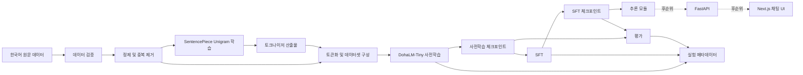
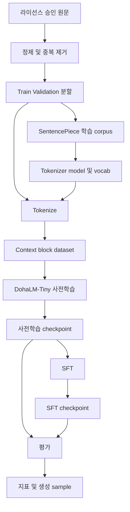
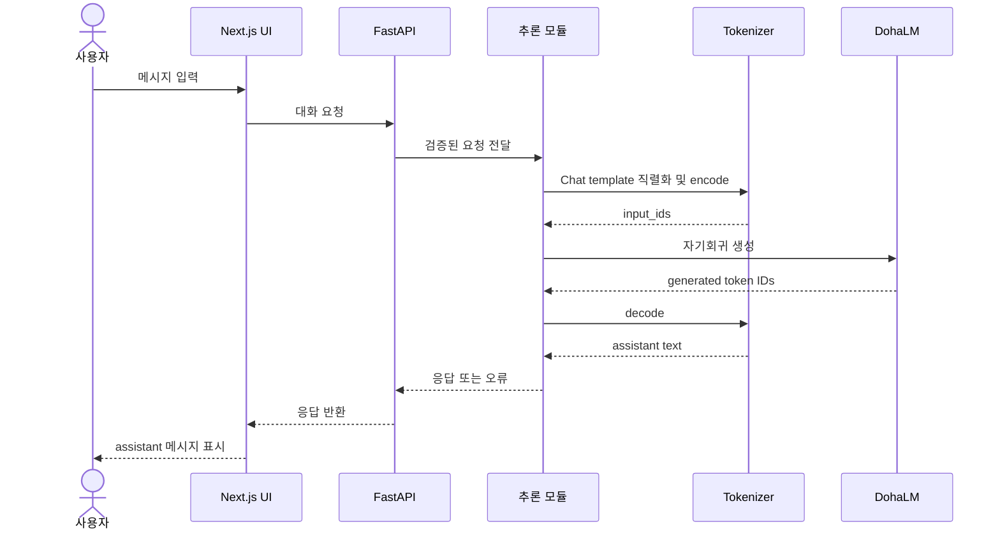

# DohaLM 시스템 아키텍처

## 문서 메타정보

| 항목 | 값 |
|---|---|
| 문서 상태 | `review` |
| 마지막 검토일 | 2026-07-23 |
| 선행 문서 | [프로젝트 개요](../project/overview.md), [범위와 목표](../project/scope-and-goals.md), [개발 규칙](../governance/development-rules.md), [ADR-001](../decisions/ADR-001-initial-model-scope.md) |
| 후속 문서 | [모델 아키텍처](./model-architecture.md), [토크나이저 설계](../training/tokenizer-design.md), [사전학습 계획](../training/pretraining-plan.md), [SFT 계획](../training/sft-plan.md), [저장소 구조](./repository-structure.md), [산출물·설정 정책](../governance/artifact-and-configuration-policy.md) |
| 구현 전 필수 여부 | 예 |

- [확정] 이 문서는 구현 전 시스템 경계와 책임을 정의한다.
- [확정] 현재 저장소의 소스, 설정, 스크립트, 서버 및 프론트엔드는 스캐폴드이며 기능이 구현되지 않았다.

## 1. 시스템 목적

DohaLM 시스템은 라이선스가 확인된 한국어 원문을 입력으로 받아 직접 학습한 토크나이저와 PyTorch Decoder-only Transformer를 통해 사전학습, SFT, 평가 및 추론까지 재현 가능한 흐름을 제공하는 것을 목표로 한다.

```text
한국어 원문 데이터
→ 데이터 정제
→ 토크나이저 학습
→ 토큰화 데이터셋
→ DohaLM-Tiny 사전학습
→ 체크포인트
→ SFT
→ 평가
→ 추론 모듈
→ FastAPI
→ Next.js 채팅 UI
```

- [확정] 1차 대상은 `DohaLM-Tiny`이며 예상 파라미터는 16,889,856개다.
- [확정] 기준 하드웨어는 단일 `RTX 3060 Ti 8GB`다.
- [후순위] FastAPI와 Next.js는 핵심 학습·평가·추론 검증 이후 연결한다.
- [확정] FastAPI와 Next.js는 현재 구현 완료 상태가 아니다.

### 1.1 시스템이 따르는 DohaLM-Tiny 기준

| 항목 | 확정값 |
|---|---|
| 구조 | Decoder-only Transformer |
| Transformer Layer | 6 |
| Hidden Size | 384 |
| Attention Head / Head Dimension | 6 / 64 |
| Context Length | 256 |
| Vocabulary Size | 16,000 |
| FFN Size | 1,536 |
| Normalization | Pre-LayerNorm |
| Position Embedding | 학습형 absolute positional embedding |
| Linear / LM Head bias | Linear bias 사용 / LM Head bias 미사용 |
| Weight tying | Token Embedding–LM Head 사용 |
| Precision | FP16 mixed precision |
| 예상 파라미터 | 16,889,856 |

- [확정] 상세 산식과 tensor shape는 [모델 아키텍처](./model-architecture.md)를 단일 기준으로 삼는다.
- [검증 필요] 구현 후 실제 파라미터 수와 위 예상값의 일치 여부를 테스트해야 한다.

## 2. 전체 시스템 구성도



## 3. 구성요소 정의

| 구성요소 | 역할 | 입력 | 출력 | 담당 모듈 또는 계획 경로 | 선행 조건 | 현재 상태 | Git 추적 여부 |
|---|---|---|---|---|---|---|---|
| 원본 데이터 저장 영역 | 취득한 원문을 변경 없이 보존 | 허가된 외부 데이터 | 원본 파일과 출처 기록 | `data/raw/` | 라이선스·취득 조건 확인 | [검증 필요] 데이터 없음 | 데이터 제외, `.gitkeep`만 추적 |
| 데이터 검증 영역 | 라이선스, 형식, 개인정보, 품질 검사 | 원본 데이터와 메타데이터 | 승인·제외 결과 | [데이터 전략](../data/data-strategy.md), `src/data/` | 데이터 등록 | [검증 필요] 미구현 | 코드·정책만 추적 |
| 전처리 영역 | 정제, 필터, 중복 제거, 분할 | 승인 원문 | 정제 데이터와 처리 기록 | `src/data/`, `data/cleaned/` | 검증 규칙 확정 | [검증 필요] 스캐폴드 | 코드 추적, 데이터 제외 |
| 토크나이저 학습 영역 | SentencePiece Unigram 직접 학습 | 정제 corpus와 설정 | `.model`, `.vocab`, 평가 기록 | `src/tokenizer/` | 데이터 라이선스, [ADR-003](../decisions/ADR-003-tokenizer-method.md) | [검증 필요] 스캐폴드 | 코드 추적, 산출물은 정책 확인 필요 |
| 토큰화 데이터 생성 영역 | 텍스트를 ID와 context block으로 변환 | 정제 데이터, tokenizer | 토큰화 dataset과 fingerprint | `src/data/build_dataset.py`, `data/tokenized/` | tokenizer 검증 | [검증 필요] 스캐폴드 | 코드 추적, dataset 제외 |
| 모델 구현 영역 | Decoder-only Transformer 정의 | model config, token IDs | logits, loss 연결용 tensor | `src/model/` | [ADR-002](../decisions/ADR-002-tiny-model-architecture.md) | [검증 필요] 스캐폴드 | 코드·소형 설정 추적 |
| 사전학습 영역 | causal language modeling 수행 | 토큰화 train/validation, model config | checkpoint, log, 평가 요청 | `src/training/pretrain.py`, `src/training/trainer.py` | 데이터·모델·메모리 검증 | [검증 필요] 스캐폴드 | 코드 추적, 대형 산출물 제외 |
| SFT 영역 | 질문·답변 대화 형식 미세조정 | 사전학습 checkpoint, SFT dataset | SFT checkpoint와 log | `src/training/sft.py`, `data/sft/` | 사전학습 checkpoint, SFT 정책 | [검증 필요] 스캐폴드 | 코드 추적, 데이터·checkpoint 제외 |
| 평가 영역 | loss, perplexity, 생성 및 한국어 평가 | checkpoint, tokenizer, 평가 dataset | 지표, 생성 sample, 보고서 | `src/evaluation/` | 평가 기준과 고정 dataset | [검증 필요] 스캐폴드 | 코드·소형 보고서 추적 가능 |
| 추론 영역 | prompt를 자기회귀 token 생성으로 변환 | checkpoint, tokenizer, prompt | token 및 decode된 응답 | `src/inference/` | 검증된 checkpoint | [검증 필요] 스캐폴드 | 코드 추적 |
| API 영역 | 추론을 HTTP 계약으로 노출 | 요청 schema, 추론 service | 응답 또는 오류 | `server/` | 추론 인터페이스 확정 | [후순위] 스캐폴드 | 코드 추적 |
| 프론트엔드 영역 | 사용자 채팅 입력과 응답 표시 | API 계약 | 채팅 UI 상태 | `frontend/` | API specification | [후순위] README만 존재 | 소스 추적, build 산출물 제외 |
| 실험 메타데이터 영역 | 실행 조건과 결과의 계보 기록 | config, code/data/tokenizer ID, metric | 실험 record와 config snapshot | 계획 경로 `experiments/` | 실험 ID·형식 결정 | [검증 필요] 경로 없음 | 소형 metadata만 추적 후보 |
| 체크포인트·산출물 영역 | 재개·평가·배포용 결과 보존 | model/optimizer state, tokenizer, 평가 결과 | versioned artifact | `checkpoints/`, 계획 경로 `artifacts/` | 저장·보존 정책 | [검증 필요] `.gitkeep`만 존재 | 대형 binary 제외 |

## 4. 시스템 경계

### 4.1 Git으로 관리하는 항목

- [확정] Python·PowerShell·프론트엔드 소스와 테스트 코드
- [확정] Markdown 기준 문서와 ADR
- [확정] 비밀정보가 없는 소형 기본 설정
- [확정] 데이터셋 registry, 라이선스 기록, schema 및 fingerprint와 같은 소형 메타데이터
- [확정] 재현 명령, 실험 요약, 소형 평가 결과와 모델 카드

### 4.2 Git으로 관리하지 않는 대용량 항목

- [확정] 원본·정제·토큰화·SFT 데이터 전체
- [확정] model checkpoint, optimizer state, scheduler state 및 AMP scaler state
- [확정] 대규모 실험 로그, 임시 cache 및 build 산출물
- [검증 필요] SentencePiece `.model`과 `.vocab`은 크기·라이선스·배포 필요성을 확인한 뒤 추적 여부를 결정한다.

### 4.3 로컬 환경 종속 항목

- [확정] 절대 경로, GPU·driver·CUDA 환경, local cache, virtual environment 및 실행 process 상태
- [확정] 로컬 환경값은 config에 하드코딩하지 않고 환경 변수 또는 추적 제외 파일로 주입한다.

### 4.4 버전 관리 설정

- [확정] 모델·토크나이저·데이터·학습·평가 기본 설정과 schema는 Git으로 관리한다.
- [확정] 실험 실행 시 최종 적용 설정 snapshot을 별도 보존한다.

### 4.5 비밀정보

- [확정] API key, access token, 계정 정보와 민감 endpoint는 Git에 포함하지 않는다.
- [확정] `.env.example`에는 이름과 설명만 두고 실제 값은 로컬 환경에서 관리한다.

### 4.6 재생성 가능한 산출물

- [확정] 정제 데이터, 토큰화 데이터, cache와 중간 shard는 원본·설정·코드 버전으로 재생성 가능해야 한다.
- [확정] 재생성 가능하더라도 비용이 크면 hash, 생성 명령과 보존 위치를 기록한다.

### 4.7 장기 보존이 필요한 산출물

- [확정] 승인된 tokenizer, 주요 checkpoint, 최종 config snapshot, 데이터 fingerprint, 평가 결과 및 모델 카드
- [검증 필요] 보존 위치, 보존 기간, 복제 정책과 접근 권한은 실험 관리 문서에서 확정한다.

상세 정책은 [산출물·설정 정책](../governance/artifact-and-configuration-policy.md)을 따른다.

## 5. 데이터 흐름

### 5.1 토크나이저 학습 흐름

1. [확정] 데이터 registry에서 라이선스 승인 원문을 선택한다.
2. [검증 필요] 정규화·정제 규칙으로 tokenizer용 corpus를 생성한다.
3. [확정] SentencePiece Unigram, Vocabulary Size 16,000과 지정 special token으로 학습한다.
4. [검증 필요] character coverage, normalization, byte fallback 및 token 통계를 평가한다.
5. [확정] tokenizer 설정, corpus fingerprint, hash와 평가 결과를 함께 등록한다.

### 5.2 사전학습 흐름

1. [확정] 승인된 tokenizer로 정제 corpus를 token ID로 변환한다.
2. [검증 필요] 문서 경계와 packing 정책에 따라 context block을 만든다.
3. [확정] `DohaLM-Tiny`에 `[B,T]` token IDs를 입력하고 다음 token loss를 계산한다.
4. [확정] FP16 mixed precision, gradient accumulation 및 필요 시 gradient checkpointing으로 학습한다.
5. [확정] checkpoint, 최종 적용 config, 로그 및 validation 결과를 같은 experiment ID로 연결한다.

### 5.3 SFT 흐름

1. [확정] 라이선스와 품질 검증을 통과한 role 구조 데이터를 선택한다.
2. [확정] 공통 대화 template으로 직렬화하고 assistant target loss mask를 만든다.
3. [확정] 검증된 사전학습 checkpoint를 초기값으로 로드한다.
4. [검증 필요] SFT hyperparameter로 학습하고 SFT checkpoint를 parent checkpoint와 연결한다.
5. [검증 필요] SFT 전후를 같은 평가 절차로 비교한다.

### 5.4 평가 흐름

1. [검증 필요] checkpoint, tokenizer와 고정 평가 dataset을 로드한다.
2. [검증 필요] loss, perplexity, 생성 sample 및 한국어 benchmark를 계산한다.
3. [확정] config·dataset·checkpoint ID와 결과를 함께 기록한다.
4. [검증 필요] 정량 합격선은 [평가 계획](../evaluation/evaluation-plan.md)에서 확정한다.

### 5.5 체크포인트 복원 흐름

1. [확정] checkpoint format/version과 무결성 hash를 확인한다.
2. [확정] model config, tokenizer ID와 checkpoint 호환성을 검사한다.
3. [확정] 학습 재개 시 model, optimizer, scheduler, AMP scaler, step 및 RNG state를 복원한다.
4. [확정] 추론 시 model state와 필요한 tokenizer·generation config만 로드한다.
5. [검증 필요] 동일 입력 logits 또는 재개 smoke test로 복원을 확인한다.

### 5.6 추론 요청 흐름

1. [후순위] Next.js가 사용자 message와 대화 context를 FastAPI에 전송한다.
2. [후순위] API가 schema, 길이 및 허용값을 검증한다.
3. [확정] 추론 모듈이 chat template과 tokenizer로 prompt를 `[B,T]`로 변환한다.
4. [확정] 모델이 자기회귀 방식으로 token을 생성하고 `<|end|>` 또는 `<eos>`에서 종료한다.
5. [후순위] API가 응답 schema로 반환하고 UI가 assistant message를 표시한다.

### 5.7 실험 기록 흐름

1. [확정] 실행 전 code revision, 환경, 데이터·토크나이저·config ID를 기록한다.
2. [확정] 실행 중 step, loss, learning rate, 처리량, 시간과 peak GPU memory를 기록한다.
3. [확정] 실행 후 checkpoint, 평가 결과, 생성 sample과 실패 원인을 experiment ID에 연결한다.
4. [검증 필요] 실험 metadata schema와 저장 backend는 [실험 관리 정책](../training/experiment-management.md)에서 확정한다.

## 6. 학습 데이터 흐름도



## 7. 인터페이스

| 인터페이스 | 입력 | 출력 | 상태와 계약 |
|---|---|---|---|
| 전처리 → 토크나이저 | 정제 UTF-8 text, corpus metadata | tokenizer 학습 corpus | [검증 필요] line/document 경계와 normalization contract |
| 토크나이저 → 데이터셋 | tokenizer model, special-token mapping, 정제 text | token IDs, document boundary, tokenizer ID | [확정] ID 범위 `0..15,999`; [검증 필요] serialization format |
| 데이터셋 → 모델 | `input_ids [B,T]`, labels/masks, config ID | batch tensor | [확정] Tiny `T<=256`, integer IDs; [검증 필요] dataloader object 형식 |
| 모델 → 학습 루프 | token IDs와 mask | `logits [B,T,16000]`, scalar loss 또는 loss 입력 | [확정] causal LM shape; [검증 필요] loss 계산 책임 위치 |
| 체크포인트 → 추론 | model state, model config, tokenizer ID, generation config | 복원된 model/tokenizer | [확정] architecture·vocab 호환성 검사; [검증 필요] package format |
| 추론 → API | prompt/message, generation options | assistant text, token/stop metadata 또는 오류 | [검증 필요] request/response schema와 streaming |
| API → 프론트엔드 | HTTP request/response 또는 stream | UI message state | [후순위] `12-api-specification.md`, `13-frontend-specification.md`에서 확정 |

## 8. 추론 요청 흐름도



- [후순위] 위 sequence는 목표 인터페이스이며 API와 UI가 구현됐다는 의미가 아니다.

## 9. 미결정 사항

- [검증 필요] 전처리 corpus, tokenized dataset 및 checkpoint의 실제 serialization format
- [검증 필요] experiment metadata schema와 저장 위치
- [검증 필요] tokenizer artifact의 Git 추적·외부 보존 정책
- [검증 필요] checkpoint registry, 보존 기간과 원격 저장 backend
- [검증 필요] 평가 지표·합격선과 서비스 request/response schema
- [검증 필요] 추론 sampling, KV cache와 streaming 정책

## 10. 변경 이력

| 날짜 | 변경 내용 |
|---|---|
| 2026-07-23 | [확정] 전체 시스템 경계, 구성요소, 데이터 흐름 및 구현 전 인터페이스 초안 작성 |
