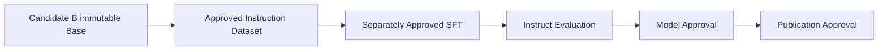

# ADR-010: DohaLM Instruct Strategy

- 문서 상태: `approved`
- 결정일: 2026-07-28
- 승인일: 2026-07-28
- 구현 상태: `design_completed_execution_not_approved`
- 대체 여부: `not_superseded`
- 관련 문서: [ADR-009](./ADR-009-candidate-b-official-reassessment.md), [Instruct 전략](../instruct/instruct-strategy.md), [Instruct Readiness](../instruct/instruction-readiness.md)

## 배경

Candidate B는 ADR-009에서 current official Base baseline과 `approved_experimental` derivative parent로
승인됐다. Base artifact를 변경하지 않고 Instruction Following·structured output·role following 능력을
개발하려면 Instruct family의 parent, data, SFT, evaluation, safety와 Chat lineage를 먼저 고정해야 한다.

## 결정

1. Candidate B Final을 `DohaLM Instruct Tiny v1`의 immutable Base parent로 사용한다.
2. Instruct는 Base를 덮어쓰거나 재명명하지 않는 새 supervised fine-tuning derivative다.
3. 기본 lineage는 `Base Tiny v1 → Instruct Tiny v1 → Chat Tiny v1`이다.
4. 현재 Chat은 Instruct를 parent로 하며 Base direct derivation은 별도 ADR 전에는 허용하지 않는다.
5. Instruction dataset은 category·schema·license·PII·safety·중복·누수·split 승인을 모두 요구한다.
6. Metadata·license·source·quality·safety field는 model input에서 제외한다.
7. Prompt template은 versioned serialization·mask·EOS·truncation fingerprint를 가져야 하며 tokenizer를 변경하지 않는다.
8. Instruct 평가는 Base 회귀, instruction following, structured output, safety와 EOS/length를 분리 보고한다.
9. Tool calling은 schema·selection·argument·permission 설계만 포함하고 실제 실행은 Agent/Backend 승인으로 분리한다.
10. 학습 완료, model approval과 publication approval은 서로 독립이다.

## SFT pipeline



각 화살표는 별도 Ready·identity·사용자 승인을 요구한다. 이번 결정으로 pipeline 실행 권한을 부여하지 않는다.

## Dataset와 schema

QA, instruction, summarization, translation, extraction, rewrite, classification, JSON, tool, SQL, code, Recruit와
Game category를 후보로 정의한다. Logical record는 `instruction`, optional `input`, `output`, optional
`system`과 비학습 metadata·language·license·source·quality·safety·category·difficulty·version으로 구성한다.
실제 dataset이나 record는 생성하지 않는다.

## Evaluation과 EOS

[ADR-008](./ADR-008-eos-generation-and-decoding-evaluation-policy.md)에 따라 teacher-forced EOS, pure generation과
decoding-assisted behavior를 분리한다. Instruct는 Base보다 엄격한 응답 완결성·format·JSON·safety 계약을
요구하지만 numeric threshold는 실제 평가 dataset 승인 전 `proposed`다. Service decoding은 별도 정책이다.

## Safety

PII, prompt injection, tool abuse, role confusion, system prompt leakage, refusal, hallucination, unsafe code/SQL과
domain harm를 필수 threat model로 둔다. Dataset approval, safety evaluation과 red-team evidence 없이 SFT나
model approval을 시작하지 않는다.

## 실행 상태

```text
design_status: design_completed
execution_allowed: false
dataset: not_selected
backend: not_started
training: not_approved
evaluation_execution: not_approved
publication: not_approved
```

## 대안

- Base를 직접 instruction model로 재명명: lineage와 artifact identity를 훼손하므로 제외한다.
- Base에서 Chat 직접 파생: Instruct 계약과 응답 형식 기반이 없어 현재 전략에서 제외한다.
- Dataset 확보 후 문서화: license·PII·누수·mask 오류를 늦게 발견하므로 제외한다.
- Tool 실행까지 Instruct에 포함: permission·workflow 위험이 커 Agent/Backend 단계로 분리한다.

## 영향

Instruct 문서·승인 구조가 생기지만 model, checkpoint, dataset, tokenizer, evaluation 구현과 Base 결과는
변경되지 않는다. 후속 작업은 dataset read-only 후보 검토부터 시작하며 SFT는 별도 최종 승인 전 금지된다.

## 재검토 조건

- Parent Base, tokenizer, context, schema 또는 prompt serialization이 변경된다.
- 실제 dataset license·PII·category 분포가 현재 계약과 충돌한다.
- Chat direct derivation이나 Agent tool execution이 필요하다.
- Instruct numeric evaluation·service decoding·preference optimization 정책을 승인하려 한다.

## 변경 이력

| 날짜 | 변경 내용 |
|---|---|
| 2026-07-28 | Candidate B immutable parent 기반 DohaLM Instruct 전략·Readiness 승인 |
