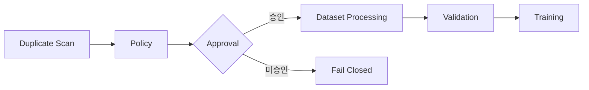

# AIHUB-71748 SFT Exact Duplicate 처리 정책

- 문서 상태: `review`
- 마지막 검토일: 2026-07-29
- Dataset ID: `AIHUB-71748`
- 정책 상태: `completed`
- 처리 상태: `proposed_not_approved`
- 관련 문서: [Exact Duplicate Scan 결과](./aihub-71748-exact-duplicate-result.md), [PII 판정 정책](./aihub-71748-pii-policy.md), [ADR-004](../decisions/ADR-004-data-governance.md), [ADR-010](../decisions/ADR-010-dohalm-instruct-strategy.md)

## 1. Scope

[확정] 이 문서는 완료된 Exact Duplicate Scan의 고정 집계를 다시 계산하지 않고, 중복 유형을 검토 가능한
처리 후보로 분류하는 정책만 정의한다. Dataset·ZIP·JSON 재열람, record 식별, 실제 label 부여, canonical record
선택, split 변경, 삭제와 파생 Dataset 생성은 범위 밖이다.

[확정] Near Duplicate Scan과 Leakage Scan은 승인되지 않았고 실행하지 않았다. Dataset 선택·처리와 SFT도
승인되지 않았으며 `execution_allowed: false`를 유지한다.

## 2. 고정 Scan 사실

다음 수치는 [기존 결과](./aihub-71748-exact-duplicate-result.md)의 고정 사실이며 이 작업에서 재계산하지 않았다.

| 대상 | Duplicate group | Duplicate excess record |
|---|---:|---:|
| Question | 6 | 7 |
| Answer | 3 | 145 |
| QA Pair | 6 | 7 |

| 교차 관계 | Group |
|---|---:|
| Training ↔ Validation Question overlap | 2 |
| Training ↔ Validation Answer overlap | 2 |
| Training ↔ Validation QA Pair overlap | 2 |
| Same question, different answer | 0 |
| Different question, same answer | 3 |

## 3. Duplicate 유형

| 유형 | 정의 | 위험 | 처리 후보 | 자동 처리 | 검토 |
|---|---|---|---|---|---|
| `EXACT_QA_DUPLICATE` | question과 answer가 모두 동일 | 중간: 편향·과대표현 가능성 | canonical 후보와 remove 후보 | `false` | 필수 |
| `QUESTION_CONFLICT` | question은 같고 answer가 다름 | 높음: 정답·품질 충돌 가능성 | 수동 검토 후보 | `false` | 필수 |
| `ANSWER_REUSE` | question은 다르고 answer가 같음 | 중간: 정상 재사용과 boilerplate를 구분할 수 없음 | retain 후보와 검토 후보 | `false` | 필수 |
| `CROSS_SPLIT_DUPLICATE` | Training과 Validation 사이 exact overlap | 높음: 평가 누수 가능성 | Training keep 후보와 Validation exclusion 후보 | `false` | 필수 |

[확정] `QUESTION_CONFLICT`는 현재 고정 집계에서 0그룹이지만, 정책은 향후 입력을 Fail Closed로 처리하기 위해
정의한다. 모든 유형의 `automatic_processing`은 `false`다.

## 4. Canonical 선택 정책 제안

[제안] 별도 Dataset Processing 승인이 주어진 뒤에만 다음 우선순위를 적용할 수 있다.

1. Training record를 Validation record보다 우선한다.
2. 같은 split이면 원본 순서를 유지한다.
3. 그 안에서 첫 record를 canonical 후보로 삼는다.

[확정] 이는 후보 결정 규칙일 뿐이다. 이번 작업에서는 어떤 record도 선택하거나 `KEEP`·`CANONICAL_CANDIDATE`를
실제로 부여하지 않았다.

## 5. Cross Split 정책 제안

[제안] Cross-split exact overlap은 threshold `0`을 목표로 하되 상태는 `not_approved`다. 정책 출력은
`BLOCKED`, `training_keep_candidate`, `validation_exclusion_candidate`이며 실제 제외나 split 변경은 별도 승인을
요구한다. Training 우선 제안은 평가용 Validation을 학습에서 격리하려는 목적이며 품질 판정을 뜻하지 않는다.

## 6. Answer Reuse 정책

[확정] 서로 다른 question에 같은 answer가 연결된 경우는 인사, 예/아니오, 고정 응답 또는 template일 수 있다.
원문과 문맥을 검토하지 않은 상태에서는 정상 재사용과 품질 문제를 구분할 수 없으므로 자동 삭제하지 않는다.
정책 결과는 `REVIEW_REQUIRED`, retain 후보와 review 후보로 제한한다.

## 7. Threshold 제안

| 항목 | 제안 | 상태 | 적용 |
|---|---:|---|---|
| Cross-split exact overlap | 0 | `not_approved` | 없음 |
| Question conflict | 0 | `not_approved` | 없음 |
| Within-split exact QA duplicate | 수치 미확정 | `not_approved` | 없음 |
| Answer reuse | 수치 미확정 | `not_approved` | 없음 |

[확정] 위 값은 승인·실행 threshold가 아니다. Near duplicate와 semantic leakage의 threshold도 정의하지 않는다.

## 8. 정책 Label

| Label | 의미 |
|---|---|
| `KEEP` | 승인된 처리 이후 유지 대상으로 확정할 때만 사용 |
| `CANONICAL_CANDIDATE` | canonical 검토 후보이며 실제 선택 아님 |
| `REMOVE_DUPLICATE_CANDIDATE` | 중복 제거 검토 후보이며 실제 삭제 아님 |
| `REVIEW_REQUIRED` | 사람 검토와 별도 승인이 필요 |
| `BLOCKED` | 승인 전 후속 처리를 차단 |
| `UNRESOLVED` | 현재 정보로 판정할 수 없음 |

[확정] 이번 작업에서는 실제 record에 어떤 label도 부여하지 않았다.

## 9. 처리 승인 Flow



[확정] 현재는 Policy 단계까지만 완료됐으며 Approval 이후 단계는 실행하지 않았다.

## 10. 순수 정책 계약

`src/data/exact_duplicate_policy.py`는 Dataset이나 record를 입력받지 않는다. 입력은 `duplicate_type`과
`overlap_type`의 고정 상태값뿐이며 출력은 `policy_label`, `processing_candidate`, `reason_code`,
`automatic_processing=false`, `review_required=true`다. 알 수 없는 duplicate 또는 overlap 값은 고정 오류 코드로
Fail Closed한다. 반환 객체는 불변이며 파일·네트워크·환경·난수에 접근하지 않는다.

## 11. Readiness

```yaml
AIHUB_71748_SFT:
  exact_duplicate_scan: completed
  duplicate_policy: completed
  duplicate_processing: proposed_not_approved
  near_duplicate_scan: not_approved
  leakage_scan: not_approved
  dataset_processing: not_approved
overall:
  execution_allowed: false
```

## 12. 다음 승인

[승인 필요] Dataset Processing 전에 canonical 선택, cross-split exclusion, answer reuse 수동 검토 범위와 각
threshold를 별도로 승인해야 한다. Near Duplicate와 Leakage Scan도 각각 별도 승인 없이는 실행할 수 없다.

## 변경 이력

| 날짜 | 변경 내용 |
|---|---|
| 2026-07-29 | Exact Duplicate 유형·후보 label·Fail Closed 정책과 미승인 처리 경계 작성 |
