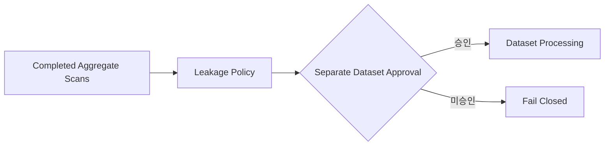

# AIHUB-71748 SFT Leakage 처리 정책

- 문서 상태: `review`
- 마지막 검토일: 2026-07-29
- Dataset ID: `AIHUB-71748`
- 정책 설계 상태: `completed`
- 처리 상태: `not_approved`
- Threshold 상태: `not_approved`
- 관련 문서: [Leakage 결과](./aihub-71748-leakage-result.md), [Exact Duplicate 정책](./aihub-71748-exact-duplicate-policy.md), [Near Duplicate 정책](./aihub-71748-near-duplicate-policy.md), [Dataset Readiness](./aihub-71748-readiness.md), [ADR-004](../decisions/ADR-004-data-governance.md), [ADR-010](../decisions/ADR-010-dohalm-instruct-strategy.md)

## 1. Scope

[확정] 이 문서는 기존 aggregate-only Leakage 결과의 처리 후보와 Dataset 승인 영향만 설계한다. Dataset·ZIP·JSON
재열람, Scan 재실행, record 식별, 실제 label 생성, 자동 제외·삭제·병합, split 변경과 Dataset Processing은
수행하지 않는다. 기존 수치와 학생·비상업 라이선스 상태를 변경하지 않는다.

## 2. 고정 결과

| 유형 | Candidate pair 또는 상태 | 근거 |
|---|---:|---|
| `TRAIN_VALIDATION_QUESTION_LEAK` | 48 | Exact 2 + Normalized 1 + Near 45 |
| `TRAIN_VALIDATION_ANSWER_LEAK` | 1,690 | Exact 1,688 + Near 2 |
| `TRAIN_VALIDATION_QA_LEAK` | 3 | Exact 2 + Normalized 1 |
| `EVALUATION_PROMPT_LEAK` | 0 | 저장소 synthetic prompt 10개 |
| `MODEL_EVALUATION_LEAK` | 0 | Candidate A/B 진단 synthetic prompt 15개 |
| `BENCHMARK_CONTAMINATION_CANDIDATE` | `not_available_local` | 로컬 고정 Benchmark source 없음 |

[확정] 위 수치는 후보 관계의 aggregate이며 고유 record 수, 실제 누수 확정 수 또는 자동 처리 대상 수가 아니다.

## 3. Risk Matrix와 처리 정책

| 유형 | 정책 위험 | 자동 처리 | 검토 | Processing 후보 | Dataset 승인 영향 |
|---|---|---|---|---|---|
| Train/Validation Question | `review_candidate` | `false` | 필수 | `VALIDATION_EXCLUSION_CANDIDATE` | 검토 완료 전 승인 보류 |
| Train/Validation Answer | `review_candidate` | `false` | 필수 | `REVIEW_REQUIRED` | 문맥 판정 전 승인 보류 |
| Train/Validation QA | `block_candidate` | `false` | 필수 | `VALIDATION_EXCLUSION_CANDIDATE` | 해결 전 승인 차단 후보 |
| Evaluation Prompt | `block_candidate` | `false` | 후보 발견 시 필수 | `BLOCKED` | 후보 발견 시 승인 차단 |
| Candidate Model Evaluation | `block_candidate` | `false` | 후보 발견 시 필수 | `BLOCKED` | 후보 발견 시 승인 차단 |
| Benchmark Candidate | `block_candidate` | `false` | source 승인 후 필수 | `UNRESOLVED` | 현재 source 부재로 readiness 차단 |

[확정] Evaluation과 Candidate Model prompt의 현재 후보 0은 해당 고정 prompt에 대한 Exact·Normalized 결과일 뿐
Dataset 승인이나 외부 Benchmark 오염 없음의 증명이 아니다.

## 4. Answer Exact 1,688쌍 정책

원문·문맥 검토 없이 다음 네 가능성을 구분할 수 없다.

| 해석 후보 | 정책 | 자동 조치 |
|---|---|---|
| 일반 템플릿 | 정상 재사용 가능성, `REVIEW_REQUIRED` | 없음 |
| 짧은 고정 응답 | 질문별 정상 응답 가능성, `REVIEW_REQUIRED` | 없음 |
| 의미 없는 반복 | 품질 문제 가능성, `REVIEW_REQUIRED` | 없음 |
| 실제 Train/Validation 누수 | 평가 오염 가능성, `VALIDATION_EXCLUSION_CANDIDATE` | 없음 |

[확정] 자동 삭제·제외·canonical 선택·승인하지 않는다. 1,688쌍을 boilerplate, 오류 또는 실제 누수로 단정하지
않으며 수동 원문 검토도 별도 승인 전에는 실행하지 않는다.

## 5. Processing Label

| Label | 의미 | 이번 실제 부여 |
|---|---|---|
| `KEEP` | 승인된 처리에서 유지가 확정된 대상 | 없음 |
| `REVIEW_REQUIRED` | 사람 검토와 별도 승인이 필요한 후보 | 정책 출력만 |
| `CANONICAL_CANDIDATE` | canonical 선정 검토 후보 | 없음 |
| `MERGE_CANDIDATE` | 병합 검토 후보 | 없음 |
| `VALIDATION_EXCLUSION_CANDIDATE` | 평가 격리를 위한 Validation 제외 검토 후보 | 없음 |
| `BLOCKED` | 미해결 상태에서 후속 승인을 차단 | record label 없음 |
| `UNRESOLVED` | 현재 증거로 판정할 수 없음 | 정책 출력만 |

[확정] Label은 승인 이후 가능한 처리 의미를 정의할 뿐 실제 record manifest나 파생 Dataset을 생성하지 않는다.

## 6. Threshold

| 대상 | 현재 상태 | 자동 적용 |
|---|---|---|
| Exact cross-split | `not_approved` | `false` |
| Normalized exact | `not_approved` | `false` |
| Near 0.90 / 0.97 proposal | `not_approved` | `false` |
| Evaluation prompt | `not_approved` | `false` |
| Benchmark contamination | source·threshold 모두 미확정 | `false` |

[확정] 정책 문서는 기존 proposal을 승인·완화·강화하지 않는다.

## 7. 순수 Policy Layer

`src/data/dataset_readiness_policy.py`는 고정 `scan_result`와 `policy_type`만 입력받아 불변 결정을 반환한다.

```yaml
input:
  scan_result: fixed_aggregate_status
  policy_type: fixed_policy_vocabulary
output:
  status: completed_or_review_required_or_blocked_or_not_started
  reason: fixed_reason_code
  processing_candidate: fixed_label
  automatic_processing: false
  dataset_selection_approved: false
  dataset_processing_approved: false
  execution_allowed: false
```

- Dataset, 파일, ZIP, JSON, 환경변수, 네트워크와 난수에 접근하지 않는다.
- 실제 문자열·record·ID·hash·candidate 목록을 입력받지 않는다.
- unknown 또는 type/result 불일치는 고정 오류 코드로 Fail Closed한다.
- 후보 0건도 Dataset 선택·처리나 실행 승인을 만들지 않는다.

## 8. Approval 영향



[확정] 현재는 Policy 설계까지만 완료됐고 Approval은 부여되지 않았다. Processing 이후 단계는 금지된다.

## 9. 최종 상태

```yaml
leakage_scan: completed
leakage_policy: completed
leakage_processing: not_approved
threshold: not_approved
benchmark: blocked
dataset_selection: not_selected
dataset_processing: not_approved
sft_backend: not_started
sft_training: not_approved
execution_allowed: false
```

## 변경 이력

| 날짜 | 변경 내용 |
|---|---|
| 2026-07-29 | 여섯 Leakage 유형, Answer Exact 해석 경계, Processing Label과 Fail Closed 승인 영향 설계 |
