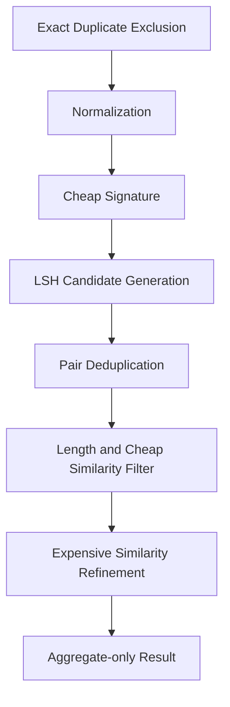

# AIHUB-71748 SFT Near Duplicate Scanner 최적화

- 문서 상태: `review`
- 마지막 검토일: 2026-07-29
- Dataset ID: `AIHUB-71748`
- 최적화 상태: `completed_synthetic_only`
- 실제 scan 상태: `attempt_1_failed_attempt_2_completed`
- 재실행 승인 상태: `consumed_completed`
- 관련 문서: [Near Duplicate 결과](./aihub-71748-near-duplicate-result.md), [Exact Duplicate 결과](./aihub-71748-exact-duplicate-result.md), [Exact Duplicate 정책](./aihub-71748-exact-duplicate-policy.md), [Safe Dataset Inspector](./safe-dataset-inspector.md), [ADR-004](../decisions/ADR-004-data-governance.md), [ADR-010](../decisions/ADR-010-dohalm-instruct-strategy.md)

## 1. Scope

[확정] 이 작업은 첫 Near Duplicate scan의 timeout을 실제 Dataset 재접근 없이 분석하고 scanner의 후보 생성,
정밀 비교, 상한과 cancellation 계약을 Synthetic-only로 개선했다. Dataset·ZIP·JSON payload, 실제 질문·답변,
PII·Exact Duplicate·Leakage scan, Dataset 처리와 학습에는 접근하지 않았다.

[확정] 이 문서 작성 당시 실제 성공 결과는 없었으나, 후속 독립 승인 Run 0002가 1회 완료됐다. 결과와 후속
미승인 경계는 [Near Duplicate 결과](./aihub-71748-near-duplicate-result.md)를 따른다.

## 2. 첫 번째 실행 실패

```yaml
attempt_history:
  - attempt: 1
    status: failed_closed
    reason_code: RUNTIME_TIMEOUT
    timeout_seconds: 604
    completed_result: false
    approval_consumed: true
    raw_value_leak: false
    dataset_modified: false
    retry_performed: false
```

[확정] timeout 후 남은 scanner 자식 process 2개를 식별해 종료했다. PID 값은 영구 문서에 기록하지 않는다.
Partial result와 후보 record는 생성·보존하지 않았고 첫 실행을 성공으로 덮어쓰지 않았다.

## 3. Timeout 원인

[확정] 기존 구현은 LSH bucket에서 나온 record pair를 question·answer별 전역 `set`에 모두 materialize했다.
후보 pair 상한, record별 상한, runtime·memory budget과 cancellation hook이 없었다.

[확정] 모든 deduplicated 후보에 대해 length/ngram cheap rejection 없이
`SequenceMatcher(..., autojunk=False).ratio()`를 호출했다. 반복·장문에서 비용이 큰 정밀 비교가 후보 수만큼
누적됐고 question·answer 이후 QA pair 후보도 별도 집합으로 유지했다. Python 단일 process에서 전체 후보와
fingerprint를 결과 생성 전까지 보유한 경로가 604초 timeout의 직접 병목이다.

## 4. 성능 위협 모델

| 위협 | 이전 영향 | 개선 |
|---|---|---|
| 여러 LSH bucket의 같은 pair | 중복 생성 후 전역 set 확인 | canonical group-pair key로 정밀 비교 전 dedup |
| 공통 prefix·boilerplate | bucket 폭증 | total·record별 candidate 상한으로 Fail Closed |
| 장문 `SequenceMatcher.ratio()` | 비싼 정밀 비교 반복 | cheap gate 뒤 선형 `quick_ratio()` 1회 |
| question component 중복 | SFTdata·SFTlabel question 동시 읽기·비교 | 검증된 SFTdata question만 canonical 사용 |
| 무제한 실행 | timeout 후 자식 잔류 | runtime/cancellation callback과 single-process 구조 |
| full pair matrix | 메모리 폭증 | 금지; bounded LSH group pair만 유지 |

## 5. Pipeline 개선



[확정] 모든 단계는 원문·substring·ID·hash·archive path를 출력하지 않는다. Threshold를 자동 완화하거나
sampling으로 전환하지 않는다.

## 6. Exact Duplicate 제외

[확정] raw text가 같은 pair와 NFC·trim·연속 공백·줄바꿈 정규화 후 같은 pair는 fingerprint group을 만들기 전에
Near Duplicate 후보에서 제외한다. 두 유형은 aggregate count만 분리하며 record list·stable hash를 저장하지 않는다.
기존 Exact Duplicate 통계와 중복 집계하지 않고 Dataset도 변경하지 않는다.

## 7. Component 계산 중복 제거

```yaml
question_source:
  canonical_component: sftdata
  sftlabel_question: skipped_verified_exact_copy
  basis: join_and_component_consistency_results
answer_source:
  canonical_component: sftlabel_answer_contents
```

[확정] 기존 검증의 question exact consistency 11,902/11,902를 근거로 SFTdata.question을 한 번만 계산한다.
SFTlabel에서는 answer.contents만 사용하며 QA pair는 canonical question과 answer의 near score 교집합으로 계산한다.

## 8. Candidate Deduplication

[확정] normalized value를 process-local group ordinal로 묶고 pair key를
`(min(local_ordinal_a, local_ordinal_b), max(...))`로 고정한다. 여러 SimHash·MinHash bucket에서 같은 pair가
발생해도 정밀 비교는 한 번만 수행한다. local ordinal, data_id, raw pair와 stable hash는 결과에 남기지 않는다.

필수 집계는 raw candidate pair, deduplicated candidate pair, 제거된 반복 candidate, deduplicated group pair와
expensive comparison 수다.

## 9. Cheap Filter

| 구분 | 구현 parameter | 상태 |
|---|---:|---|
| 긴 문자열 최소 length ratio | 0.70 | `implementation_parameter` |
| 짧은 문자열 경계 | 24자 | `implementation_parameter` |
| 짧은 문자열 최대 길이 차 | 4자 | `implementation_parameter` |
| character 3/4-gram Jaccard | 0.30 | `implementation_parameter` |
| whitespace token 1/2-gram Jaccard | 0.40 | `implementation_parameter` |
| SimHash 최대 Hamming distance | 12 | `implementation_parameter` |
| MinHash Jaccard estimate | 0.50 | `implementation_parameter` |

[확정] retrieval filter는 후보 감소를 위한 구현 parameter이며 Dataset 처리 정책 threshold가 아니다. 최종 정책
threshold proposal `0.90/0.97`은 변경하지 않았고 `not_approved`다.

## 10. Expensive Similarity 제한

[확정] 정밀 비교는 raw/normalized exact가 아니고 length filter, cheap signature 기준, pair dedup과 상한을 모두
통과한 group pair에만 적용한다. 기존 quadratic 가능성이 큰 full `ratio()` 대신 candidate-only
`SequenceMatcher.quick_ratio()`를 한 번 호출한다. question·answer의 평가 결과를 QA pair에서 재사용한다.

## 11. Candidate 상한

```yaml
performance_contract:
  status: proposed_not_approved
  maximum_per_record: 256
  maximum_total_pairs: 250000
  maximum_expensive_comparisons: 100000
  memory_budget_bytes: 536870912
```

[확정] question이 사용한 total pair·expensive budget을 차감한 잔여량만 answer에 전달한다. 상한 초과 시 각각
`PER_RECORD_CANDIDATE_LIMIT_EXCEEDED`, `CANDIDATE_PAIR_LIMIT_EXCEEDED`,
`EXPENSIVE_COMPARISON_LIMIT_EXCEEDED`, `MEMORY_BUDGET_EXCEEDED`로 Fail Closed한다.

## 12. Runtime Monitor

[확정] 제안 runtime budget은 300초다. monitor는 현재 phase, 처리 count, candidate count, expensive comparison,
elapsed seconds와 peak memory estimate만 집계한다. 원문·substring·ID·hash·path는 받거나 출력하지 않는다.
budget 초과는 `RUNTIME_BUDGET_EXCEEDED`로 종료한다.

## 13. Cancellation

[확정] scanner는 worker pool과 임시 파일을 사용하지 않는 단일 process 설계를 유지한다. CLI의 SIGINT·SIGTERM은
cancellation event만 설정하고 monitor가 `SCAN_CANCELLED`로 Fail Closed한다. Partial result를 성공 결과로
반환하지 않고 자동 재시작·retry·resume을 수행하지 않는다. Synthetic 강제 cancellation에서 worker·temp 0건을
검증했다.

## 14. Synthetic Benchmark

고정 generator가 만든 실제 데이터와 무관한 48자 합성 문자열에 근사 QA fixture 2그룹을 주입했다.

| Record | 시간(초) | Raw candidate | Deduplicated candidate | Expensive comparison | Peak memory estimate | 검출 QA group | False negative fixture |
|---:|---:|---:|---:|---:|---:|---:|---:|
| 100 | 0.140137 | 30 | 10 | 9 | 357,910 B | 2 | 0 |
| 1,000 | 1.430249 | 757 | 558 | 411 | 3,601,042 B | 2 | 0 |
| 5,000 | 8.310678 | 19,515 | 15,234 | 10,155 | 18,645,234 B | 2 | 0 |
| 12,000 | 21.429789 | 101,242 | 81,837 | 53,515 | 47,026,526 B | 2 | 0 |

[확정] 12,000에서 bucket 중복 제거로 raw 대비 candidate가 약 19.17% 감소했고, cheap filter 뒤 expensive
comparison은 deduplicated candidate 대비 약 34.61% 감소했다. 수치는 현재 CPU 환경 관측값이며 실제 Dataset
runtime 예측이나 승인 threshold가 아니다.

## 15. Adversarial Benchmark

| Synthetic case | 결과 |
|---|---|
| 공통 prefix·같은 LSH bucket | bounded limit에서 Fail Closed |
| 같은 cheap signature | pair dedup 후 정밀 비교 1회 |
| 짧은 문장·공백·줄바꿈 | normalized-exact로 분리·Near 집계 제외 |
| 한 글자 차이 | 후보 탐지 |
| 동일 boilerplate·raw exact | exact aggregate로 분리·Near 집계 제외 |
| 긴 문장 pair | aggregate-only 탐지, 원문 출력 0건 |
| per-record·total·expensive·memory 상한 | 각 고정 오류 코드 검증 |

[확정] 자동 sampling, threshold 완화 또는 fallback은 발생하지 않았다.

## 16. 결정론

[확정] normalized group을 정렬하고 canonical group-pair key를 사용한다. elapsed seconds만 runtime 관측값으로
분리한 semantic aggregate는 12,000 record 역순 재실행과 일치했다. 반복 실행 시간은 21.683541초였다.

## 17. Safety

```yaml
safety:
  actual_dataset_access: false
  zip_payload_read: false
  json_payload_read: false
  dataset_write: false
  raw_output: false
  substring_output: false
  data_id_output: false
  hash_output: false
  archive_path_output: false
  worker_processes: false
  temporary_files: false
  leakage_scan: not_approved
  execution_allowed: false
```

[확정] 이번 최적화·benchmark·test 입력은 Synthetic-only다. 실제 Dataset byte 변경 검사를 위해 Dataset을 다시
열지 않았으며 코드 경로에 Dataset 쓰기 작업이 없다.

## 18. Retry Readiness

```yaml
retry_readiness:
  synthetic_12000_completed: true
  adversarial_limit_test_passed: true
  candidate_deduplication_verified: true
  expensive_comparison_bounded: true
  runtime_monitor_validated: true
  cancellation_validated: true
  deterministic_repeat_passed: true
  raw_output_leak: false
  actual_dataset_access: false
  status: consumed_by_completed_run_0002
```

[확정] Ready 자체는 재실행 승인이 아니었다. 이후 사용자가 새 execution ID를 별도로 승인했고 Run 0002가 정확히
한 번 완료됐다. 승인 소비와 실제 집계는 결과 문서에 기록한다.

## 19. 상태

```yaml
near_duplicate_scan:
  attempt_1: failed_closed_runtime_timeout
  attempt_2: completed
  completed_result: true
  retry: not_applicable_independent_execution
near_duplicate_optimization:
  status: completed_synthetic_only
near_duplicate_policy:
  implementation: draft
  default_action: REVIEW_REQUIRED
  threshold: proposed_not_approved
  processing: not_approved
leakage_scan: not_approved
dataset_selection: not_selected
dataset_processing: not_approved
sft_training: not_approved
execution_allowed: false
```

## 20. 다음 승인 조건

[승인 필요] 후속 작업은 Near Duplicate threshold와 Cross-split 후보 처리 정책 확정 또는 별도 Leakage Scan 승인이다.
Dataset 선택·처리, Adapter·Tokenizer·SFT 학습은 계속 승인되지 않았다.

## 변경 이력

| 날짜 | 변경 내용 |
|---|---|
| 2026-07-29 | 후속 독립 승인 Run 0002 완료 결과와 정책·Leakage·처리 미승인 경계 연결 |
| 2026-07-29 | 첫 timeout 이력 보존, bounded 후보·정밀 비교·cancellation 계약과 12,000 Synthetic 검증 기록 |
