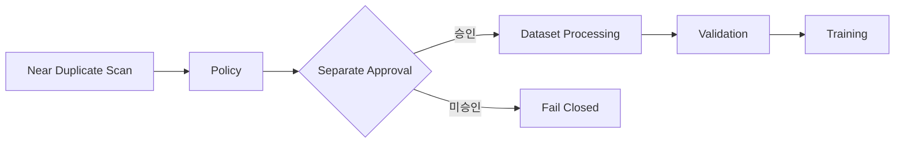

# AIHUB-71748 SFT Near Duplicate 처리 정책

- 문서 상태: `review`
- 마지막 검토일: 2026-07-29
- Dataset ID: `AIHUB-71748`
- 정책 설계 상태: `completed`
- 처리 상태: `proposed_not_approved`
- Threshold 상태: `proposed_not_approved`
- 관련 문서: [Near Duplicate 결과](./aihub-71748-near-duplicate-result.md), [Exact Duplicate 정책](./aihub-71748-exact-duplicate-policy.md), [Safe Dataset Inspector](./safe-dataset-inspector.md), [ADR-004](../decisions/ADR-004-data-governance.md), [ADR-010](../decisions/ADR-010-dohalm-instruct-strategy.md)

## 1. Scope

[확정] 이 문서는 완료된 Near Duplicate Scan의 고정 aggregate를 재계산하지 않고, 후보 유형·위험·검토 label과
향후 처리 후보만 정의한다. Dataset·ZIP·JSON 재열람, scan 재실행, record 식별, 실제 label 생성, canonical 선택,
filtering, merge, split 변경과 파생 Dataset 생성은 범위 밖이다.

[확정] 정책 설계 완료는 threshold 또는 Dataset Processing 승인이 아니다. Leakage Scan, Dataset 선택·처리,
Tokenization, Adapter, SFT backend와 학습은 승인되지 않았으며 `execution_allowed: false`를 유지한다.

## 2. 고정 결과

다음은 [기준 결과](./aihub-71748-near-duplicate-result.md)의 고정 사실이며 이 작업에서 재계산하지 않았다.

| 대상 | Candidate group | Affected record |
|---|---:|---:|
| Question | 167 | 362 |
| Answer | 4 | 20 |
| QA Pair | 0 | 0 |

| Cross-split 대상 | Candidate group | Candidate pair |
|---|---:|---:|
| Question | 40 | 45 |
| Answer | 1 | 2 |
| QA Pair | 0 | 0 |

## 3. Near Duplicate 유형

| Type | 식별자 | 정의 | 정책 위험 | 자동 처리 | 검토 |
|---|---|---|---|---|---|
| `TYPE_A` | `QUESTION_NEAR_DUPLICATE` | 표현은 다르지만 의미가 매우 유사한 질문 후보 | `review_candidate` | `false` | 필수 |
| `TYPE_B` | `ANSWER_NEAR_DUPLICATE` | 표현은 다르지만 의미가 매우 유사한 답변 후보 | `review_candidate` | `false` | 필수 |
| `TYPE_C` | `QA_PAIR_NEAR_DUPLICATE` | 질문과 답변 조합이 함께 매우 유사한 후보 | `high_review_candidate` | `false` | 필수 |
| `TYPE_D` | `CROSS_SPLIT_NEAR_DUPLICATE` | Training과 Validation 사이 의미 중복 후보 | `leakage_review_candidate` | `false` | 필수 |

[확정] Scanner는 lexical candidate를 집계했으며 의미 동일성을 확정하지 않았다. Candidate가 없다는 사실도 Near
Duplicate가 절대 없음을 증명하지 않는다.

## 4. 유형별 Processing 후보

```yaml
QUESTION_NEAR_DUPLICATE:
  processing_candidate: question_review_candidate
  policy_label: REVIEW_REQUIRED
  automatic_processing: false

ANSWER_NEAR_DUPLICATE:
  processing_candidate: answer_review_candidate
  policy_label: REVIEW_REQUIRED
  automatic_processing: false

QA_PAIR_NEAR_DUPLICATE:
  processing_candidate: canonical_or_merge_review_candidate
  policy_label: REVIEW_REQUIRED
  automatic_processing: false

CROSS_SPLIT_NEAR_DUPLICATE:
  processing_candidate: training_keep_and_validation_exclusion_candidate
  policy_label: REVIEW_REQUIRED
  automatic_processing: false
```

[확정] `processing_candidate`는 승인 이후 검토 가능한 조치 이름일 뿐 실제 record label이나 처리 지시가 아니다.

## 5. Similarity Band 정책

| Band | 현재 집계 의미 | Policy label | 처리 | 승인 |
|---|---|---|---|---|
| `0.90-0.93` | review proposal 하위 구간 | `REVIEW_REQUIRED` | 없음 | `not_approved` |
| `0.93-0.97` | review proposal 상위 구간 | `REVIEW_REQUIRED` | 없음 | `not_approved` |
| `0.97-1.00` | blocked proposal 구간, exact 1.0 제외 | `REVIEW_REQUIRED` | 없음 | `not_approved` |

[확정] `blocked proposal`은 더 높은 검토 우선순위를 뜻할 뿐 `BLOCKED` label의 실제 부여나 자동 제외를 의미하지
않는다. 세 구간 모두 현재는 동일하게 사람 검토와 별도 승인을 요구한다.

## 6. Threshold Proposal

```yaml
review_candidate:
  similarity: 0.90
  status: proposed_not_approved
  automatic_application: false

blocked_candidate:
  similarity: 0.97
  status: proposed_not_approved
  automatic_application: false
```

[확정] 이 문서는 기존 proposal을 보존하며 승인·완화·강화하지 않는다. 실제 처리 threshold는 Leakage 결과와
검토 비용·오탐 위험을 함께 평가한 별도 사용자 승인 전에는 적용할 수 없다.

## 7. Cross-split 정책

[제안] 현재 Cross-split Question 40그룹·45쌍과 Answer 1그룹·2쌍은
`training_keep_and_validation_exclusion_candidate`로만 분류할 수 있다. Training 유지와 Validation 제외는 평가
누수 방지 목적의 후보이며 품질·정답성을 판정하지 않는다.

[확정] 실제 Training keep, Validation exclusion, split 이동, 삭제와 재분할은 수행하지 않았다. Leakage Scan과
Dataset Processing 승인이 모두 없으므로 현재 조치는 `REVIEW_REQUIRED`뿐이다.

## 8. Canonical 정책 제안

별도 Dataset Processing 승인이 부여된 경우에만 다음 우선순위를 검토할 수 있다.

1. Cross-split이면 Training record를 Validation record보다 우선한다.
2. 같은 split이면 더 짧은 표현을 canonical 후보로 검토한다.
3. 길이가 같으면 원본 source ordering이 앞선 record를 후보로 검토한다.
4. provenance나 품질 충돌이 있으면 자동 선택하지 않고 `UNRESOLVED`로 보낸다.

[확정] 현재 schema에는 신뢰 가능한 생성 시각 계약이 없으므로 “가장 먼저 생성”을 추정하지 않는다. source ordering도
향후 처리 승인에서 안정성과 계보를 검증하기 전에는 canonical 선정 근거로 적용하지 않는다.

## 9. Label 정의

| Label | 의미 | 현재 실제 부여 |
|---|---|---|
| `KEEP` | 승인된 처리 이후 유지 확정 | 없음 |
| `REVIEW_REQUIRED` | 사람 검토와 별도 승인 필요 | 정책 출력만 사용 |
| `CANONICAL_CANDIDATE` | canonical 검토 후보 | 없음 |
| `MERGE_CANDIDATE` | 병합 검토 후보 | 없음 |
| `BLOCKED` | 승인 전 후속 처리 차단 | record label 없음 |
| `UNRESOLVED` | 현재 계약으로 판정 불가 | record label 없음 |

[확정] 순수 Policy Layer는 현재 `REVIEW_REQUIRED`만 반환하며 Dataset record에 label을 쓰지 않는다.

## 10. Processing Flow



[확정] 현재는 Policy 단계까지만 완료됐다. Approval 이후 단계는 실행하지 않았다.

## 11. 순수 Policy Layer

구현은 `src/data/near_duplicate_policy_final.py`에 있으며 입력은 `duplicate_type`, `similarity_band`,
`cross_split`뿐이다. 출력은 불변 객체의 `policy_label`, `processing_candidate`, `reason_code`와 미승인·자동 처리
금지 상태다.

- Dataset, 파일, ZIP, JSON, 환경변수, 네트워크와 난수에 접근하지 않는다.
- score helper는 Synthetic 검증용이며 `0.90`, `0.95`, `0.98`을 고정 proposal band로만 분류한다.
- exact `1.0`, proposal 미만, unknown type·band와 모순된 Cross-split 조합은 고정 오류 코드로 Fail Closed한다.
- 실제 candidate, record ID, 문자열, hash 또는 split record 목록을 입력받지 않는다.

## 12. Readiness

```yaml
AIHUB_71748_SFT:
  near_duplicate_scan: completed
  near_duplicate_policy: completed
  near_duplicate_processing: proposed_not_approved
  threshold: proposed_not_approved
  leakage_scan: not_approved
  dataset_selection: not_selected
  dataset_processing: not_approved
overall:
  sft_backend: not_started
  sft_training: not_approved
  execution_allowed: false
```

## 13. 다음 단계

[승인 필요] 다음 권장 단계는 별도 계약의 Leakage Scan이다. 이후 Near Duplicate threshold, Cross-split 처리,
canonical·merge 기준과 review 운영 범위를 함께 결정해야 한다. 현재 정책만으로 Dataset Processing이나 SFT를
시작할 수 없다.

## 변경 이력

| 날짜 | 변경 내용 |
|---|---|
| 2026-07-29 | Near Duplicate 유형·구간·Cross-split·canonical 처리 후보와 순수 Fail Closed 정책 설계 |
