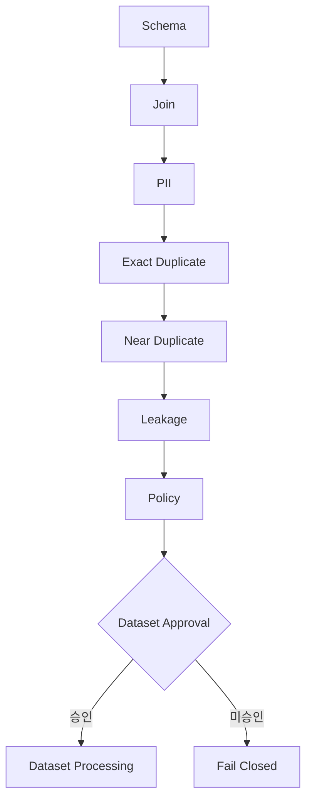

# AIHUB-71748 SFT Dataset Readiness

- 문서 상태: `review`
- 마지막 검토일: 2026-07-29
- Dataset ID: `AIHUB-71748`
- Readiness 설계 상태: `completed`
- Dataset 선택 상태: `CONDITIONALLY_SELECTED`
- 관련 문서: [Selection Decision](./aihub-71748-selection-decision.md), [Dataset Selection Approval Package](./aihub-71748-selection-approval-package.md), [Leakage 처리 정책](./aihub-71748-leakage-policy.md), [Leakage 결과](./aihub-71748-leakage-result.md), [PII 정책](./aihub-71748-pii-policy.md), [Exact Duplicate 정책](./aihub-71748-exact-duplicate-policy.md), [Near Duplicate 정책](./aihub-71748-near-duplicate-policy.md), [SFT 이용조건](./aihub-71748-sft-terms-review.md), [ADR-004](../decisions/ADR-004-data-governance.md), [ADR-010](../decisions/ADR-010-dohalm-instruct-strategy.md)

## 1. Scope

[확정] 이 문서는 기존 검증 결과와 정책만 종합해 Dataset Readiness를 설계한다. Dataset 재열람, Scan 재실행,
Dataset 선택·수정·처리, Threshold 승인, 외부 Benchmark 추가, Backend와 Training은 범위 밖이다.

## 2. 전체 검증 요약

| 항목 | 고정 결과 | 남은 정책 경계 |
|---|---|---|
| Schema | 구조·mapping `completed` | category 오염과 output incident 이력 유지 |
| Safe Inspector | `validated` | 값 출력·동적 오류 메시지 계속 금지 |
| Join | one-to-one, orphan·collision 0, `passed` | Dataset 승인과 독립 |
| PII | 후보 Scan·정책 `completed` | threshold·수동 검토·처리 미승인 |
| Exact Duplicate | Scan·정책 `completed` | canonical·split 처리 미승인 |
| Near Duplicate | Scan·정책 `completed` | 0.90/0.97 threshold와 처리 미승인 |
| Leakage | Scan·정책 `completed` | 1,741 candidate pair 처리 미승인 |
| Benchmark | `not_available_local` | source/version 계약 없음 |
| License | `approved_student_noncommercial` 유지 | SFT 목적·취득 증빙은 `verification_required` |

## 3. Risk Matrix

| 영역 | 현재 위험 | 자동 처리 | Readiness 영향 |
|---|---|---|---|
| Schema·Join | 구조 계약 통과 | 없음 | `completed` |
| PII | 후보와 false positive 혼재 | 금지 | `review_required` |
| Exact Duplicate | cross-split overlap 존재 | 금지 | `review_required` |
| Near Duplicate | cross-split 후보 존재 | 금지 | `review_required` |
| Leakage | Question 48, Answer 1,690, QA 3 candidate pair | 금지 | `review_required` |
| Benchmark | 로컬 source 없음 | 외부 다운로드 금지 | `blocked` |
| License | 학생·비상업 상태 유지, SFT 증빙 미확정 | 확대 금지 | `review_required` |

## 4. Processing Label

[확정] 정책 vocabulary는 `KEEP`, `REVIEW_REQUIRED`, `CANONICAL_CANDIDATE`, `MERGE_CANDIDATE`,
`VALIDATION_EXCLUSION_CANDIDATE`, `BLOCKED`, `UNRESOLVED`다. 현재 실제 record에 부여된 label은 0건이며
record label manifest도 생성하지 않았다.

## 5. Dataset Readiness Matrix

상태는 `completed`, `review_required`, `blocked`, `not_started` 중 하나만 사용한다.

| 항목 | 상태 | 근거 |
|---|---|---|
| `schema` | `completed` | 구조와 mapping 확인 완료 |
| `join` | `completed` | one-to-one Join 계약 통과 |
| `pii` | `review_required` | Scan·정책 완료, threshold·처리 미승인 |
| `exact_duplicate` | `review_required` | Scan·정책 완료, 실제 처리 미승인 |
| `near_duplicate` | `review_required` | Scan·정책 완료, threshold·처리 미승인 |
| `leakage` | `review_required` | Scan·정책 완료, 1,741 candidate pair 미처리 |
| `benchmark` | `blocked` | 고정 local source/version 없음 |
| `license` | `review_required` | 기존 학생·비상업 상태 유지, SFT 증빙 미확정 |
| `processing` | `not_started` | Dataset Processing 미승인 |
| `training` | `not_started` | SFT Backend 미시작·Training 미승인 |

## 6. Readiness Score Proposal

[제안] 다음 값은 기술 검토 진행도를 설명하는 비가중 참고치다. 실제 품질·법적 적격성·승인 확률이 아니며
총점으로 Dataset 승인 여부를 결정하지 않는다.

| 기술 검토 영역 | Proposal score |
|---|---:|
| Schema | 100 |
| Join | 100 |
| PII | 85 |
| Exact Duplicate | 90 |
| Near Duplicate | 88 |
| Leakage | 72 |

[검증 필요] Benchmark, License, Processing과 Training은 같은 수치 척도로 환산하지 않는다. 위 여섯 값의 단순
평균도 Gate나 승인 근거로 사용하지 않는다.

## 7. Approval Gate



[확정] Dataset Selection은 `CONDITIONALLY_SELECTED`로 승인됐지만 Dataset Processing은 별도 승인 전까지
금지된다. 앞 단계 완료는 다음 단계의 자동 승인이 아니다.

## 8. 현재 Blocker

1. SFT 목적 이용조건과 다운로드 승인 증빙이 `verification_required`다.
2. PII threshold·수동 검토·처리 방식이 미승인이다.
3. Exact/Near/Leakage 후보의 canonical·merge·Validation 제외와 threshold가 미승인이다.
4. 고정 local 외부 Benchmark source와 version 계약이 없다.
5. Dataset은 조건부 선정됐지만 Dataset Processing은 미승인이다.

[확정] 기존 결과에서 확인된 blocker만 종합했으며 새로운 blocker를 만들지 않았다.

## 9. Policy Layer

[확정] `src/data/dataset_readiness_policy.py`는 aggregate 상태와 고정 policy type만 받는 순수 함수다. Dataset과
파일에 접근하지 않으며 모든 결정에서 자동 처리, Dataset 선택·처리와 실행 권한을 `false`로 유지한다. Synthetic
테스트는 완료·후보·Benchmark 부재·unknown·불일치 Fail Closed를 검증한다.

## 10. Readiness

```yaml
dataset_readiness: completed
dataset_selection: CONDITIONALLY_SELECTED
dataset_processing: not_approved
processing_manifest: not_started
processing_backend: not_started
sft_backend: not_started
sft_training: not_approved
execution_allowed: false
```

[확정] [Selection Decision](./aihub-71748-selection-decision.md)에 따라 Dataset 선택 상태는
`CONDITIONALLY_SELECTED`다. 이는 Dataset Processing·SFT Training 승인이 아니며 `execution_allowed: false`를
그대로 유지한다.

## 11. 다음 단계

[승인 필요] 다음 단계는 Dataset Processing 실행이 아니라 Terms Evidence, Benchmark Source와 미승인 threshold를
검토하고 Processing Manifest 설계 범위를 별도로 승인하는 것이다. immutable source, Processing version, split
격리, label manifest와 검증 계획도 새 범위에서 확정해야 한다.

## 변경 이력

| 날짜 | 변경 내용 |
|---|---|
| 2026-07-29 | 공식 `CONDITIONALLY_SELECTED` 결정과 Processing·Training 미승인 상태 반영 |
| 2026-07-29 | Dataset Selection Approval Package 연결과 조건부 선택 권장안의 비승인 경계 명시 |
| 2026-07-29 | 기존 Schema·Join·PII·Exact·Near·Leakage 결과를 종합한 Readiness Matrix와 Approval Gate 설계 |
