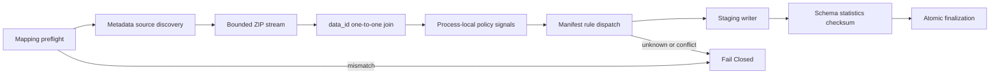

# AIHUB-71748 실제 Processing Backend와 Mapping 계약

- 문서 상태: `review`
- 마지막 검토일: 2026-07-29
- Mapping 계약: `implemented`
- 실제 Backend: `implemented_synthetic_validated`
- 실제 Processing: `not_approved`
- `execution_allowed`: `false`
- 관련 문서: [Processing Manifest](./aihub-71748-processing-manifest.md), [Processing Backend](./processing-backend.md), [ADR-004](../decisions/ADR-004-data-governance.md), [ADR-010](../decisions/ADR-010-dohalm-instruct-strategy.md)

## Run 0001 Fail Closed

[확정] `AIHUB-71748-SFT-PROCESSING-20260729-0001`은 Mapping Gate에서 Fail Closed됐다. Processing 호출,
Approval 생성·소비, ZIP payload read와 Dataset write는 모두 0건이다. 이 Run과 Approval ID는 영구 폐기하며
재시도·resume·재사용하지 않는다.

## Mapping 계약

추적 설정 [aihub-71748-mapping.yaml](../../configs/data/aihub-71748-mapping.yaml)은 Dataset ID, SFT Component,
외부 read-only root, 허용 Component·split, 원본 불변과 논리 processed root를 고정한다. 실제 절대경로는
Git에서 제외된 `configs/local-datasets.yaml`에만 둔다.

Resolution 순서는 명시적 CLI root → local config → `DOHALM_DATASET_ROOT` → Fail Closed다. source는 저장소
밖의 존재하는 `AIHUB-71748` 디렉터리여야 하고 raw·processed 경로는 겹칠 수 없다. 고정 Mapping 오류는
`DATASET_MAPPING_MISSING`, `DATASET_MAPPING_INVALID`, `DATASET_ROOT_UNRESOLVED`,
`DATASET_ROOT_NOT_FOUND`, `DATASET_ROOT_INSIDE_REPOSITORY`, `DATASET_COMPONENT_MISMATCH`,
`DATASET_ROOT_TYPE_INVALID`, `REPOSITORY_INTERNAL_FLAG_INVALID`, `SOURCE_NOT_READ_ONLY`,
`RAW_PROCESSED_PATH_COLLISION`이다.

## Backend Architecture



- Reader는 `SFTdata`, `SFTlabel` 및 Training, Validation의 네 archive만 찾고 `extract`를 사용하지 않는다.
- Parser는 승인된 필수 field만 형식 검증하며 원문·ID·경로를 로그나 예외에 넣지 않는다.
- Join은 process memory 안에서만 `data_id`를 사용하고 중복·orphan·cross-split ID·question 불일치를 차단한다.
- 출력 JSONL은 `instruction`, `input`, `output`, `system`만 포함한다.

## Record-level Signal

```yaml
record_level_signal:
  available: true
  lifetime: process_local_only
  persisted_details: false
```

PII pattern, exact canonical, bounded near-duplicate candidate와 cross-split leakage signal을 같은 실행 안에서 다시
계산한다. 별도 stable signal Manifest, record ID·pair·hash 목록은 저장하지 않고 결과에는 Rule별 aggregate만 남긴다.
Candidate budget 초과나 signal 생성 불능은 `RECORD_LEVEL_POLICY_SIGNAL_MISSING`으로 중단한다.

## Rule Dispatch와 Output

Backend는 Manifest의 12단계 순서를 정확히 검증한다. Unknown·중복·순서 불일치 Rule은 Fail Closed한다.
Writer의 허용 파일은 `train.jsonl`, `validation.jsonl`, `manifest.yaml`, `statistics.json`,
`checksums.sha256`, `processing-result.yaml`뿐이다. `<run-root>.staging` 검증 후 atomic rename하며 기존 final,
동일 Run ID와 부분 final을 허용하지 않는다.

## Approval과 Runtime

Approval 상태는 `created → validated → consumed → completed_or_failed`다. Run 0001은 retired 목록에서 거부한다.
실제 실행은 새 Run 0002와 Approval 0002의 별도 사용자 승인 후에만 가능하다. Runtime monitor는 시간, source·output
record, 제외율, memory·disk 추정, fixed phase와 cancellation만 기록하고 원문·ID·경로는 기록하지 않는다.

## Preflight-only와 Dry-run

CLI는 `scripts/datasets/process_aihub_71748_sft.py`다. 기본값은 `dry_run: true`,
`processing_allowed: false`이며 `--preflight-only`만 실제 local Mapping에서 허용한다. 이 mode는 Mapping,
Manifest, archive 파일 metadata와 output 충돌만 확인하고 ZIP member를 열지 않는다. Full dry-run은 Synthetic fixture와
임시 디렉터리에서만 검증한다.

이번 검증의 local metadata-only 결과는 archive 4개가 발견됐고 payload open·Processing call·Approval 생성·소비·
Dataset write는 모두 0건이었다. 실제 절대경로와 파일명은 문서에 기록하지 않는다.

## Current Status

```yaml
mapping_contract: implemented
real_processing_backend:
  status: implemented
  validation: synthetic_passed
local_mapping: validated_metadata_only
processing_run_0001: retired_failed_closed
processing_run_0002: preflight_passed_approval_prepared_not_issued
processed_dataset: not_created
tokenization: not_approved
training: not_approved
execution_allowed: false
```

## 다음 승인

[Run 0002 Preflight](./aihub-71748-processing-run-0002-preflight.md)는 immutable backend, metadata-only
source inventory, output parent probe와 non-executable Approval 초안을 검증했다. [승인 필요] 실제 single-use
Approval 발급과 Processing 실행은 별도로 승인해야 한다. 그 전에는 ZIP payload read, Processed Dataset 생성과
Approval consume을 수행하지 않는다. Processing 승인은 Tokenization 또는 SFT Training 승인이 아니다.

## 변경 이력

| 날짜 | 변경 내용 |
|---|---|
| 2026-07-29 | Run 0002 metadata-only Preflight 통과와 Approval prepared_not_issued 상태 연결 |
| 2026-07-29 | Run 0001 폐기, 외부 Mapping 계약, 실제 ZIP streaming·join·process-local signal·atomic writer Backend와 Synthetic 검증 등록 |
