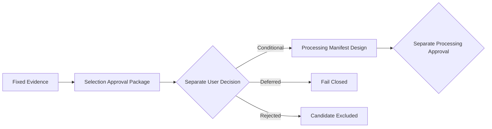

# AIHUB-71748 SFT Dataset Selection Approval Package

- 문서 상태: `review`
- 마지막 검토일: 2026-07-29
- Dataset ID: `AIHUB-71748`
- 패키지 상태: `completed`
- 권장 상태: `CONDITIONALLY_SELECTED` (`recommendation_only`)
- 실제 선택 상태: `not_selected`
- 관련 문서: [Dataset Readiness](./aihub-71748-readiness.md), [SFT 이용조건](./aihub-71748-sft-terms-review.md), [Leakage 처리 정책](./aihub-71748-leakage-policy.md), [ADR-004](../decisions/ADR-004-data-governance.md), [ADR-010](../decisions/ADR-010-dohalm-instruct-strategy.md)

## 1. Scope

[확정] 이 패키지는 기존 검증·정책·Readiness의 고정 사실을 승인권자가 검토할 수 있게 정리한다. Dataset, ZIP,
JSON, record와 기존 scan 산출물을 다시 읽거나 계산하지 않는다. Dataset 선택·처리·학습 승인 또는 실행을 생성하지
않으며 최종 선택은 별도의 명시적 사용자 승인으로만 가능하다.

## 2. 현재 상태

```yaml
dataset_readiness: completed
dataset_selection: not_selected
dataset_processing: not_approved
processing_manifest: not_started
processing_backend: not_started
sft_backend: not_started
sft_training: not_approved
execution_allowed: false
```

## 3. Evidence Summary

기존 문서가 제공하는 근거는 구조·관계·안전한 검사 방식과 후보 집계가 완료됐음을 보여준다. 그러나 이용조건 증빙,
PII·중복·누수 처리 기준, 외부 Benchmark 계약과 처리 구현은 선택 이후에도 별도 승인이 필요한 상태다. 증거가
충분하지 않은 영역을 완료 또는 안전으로 추정하지 않는다.

## 4. Positive Evidence

```yaml
positive_evidence:
  schema: {status: completed}
  join_integrity: {status: passed, relationship: one_to_one}
  safe_inspector: {status: validated}
  component_consistency: {status: passed}
  exact_duplicate: {status: completed}
  near_duplicate: {status: completed}
  leakage: {status: completed}
  tests: {baseline_total: 967}
```

[확정] 위 완료 상태는 scan 또는 정책 설계 완료를 뜻한다. Dataset 처리 적격성이나 학습 적격성을 뜻하지 않는다.

## 5. Blockers

```yaml
blockers:
  - sft_usage_evidence_not_finalized
  - pii_threshold_not_approved
  - duplicate_processing_not_approved
  - leakage_processing_not_approved
  - benchmark_source_not_available
  - benchmark_contamination_not_determined
  - dataset_processing_not_approved
```

## 6. Selection Options

| 선택안 | 의미 | 처리 허용 | 학습 허용 | 승인 계약 |
|---|---|---:|---:|---|
| `CONDITIONALLY_SELECTED` | 조건 충족을 전제로 한 후보 선정 | `false` | `false` | 별도 승인 필요 |
| `DEFERRED` | blocker가 해소될 때까지 결정 보류 | `false` | `false` | 별도 승인 필요 |
| `REJECTED` | 현재 Instruct SFT 후보에서 제외 | `false` | `false` | 재검토 시 새 review 필요 |

[확정] 세 선택안 모두 Dataset Processing이나 Training 권한을 부여하지 않으며 자동 판정하지 않는다.

## 7. Recommended Decision

```yaml
recommended_decision: CONDITIONALLY_SELECTED
decision_status: recommendation_only
dataset_selection: not_selected
```

[제안] Schema, one-to-one Join, Safe Inspector와 component consistency가 통과했고 PII·Exact·Near·Leakage 후보
집계가 완료됐으므로 조건부 후보가 합리적이다. 치명적인 Join 오류가 없고 Dataset을 변경하지 않은 채 후속 검토가
가능하다. 이는 승인이나 처리 시작 지시가 아니다.

## 8. Selection Conditions

우선순위는 ① 이용조건 및 권리 증빙, ② Benchmark source 계약, ③ PII threshold, ④ Duplicate·Leakage threshold,
⑤ Processing Manifest, ⑥ Processing Backend, ⑦ Dataset Selection 최종 승인, ⑧ Dataset Processing 실행 승인이다.
최종 선택보다 Processing Backend 설계를 먼저 시작하지 않는다.

| 영역 | 승인 전에 충족할 조건 |
|---|---|
| 이용조건 | SFT 학습 사용 증빙, 파생 Dataset 처리 범위, 로컬 checkpoint 조건 확인; 공개 weight는 별도 승인 |
| PII | threshold, 처리 label, critical 후보와 직접 식별정보 후보 처리 계약 승인 |
| Duplicate | Exact·Near threshold, Cross-split 처리와 canonical 규칙 승인 |
| Leakage | Train/Validation Question·Answer·QA와 Evaluation Prompt 후보 처리 정책 승인 |
| Benchmark | source registry, 고정 version, license 확인과 contamination scan 별도 승인 |
| Processing | Manifest schema, immutable raw, 재현 가능한 transform, 전후 count 검증과 Fail Closed backend 설계 |

## 9. Rejection Conditions

SFT 학습이 명시적으로 금지되거나 파생 모델 조건이 목적과 충돌하는 경우, 해결 불가능한 무결성 문제, 분리할 수 없는
광범위 Benchmark contamination, 안전하게 관리할 수 없는 PII, 처리 후 목표 미만의 유효 규모, 라이선스 증빙 확보
불가 중 하나가 확인되면 `REJECTED` 후보로 검토한다. 자동 거절은 금지한다.

## 10. Deferred Conditions

권리·이용조건 확인 대기, Benchmark source registry 미완성, threshold 미승인, 처리 비용·일정 미확정 또는 다른
Dataset 후보 비교가 필요하면 `DEFERRED`가 적절하다.

## 11. Approval Decision Record

다음 schema는 의도적으로 채우지 않는다.

```yaml
dataset_selection_decision:
  dataset_id: AIHUB-71748
  component: SFT
  decision:
    value: not_selected
    allowed_values: [CONDITIONALLY_SELECTED, DEFERRED, REJECTED]
  decision_by: null
  decision_at: null
  decision_reason_codes: []
  conditions: []
  evidence_commit: null
  approval_id: null
  processing_allowed: false
  training_allowed: false
  execution_allowed: false
```

## 12. Approval ID

최종 선택 승인 ID 형식은 `AIHUB-71748-SFT-SELECTION-APPROVAL-YYYYMMDD-NNNN`이다. Approval은 single-use이며
immutable Git commit, 승인자·시간, 선택 상태, 조건·증빙, 처리·학습 허용 상태를 포함해야 한다. Selection
Approval은 Processing Approval이나 Training Approval을 대체하지 않는다.

## 13. Reason Codes

허용 코드는 `SCHEMA_VALIDATED`, `JOIN_INTEGRITY_PASSED`, `SAFE_INSPECTOR_VALIDATED`, `PII_POLICY_PENDING`,
`DUPLICATE_POLICY_PENDING`, `LEAKAGE_POLICY_PENDING`, `TERMS_EVIDENCE_PENDING`, `BENCHMARK_SOURCE_PENDING`,
`BENCHMARK_CONTAMINATION_UNDETERMINED`, `PROCESSING_MANIFEST_PENDING`, `PROCESSING_BACKEND_PENDING`이다.
Fail Closed에는 `INVALID_APPROVAL_REQUEST`만 사용한다. 입력에서 유래한 동적 코드를 만들지 않는다.

## 14. Selection Policy Layer

[`dataset_selection_policy.py`](../../src/data/dataset_selection_policy.py)는 고정 readiness 상태, selection condition과
requested decision만 평가하는 순수 정책 계층이다. Dataset·파일·네트워크·환경변수에 접근하지 않는다. 반환값은
불변이며 추천, 요청 유효성, 항상 `false`인 처리·학습·실행 권한과 결정론적 reason code만 포함한다.

## 15. Approval Gate



[확정] 현재 흐름은 `Package`에서 멈춘다. `CONDITIONALLY_SELECTED`가 승인되더라도 Processing 설계와 실행은
각각 별도 범위와 승인을 요구한다.

## 16. Fail Closed

unknown decision/readiness, 필수 evidence 누락, 처리·학습·실행 `true` 요청, 최종 승인에서 evidence commit 누락,
Dataset ID 또는 component 불일치는 `recommendation: DEFERRED`, `decision_allowed: false`,
`reason_codes: [INVALID_APPROVAL_REQUEST]`로 종료한다.

## 17. Current Readiness

```yaml
selection_approval_package: completed
recommended_decision: CONDITIONALLY_SELECTED
recommendation_status: recommendation_only
dataset_selection: not_selected
dataset_processing: not_approved
processing_manifest: not_started
processing_backend: not_started
sft_backend: not_started
sft_training: not_approved
execution_allowed: false
```

## 18. Next Step

[승인 필요] 다음 단계는 승인권자가 세 선택안 중 하나를 명시하고 immutable evidence commit, 승인자·시간, 조건,
reason code와 별도 Selection Approval ID를 채우는 것이다. 이번 패키지는 실제 결정을 기록하지 않으며 Dataset
Processing Manifest, Backend, Adapter, Tokenization과 SFT는 시작하지 않는다.

## 변경 이력

| 날짜 | 변경 내용 |
|---|---|
| 2026-07-29 | AIHUB-71748 SFT 선택안·근거·조건·승인 schema와 Fail Closed 정책 패키지 작성 |
