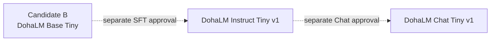
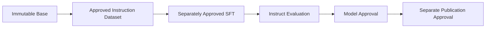

# DohaLM Instruct 전략

- 문서 상태: `review`
- 마지막 검토일: 2026-07-28
- 설계 상태: `design_completed`
- 실행 상태: `execution_not_approved`

## 목적과 비목표

[확정] DohaLM Instruct는 범용 next-token Base를 직접 수정하지 않고 사용자 지시를 따르는 별도 derivative를
설계한다. 목표는 instruction following, 제한된 multi-step instruction, structured output, JSON·Markdown,
tool prompt, role following과 answer formatting이다.

[제외] Base 재명명·덮어쓰기, open-ended Chat 학습, RLHF·DPO·PPO, 실제 tool 실행, chain-of-thought 저장·
요구, API·Frontend와 publication은 이번 설계 범위가 아니다. `Chain Style`은 숨은 추론 공개가 아니라
승인된 경우에만 짧은 단계·근거·결론 형식을 따르는 응답 구조를 뜻한다.

## Parent와 lineage



- Parent: Candidate B Final, `approved_experimental`
- Parent checkpoint checksum: `sha256:f3edc978db9d88e9de8e2e423a28291e9f35e2e163f0413c0e27e95facc55395`
- Base mutation: `forbidden`
- Candidate A: historical comparison baseline, parent가 아님
- Instruct model artifact: `not_created`
- Chat direct-from-Base derivation: `forbidden_by_current_strategy`

## SFT lifecycle



각 단계는 독립 승인 대상이다. Dataset 단계는 license·PII·safety·중복·benchmark contamination과 split을
고정한다. SFT는 parent·data·template·mask·config identity를 묶는다. Evaluation은 Base 회귀와 Instruct
계약을 분리한다. Approval은 학습 완료와 다르며 Release는 checkpoint 공개를 자동 허용하지 않는다.

## Family 경계

- Base: 범용 next-token·teacher-forced 성능 중심
- Instruct: 단일 또는 제한된 multi-step 지시 완결·형식 준수 중심
- Chat: Instruct를 parent로 한 multi-turn 대화·대화 상태·서비스 decoding 중심
- Agent: tool call·workflow·permission의 structured termination 중심

## Version

```text
dohalm-base-tiny-v1
  -> dohalm-instruct-tiny-v1
    -> dohalm-chat-tiny-v1
```

Version은 자동 승격이 아니다. Parent fingerprint, dataset, schema, prompt serialization, objective 또는 평가
계약이 바뀌면 새 version/decision을 검토한다.

## 변경 이력

| 날짜 | 변경 내용 |
|---|---|
| 2026-07-28 | Candidate B immutable parent 기반 Instruct 목적·lineage·SFT lifecycle 설계 |
