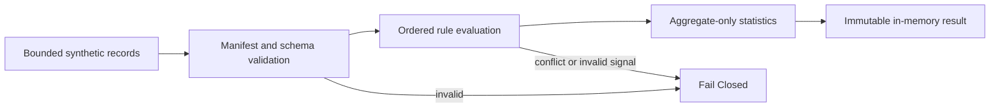

# SFT Dataset Processing Backend

- 문서 상태: `review`
- 마지막 검토일: 2026-07-29
- 구현 상태: `implemented_real_backend_hardened_synthetic_validated`
- 실제 처리 실행: `not_approved`
- `execution_allowed`: `false`
- 관련 결정: [ADR-004](../decisions/ADR-004-data-governance.md), [ADR-010](../decisions/ADR-010-dohalm-instruct-strategy.md)

## 범위

기존 메모리 전용 `process_synthetic_records` 계약은 유지한다. AIHUB-71748 전용 실제 Backend는 별도 모듈로
추가됐으며 [상세 계약](./aihub-71748-real-processing-backend.md)에 따라 외부 Mapping, bounded ZIP stream,
one-to-one join, process-local signal, atomic writer를 제공한다. 실제 실행 권한은 부여되지 않았다.

실제 AIHUB-71748 접근, 변환, 필터링, 저장, Manifest 파일 생성, Tokenization 및 SFT Training은 이 구현의
승인 범위가 아니다.

## Architecture



| 모듈 | 책임 |
|---|---|
| `processing_engine.py` | 검증 순서와 메모리 내 Synthetic flow 조정 |
| `processing_rules.py` | 고정 Rule vocabulary, 순서 및 Synthetic signal 판정 |
| `processing_validation.py` | Manifest, Rule, Output Schema, 승인 경계 검증 |
| `processing_statistics.py` | Record 식별자가 없는 불변 aggregate 통계 |
| `processing_manifest.py` | Manifest와 승인·입력 identity의 메모리 내 schema |
| `aihub_71748_manifest.py` | AIHUB-71748 비소비 Manifest identity·Rule·threshold·권한 검증 |
| `aihub_71748_mapping.py` | 외부 local Mapping resolution과 경로 분리 검증 |
| `aihub_71748_reader.py` | SFT ZIP discovery와 bounded streaming parser |
| `aihub_71748_processor.py` | Join, process-local policy signal과 12단계 Manifest dispatch |
| `post_validation.py`, `output_writer.py` | JSONL·split·checksum·source·output budget 검증과 atomic finalization gate |
| `approval.py`, `run_contract.py` | 확장된 single-use Approval lifecycle, Run 0001·0002 재사용 차단, call·payload session counter |
| `runtime_monitor.py` | 실제 RSS와 monotonic time 기반 memory·runtime guardrail |

## Rule Engine

고정 처리 순서는 다음과 같다.

1. `schema_transform`
2. `pii`
3. `exact_duplicate`
4. `canonical_selection`
5. `near_duplicate`
6. `leakage`
7. `validation_exclusion`

모든 Rule의 기본값은 `enabled: false`다. 활성 Rule은 Synthetic test가 제공한 사전 계산 scalar signal만
판정하며 원문 탐색이나 Dataset scan을 하지 않는다. `canonical_selection`은 `exact_duplicate` 없이 활성화할
수 없고, `validation_exclusion`은 `leakage` 없이 활성화할 수 없다.

## Validation

- 입력 Record는 `instruction`, `input`, `output`, `system`, `metadata` 다섯 field를 정확히 포함한다.
- `instruction`과 `output`은 비어 있지 않은 문자열이어야 한다.
- Metadata는 `synthetic: true`와 scalar 값만 허용한다.
- Manifest의 Dataset ID와 Approval ID는 `SYNTHETIC-` prefix를 가져야 한다.
- `processing_allowed`, `training_allowed`, `execution_allowed`는 모두 `false`여야 한다.
- Rule set은 누락·중복·미등록 Rule 없이 고정 순서와 일치해야 한다.

## Statistics

통계는 `input_count`, `processed_count`, `retained_count`, `excluded_count`, Rule별 적용·제외 건수,
`validation_status`만 보존한다. Record ID, 원문, 경로, hash 또는 preview는 통계에 포함하지 않는다.

## Fail Closed

다음 조건은 고정 오류 코드로 중단한다.

- 알 수 없거나 누락·중복된 Rule
- 잘못된 Processing 순서 또는 Rule 충돌
- Manifest version, 입력 identity, 출력 schema, 통계 schema 불일치
- 승인 누락 또는 실제 Processing·Training·Execution 권한 포함
- Synthetic 표식 누락, Record schema 불일치, Rule signal 누락·오류
- 100개를 초과하는 Synthetic Record

오류 시 부분 결과, Manifest 파일, Processed Dataset 또는 실행 권한을 생성하지 않는다.

AIHUB-71748 validator는 in-memory Mapping 하나만 받고 Dataset이나 runtime file에 접근하지 않는다. canonical
Manifest의 Approval 값이 채워졌거나 processing·tokenization·training·execution 권한이 `true`면 Fail Closed한다.

## Readiness

```yaml
processing_backend: implemented_real_backend_hardened_synthetic_validated
processing_execution: not_approved
processing_manifest: completed_non_executable
processed_dataset: not_created
sft_backend: not_started
training: not_approved
execution_allowed: false
```

AIHUB-71748 Manifest와 Rule threshold는 비소비 계약으로 확정됐다. Run 0001·0002는 폐기됐고
[Run 0003 Backend 계약](./aihub-71748-run-0003-backend-hardening.md)은 Synthetic으로 검증됐지만 실제
metadata-only Preflight는 식별자 선언 오탐으로 Fail Closed되어 Run·Approval ID가 폐기됐다. 다음 단계에는
validator 수정이 포함된 새 immutable commit과 새 Run·Approval ID의 별도 승인이 필요하다.

## 변경 이력

| 날짜 | 변경 내용 |
|---|---|
| 2026-07-29 | Run 0003 metadata-only Preflight 오탐 Fail Closed와 새 identity 승인 필요 상태 반영 |
| 2026-07-29 | Run 0003 Approval·counter·RSS/runtime·disk/output·post-validation·atomic gate 계약을 Synthetic 검증 |
| 2026-07-29 | AIHUB-71748 실제 Backend·Mapping 계약을 Synthetic로 검증하고 Run 0001 재사용 차단 |
| 2026-07-29 | AIHUB-71748 canonical Manifest validator와 실행 권한 차단 계약 추가 |
