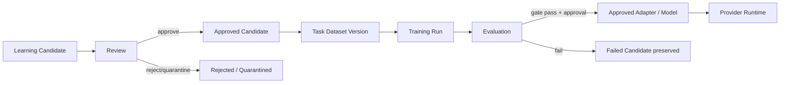
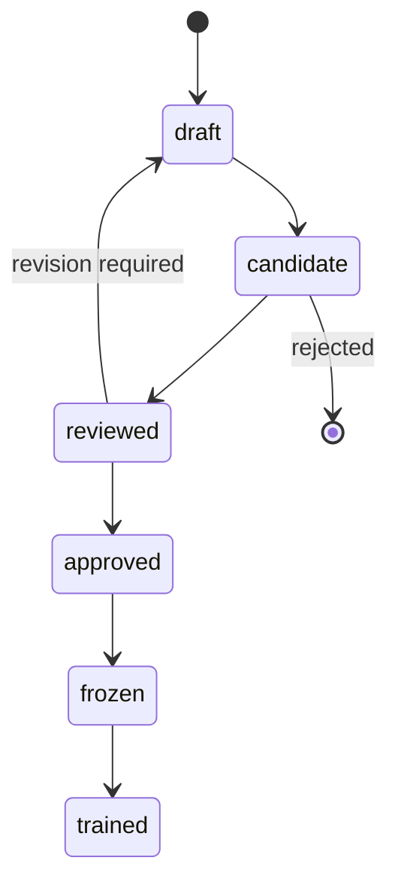
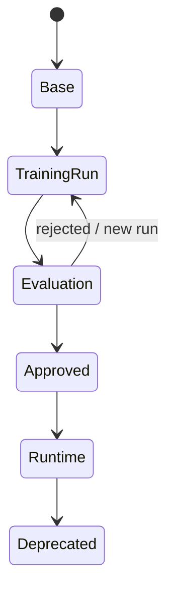

# DohaLM Continuous Learning Architecture

- 문서 상태: `draft`
- 마지막 검토일: 2026-08-11
- 구현 상태: `not_started`

## 1. 공식 흐름



[확정] 어떤 단계도 다음 단계로 자동 승격되지 않는다. 승인자는 actor, 시각, 입력 identity, 사유와 정책 version을 immutable evidence로 남긴다.

## 2. Learning Candidate 종류

| 종류 | 예 | 필수 추가 검토 |
|---|---|---|
| Human Authored | 사용자가 직접 작성한 가사·계획 | 권리·consent·PII |
| AI Generated | Provider가 생성한 계획·prompt | model/prompt identity, 품질, synthetic 표시 |
| Human Edited | AI 결과를 사용자가 수정 | before/after 권리, edit lineage |
| Preference | pairwise 선택·rating | 비교 조건, 편향, consent |
| Track Edit | track operation과 결과 | project scope, 실행 engine version |
| Section Edit | section별 수정 | section identity, context |
| Mix Edit | mix direction과 결과 | feature units, loudness/privacy |
| Prompt Edit | provider prompt 수정 | provider policy, prompt injection |
| Planning | song/structure plan | constraint·result 연결 |
| Reference Analysis | 분석 feature와 해석 | 원본 분리, feature provenance |
| Similarity Revision | risk report 기반 수정 | score version, 과잉 회피 검토 |

Candidate 공통 필드는 `candidate_id`, `kind`, `task`, `source_actor`, `consent`, `rights`, `input_refs`, `output_refs`, `edit_lineage`, `feature_refs`, `policy_version`, `created_at`, `content_fingerprint`다. 원본 audio URI는 Dataset payload가 아니라 접근 통제된 source reference로만 둔다.

## 3. Review Gate

1. 권리·license·consent와 목적 적합성
2. PII·민감정보·비밀·provider 약관
3. schema·단위·identity·fingerprint 완전성
4. 중복·near duplicate·evaluation leakage
5. reference 원본 비포함과 feature provenance
6. 품질·사실성·음악적 일관성
7. 유사도 위험과 악의적 prompt/feedback
8. task balance와 특정 사용자·장르 과대표현

Review 결과는 `approved`, `rejected`, `needs_revision`, `quarantined` 중 하나다. `approved`만 Dataset Version 입력이 된다.

## 4. Task Dataset 구조

```text
datasets/<task>/<dataset_version>/
  manifest.yaml
  train.jsonl
  validation.jsonl
  lineage.jsonl
  quality-sidecar.jsonl
  review-summary.json
  checksums.sha256
```

Task는 `lyrics_generation`, `lyrics_rewrite`, `planning`, `prompt_generation`, `track_edit`, `section_edit`, `mix_direction`, `similarity_revision`, `music_analysis`로 분리한다. 여러 task의 레코드를 한 split에 묵시적으로 혼합하지 않고 multi-task release는 각 child Dataset Version을 manifest에서 명시한다.

## 5. Dataset Lifecycle



| 상태 | 의미 | 불변 조건 |
|---|---|---|
| draft | 수집·정규화 중 | 학습 금지 |
| candidate | review 입력 고정 | content fingerprint 필요 |
| reviewed | gate 결과 존재 | reviewer evidence 필요 |
| approved | 목적별 사용 승인 | 자동 학습 금지 |
| frozen | split·schema·checksum 고정 | 변경 시 새 version |
| trained | training run에서 소비 | run identity 역참조 |

## 6. Model Lifecycle



`Base`, `Training Run`, `Evaluation`, `Approved`, `Runtime`, `Deprecated`는 별도 identity다. 평가 통과와 사용자/owner 승인을 모두 충족한 immutable artifact만 Runtime으로 승격한다. rollback을 위해 이전 Runtime과 compatibility manifest를 보존한다.

## 7. 저장과 Control Plane

- 초기 구현은 기존 YAML/JSON/JSONL immutable artifact를 재사용한다.
- 운영 질의가 필요해질 때 SQLite/Postgres는 **index/control plane**으로만 추가하고 artifact 원본과 checksum을 대체하지 않는다.
- DB 도입 전 schema, migration, backup, access control과 source-of-truth 우선순위를 별도 ADR로 결정한다.

## 변경 이력

| 날짜 | 변경 내용 |
|---|---|
| 2026-08-11 | Candidate 종류, review, task dataset, Dataset·Model lifecycle 초안 작성 |
