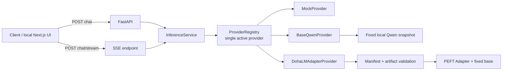
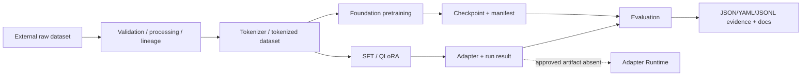
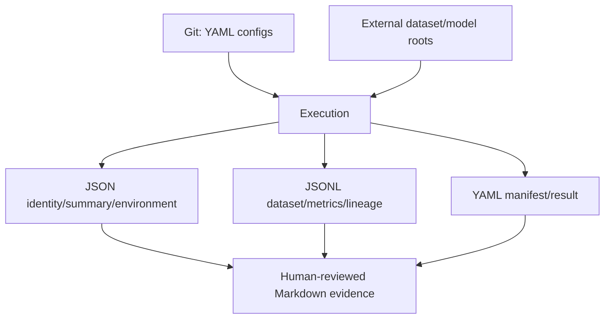

# DohaLM Current Architecture

- 문서 상태: `review`
- 마지막 검토일: 2026-08-11
- 기준: `develop` 구현과 현재 기준 문서

## 1. Runtime 연결

`ProviderRegistry`는 `mock`, `base-qwen`, `dohalm-adapter`를 만들고 환경 설정으로 하나를 활성화한다. Base Qwen과 Adapter는 lazy load, 단일 generation concurrency, timeout, cancellation과 shutdown unload를 제공한다. Adapter provider는 manifest·checksum·base identity가 맞지 않으면 fail closed한다.

## 2. Training·Evaluation 연결

학습과 서비스는 코드·문서·manifest 계약으로만 이어지고 자동 승격 control plane은 없다. 평가가 끝났다고 Provider가 자동 교체되지 않으며, 현재 eligible Adapter가 없어 Adapter Runtime은 unavailable이다.

## 3. REST·Streaming surface

| Endpoint | 역할 | 상태 |
|---|---|---|
| `GET /health` | process liveness | MVP implemented |
| `GET /ready` | provider readiness | MVP implemented |
| `GET /models` | provider/model metadata | MVP implemented |
| `POST /chat` | non-stream generation | MVP implemented |
| `POST /chat/stream` | SSE generation | MVP implemented |

음악 planning, track/section edit intent, mix direction, analysis interpretation용 typed endpoint는 없다.

## 4. 저장 구조

SQLite를 중심으로 한 중앙 DB가 아니라 immutable 파일 artifact와 문서 판정이 중심이다. 이는 재현성과 Git 비공개 경계에는 유리하지만, candidate 조회·review queue·승격 상태를 통합 관리하기 어렵다.

## 5. 현재 아키텍처의 재사용 가능점과 공백

| 재사용 가능 | 공백 |
|---|---|
| strict manifest·checksum·lineage | capability·task registry 없음 |
| dataset validation·PII·leakage gate | 사용자 edit/feedback candidate schema 없음 |
| checkpoint/resume·QLoRA | 음악 task dataset/evaluation 없음 |
| Provider lifecycle·REST/SSE | approved artifact 자동/수동 promotion contract 없음 |
| text-free evaluation evidence 원칙 | reference feature·similarity·risk pipeline 없음 |

## 변경 이력

| 날짜 | 변경 내용 |
|---|---|
| 2026-08-11 | 학습·추론·REST·Streaming·Provider·저장 구조 현행 연결 작성 |
