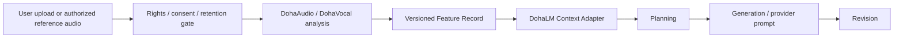
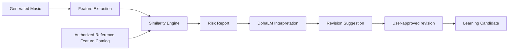

# Reference Analysis and Similarity Architecture

- 문서 상태: `draft`
- 마지막 검토일: 2026-08-11
- 구현 상태: `not_started`

## 1. Reference Analysis

원본 audio는 접근 통제된 임시/프로젝트 저장소에 남고 DohaLM에는 source fingerprint와 Feature Record만 전달한다. retention 종료 시 원본을 삭제해도 Feature Record의 분석기 version·단위·신뢰도·provenance는 남긴다. Feature Record의 장기 보관·학습 사용은 별도 consent를 요구한다.

## 2. Feature Record

| Feature | 표현 예 | 필수 metadata |
|---|---|---|
| BPM | value + confidence | extractor version, time range |
| Key | tonic/mode + confidence | tuning reference |
| Meter | numerator/denominator, changes | beat grid version |
| Structure | section labels + intervals | segmentation confidence |
| Chord Progression | time-aligned symbolic chords | vocabulary/version |
| Arrangement | layer/role timeline | taxonomy version |
| Instrument | multi-label intervals | classifier/version |
| Energy Curve | normalized time series | window, normalization |
| Rhythm | onset/density patterns | resolution |
| Groove | swing/syncopation descriptors | estimator/version |
| Vocal Melody Feature | contour/range/interval statistics | no recoverable raw vocal |
| Melody Feature | contour/interval/n-gram statistics | quantization/version |
| Mix Characteristic | loudness, spectral, width, dynamics | units, channel policy |

각 Feature Record에는 `feature_record_id`, `source_fingerprint`, `analysis_provider`, `schema_version`, `extractor_versions`, `created_at`, `consent_scope`, `retention_class`, `confidence`를 둔다.

## 3. Similarity 흐름

Reference Feature Catalog에는 권리·목적·retention이 확인된 feature만 등록한다. similarity는 같은 feature schema/version끼리 계산하며, version이 다르면 비교 불가 또는 명시적 migration 상태로 처리한다.

## 4. Similarity 항목

| 항목 | 의미 | 주의 |
|---|---|---|
| Overall | 가중 종합 신호 | 단일 법률 판정 금지 |
| Melody | pitch contour·interval pattern | key/tempo normalization 기록 |
| Vocal Melody | vocal contour·range | 음성 원본 복원 방지 |
| Chord | progression pattern | 흔한 진행 과대경고 방지 |
| Rhythm | onset·duration pattern | tempo normalization |
| Structure | section 순서·길이 | 장르 관습 고려 |
| Arrangement | instrument role·entry pattern | taxonomy confidence |
| Embedding | learned representation distance | model/version/bias 기록 |
| Section | 구간별 최대 위험 | interval evidence 필요 |
| Risk | 정책 기반 severity | score와 별도 층 |

Risk Report는 `comparison_id`, 양쪽 feature identity, metric version, per-section scores, confidence, limitations, severity, evidence refs를 포함한다. threshold는 실제 calibration dataset과 법무/정책 검토 전 `[검증 필요]`다.

## 5. Learning 경계

- [확정] Reference 원본과 reference의 재현 가능한 representation을 직접 학습하지 않는다.
- [제안] 학습 대상은 분석 결과를 사용한 planning, 사용자가 만든 결과, 사용자 수정·선호, similarity risk를 낮춘 revision의 승인된 record다.
- [확정] Risk Report 자체가 자동 정답은 아니다. 사용자/검토자가 수정을 수용하고 권리·품질 gate를 통과해야 candidate가 된다.
- [검증 필요] melody/chord feature의 재식별 가능성, feature retention, catalog opt-out와 삭제 전파.

## 변경 이력

| 날짜 | 변경 내용 |
|---|---|
| 2026-08-11 | Reference Feature Record와 Similarity Risk·Revision·Learning 경계 초안 작성 |
