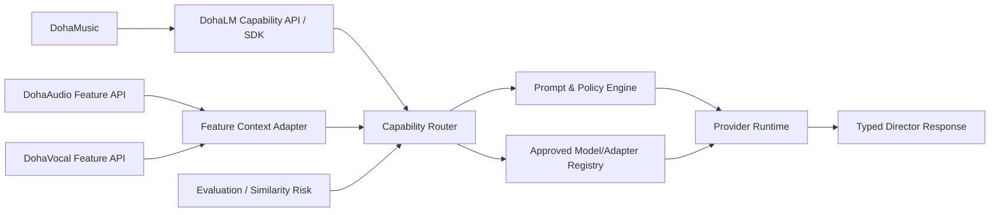
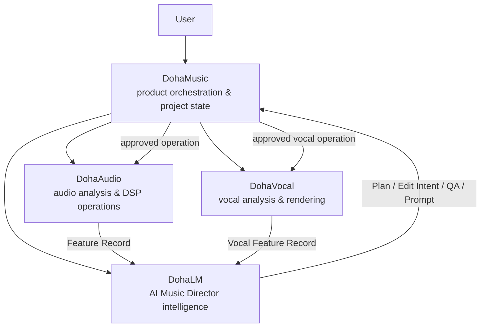

# DohaLM Target Architecture

- 문서 상태: `draft`
- 마지막 검토일: 2026-08-11
- 결정 상태: [ADR-012](../decisions/ADR-012-dohalm-ai-music-director-product-direction.md) 승인 대기

## 1. 제품 정의

[제안] DohaLM은 단순 Lyrics Generator가 아니라 **AI Music Director**다. 오디오를 직접 렌더링하는 엔진이 아니라 음악 제작 의도를 구조화하고, 계획·생성 prompt·편집 지시·QA·위험 해석을 제공하는 지능 계층이다.

```text
product_definition: ai_music_director_intelligence_provider
owns: planning, intent, prompt, interpretation, quality_direction
does_not_own: DAW UI, waveform/DSP execution, vocal rendering, project persistence
```

## 2. Capability Matrix

| Capability | 입력 | 출력 | 우선 task | 현재 상태 |
|---|---|---|---|---|
| Lyrics Generation | brief, language, constraints | structured lyrics | `lyrics_generation` | general text 기반만 존재 |
| Lyrics Rewrite | lyrics, edit intent | revised lyrics + rationale | `lyrics_rewrite` | not_started |
| Song Planning | brief, constraints, reference context | song plan | `planning` | not_started |
| Genre Recommendation | intent, audience, context | ranked genres + rationale | `planning` | not_started |
| Structure Planning | duration, genre, arc | section timeline | `planning` | not_started |
| Music Prompt Generation | plan, provider target | versioned provider prompt | `prompt_generation` | Prompt Engine 없음 |
| Track Edit Intent | track context, user edit | typed track operations | `track_edit` | not_started |
| Section Edit Intent | section context, edit | typed section operations | `section_edit` | not_started |
| Composition Operation | plan, project state | composition operation list | `planning` | not_started |
| Mix Direction | feature context, intent | mix direction | `mix_direction` | not_started |
| Music QA | plan, feature record, result | issue list + fixes | `music_analysis` | not_started |
| Reference Analysis Interpretation | feature record | semantic context | `music_analysis` | not_started |
| Similarity Report Interpretation | risk report | prioritized revision | `similarity_revision` | not_started |
| Provider Prompt Generation | capability output, provider contract | provider-specific payload | `prompt_generation` | generic chat만 존재 |

## 3. 목표 Runtime



### 핵심 계약

1. 모든 요청은 `capability`, `task_schema_version`, `project_context`, `policy_context`를 가진다.
2. Capability Router는 승인된 model/adapter와 prompt template만 선택한다.
3. Provider Runtime은 vendor별 prompt·streaming 차이를 숨기되 identity와 trace를 결과에 남긴다.
4. 응답은 자유 text만 반환하지 않고 plan, edit intent, direction, risk interpretation 등의 typed payload를 제공한다.
5. production 요청이 자동으로 학습 데이터가 되지 않는다. 별도 candidate consent·review가 필요하다.

## 4. Doha 제품 관계



| 시스템 | 소유 책임 | 소유하지 않는 것 |
|---|---|---|
| DohaMusic | UI, project state, workflow, 사용자 승인, orchestration | model training, low-level analysis engine |
| DohaLM | planning, intent, prompt, interpretation, learning governance | raw audio 보관, DSP 실행, DAW state |
| DohaAudio | audio feature extraction, DSP/edit execution | 제품 의사결정, LLM training |
| DohaVocal | vocal feature extraction, vocal processing/rendering | 전체 곡 planning, Dataset 승인 |

## 5. 비목표와 안전 경계

- [제외] 원본 reference audio를 DohaLM Dataset에 복사하거나 직접 학습한다.
- [제외] similarity score를 법률 판단 또는 표절 단정으로 사용한다.
- [제외] 사용자 승인 없이 작업 결과·수정 이력을 학습 후보로 수집한다.
- [제외] 이번 설계만으로 기존 Foundation 연구 계보를 삭제한다.
- [검증 필요] 음악 feature schema, 외부 provider별 허용 데이터, retention·consent 정책.

## 변경 이력

| 날짜 | 변경 내용 |
|---|---|
| 2026-08-11 | AI Music Director capability와 Doha 제품 책임 경계 초안 작성 |
