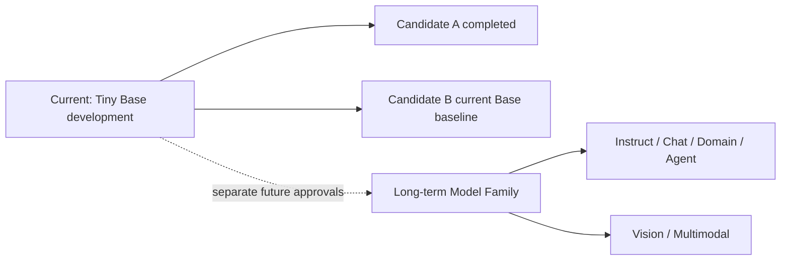
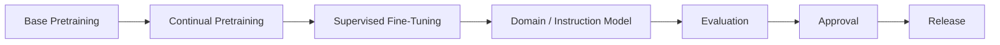

# DohaLM Foundation Model Strategy

- 문서 상태: `review`
- 마지막 검토일: 2026-07-28
- 적용 범위: 장기 제품·연구 방향과 Model Family 거버넌스
- 현재 실행 권한 영향: 없음
- 관련 문서: [Model Family Roadmap](./model-family-roadmap.md), [Model Lineage](./model-lineage.md), [현재 프로젝트 상태](./current-project-status.md)

## 1. 장기 비전

- [제안] DohaLM은 단일 Tiny 실험을 넘어 한국어 중심 Foundation Model 개발 체계와 파생 모델 생태계를 구축하는 것을 장기 목표로 한다.
- [확정] 현재 범위는 `DohaLM-Tiny` 기반 Base Pretraining 체계의 구현·검증이다. Tiny는 최종 규모가 아니라 데이터, tokenizer, 학습, checkpoint, 평가와 승인 계보를 검증하는 첫 단계다.
- [장기 계획] 승인된 Base를 바탕으로 Instruct, Chat, Code, SQL, Recruit, Game, Agent와 Vision/Multimodal 계열을 별도 lineage로 확장한다.
- [확정] 이 전략은 Candidate A/B의 budget, 평가 계약, 승인 상태나 실행 권한을 변경하지 않는다.

## 2. Foundation 철학

- [제안] Base Model은 모든 파생 모델의 공통 언어 기반이며, 승인된 Base artifact는 immutable baseline으로 취급한다.
- [제안] 기존 Base weight나 checkpoint를 덮어쓰지 않는다. 데이터, tokenizer, architecture, context 또는 objective가 바뀌면 새 Base version이나 명시적인 continual-pretraining derivative를 만든다.
- [제안] 모든 derivative는 parent model과 checkpoint fingerprint, dataset·tokenizer·config·run·evaluation lineage를 기록한다.
- [제안] Domain 성능과 Base 회귀를 분리 평가하며, Domain 개선이 Base 성능 보존을 자동으로 의미하지 않는다.
- [확정] 학습 승인, 평가 승인, publication 승인은 서로 독립된 절차다.

“Base를 직접 수정하지 않는다”는 승인된 Base artifact의 bytes·checkpoint·manifest를 덮어쓰거나, 같은 version 이름으로 재학습 결과를 교체하거나, Domain SFT 결과를 Base로 재명명하지 않는다는 뜻이다. 새 Base version, 새 dataset·architecture를 적용한 별도 Base lineage, 명시적 CPT derivative와 parent가 기록된 파생 모델은 별도 승인 아래 허용할 수 있다.

- 금지: 승인 Base 덮어쓰기, 동일 version 결과 교체, Domain 결과의 Base 재명명, parent 없는 derivative 생성.
- 허용 후보: 새 Base version, 별도 dataset·architecture Base lineage, 명시적 CPT derivative, fingerprint가 고정된 parent 기반 derivative.

## 3. 현재와 장기의 경계

| 구분 | 범위 | 상태 |
|---|---|---|
| 현재 Foundation·Base Tiny | 운영 16k tokenizer, canonical lineage, Candidate B current baseline, Candidate A historical baseline | `completed` |
| Base 재평가 | Candidate B ADR-008 reassessment·experimental parent 적격성 | `approved` |
| Instruct | Candidate B parent 기반 전략·schema·evaluation·safety·readiness | `design_completed_execution_not_approved` |
| 기타 파생 언어 모델 | Chat, Code, SQL, Recruit, Game, Agent | `not_started` / `long_term_planned` |
| Multimodal | Vision encoder·LLM 연결, image-text alignment | `long_term_planned` |
| 공개·배포 | model card, license, safety, lineage, evaluation, publication approval | `not_approved` |

## 4. 학습·파생 파이프라인

- [제안] CPT는 Base를 수정하는 작업이 아니라 새 derivative를 만드는 작업이다.
- [제안] Base Pretraining은 범용 next-token 표현을 만들고, CPT는 필요한 도메인 분포에 적응하며, SFT는 지시·형식·task response를 학습한다.
- [제안] Domain/Instruction 모델은 domain 평가와 Base 회귀 평가를 모두 통과한 뒤 평가 승인으로 이동한다.
- [제안] Release에는 checkpoint, model card, license, limitations, lineage, evaluation과 safety 정보에 대한 별도 publication 승인이 필요하다.
- [확정] 현재 SFT, RLHF, preference optimization과 release는 승인되지 않았다.
- [확정] Candidate A와 Candidate B는 Model Family 이름이 아니라 Base Pretraining 후보·실험 단계다.

## 5. Scale과 Version

- [제안] Scale과 version을 분리한다. `Tiny v1 → Tiny v2 → Small → Medium → Large`는 자동 승격 순서가 아니다.
- [제안] Dataset, tokenizer, architecture, context, objective, 안전 정책 또는 핵심 평가 계약이 바뀌면 새 version 후보로 검토한다.
- [제안] 문서·metadata·동일 weight packaging 교정은 revision으로 관리할 수 있다.
- [검증 필요] Small 이상 parameter 수, architecture, context와 하드웨어 예산은 Tiny 실측과 별도 ADR 전까지 확정하지 않는다.

모델 ID 제안은 `dohalm-{family}-{scale}-v{major}` 형식이다. 현재 artifact 이름은 변경하지 않는다.

예시는 `dohalm-base-tiny-v1`, `dohalm-base-tiny-v2`, `dohalm-instruct-tiny-v1`, `dohalm-code-small-v1`, `dohalm-sql-small-v1`이다. `Tiny v1 → Tiny v2 → Small → Medium → Large`는 후보 흐름일 뿐 별도 데이터·자원·ADR·승인 없이 자동 진행하지 않는다.

## 6. 현재 실행과의 비충돌

- Candidate A 완료 상태와 historical Full baseline fingerprint를 변경하지 않는다.
- Candidate B는 25,000,000 requested token, 25,001,984 scheduled token, 12,208 step, fresh seed 17을 유지한다.
- Candidate B Run 0002 training은 완료됐다. historical 계약 판정은 `evaluated_contract_not_passed`로
  보존하고 ADR-009 current reassessment는 `approved_as_base_baseline`이다.
- Candidate B derivative parent eligibility는 `approved_experimental`이지만 실제 Instruct·Chat·Domain
  training과 publication은 `not_approved`다.
- 장기 Family 계획은 Dataset·Tokenizer·Packing·EOS·Evaluation 계약의 변경 승인이 아니다.
- EOS 종료 계약은 [승인 정책](../evaluation/eos-success-policy.md)에서 Base·Instruct·Chat과 service decoding을 분리한다.
- ADR-010은 Instruct 설계만 승인한다. Candidate B Base는 immutable이고 dataset·backend·SFT·evaluation 실행과
  Chat 생성은 승인되지 않았다.

## 변경 이력

| 날짜 | 변경 내용 |
|---|---|
| 2026-07-28 | ADR-010 Instruct design_completed·execution_not_approved 경계 반영 |
| 2026-07-28 | Foundation Model 장기 비전, immutable Base 원칙, 파생·scale·승인 경계 초안 작성 |
