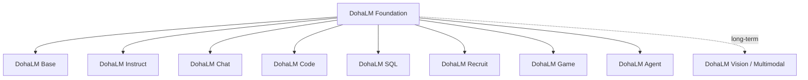

# DohaLM Model Family Roadmap

- 문서 상태: `review`
- 마지막 검토일: 2026-07-28
- 현재 실행 권한 영향: 없음
- 관련 문서: [Foundation Strategy](./foundation-model-strategy.md), [Domain Strategy](./domain-model-strategy.md), [Model Lineage](./model-lineage.md)

## 1. Family 구조

화살표는 가능한 기본 lineage를 보여 주며 단일 고정 구조가 아니다. 실제 parent는 각 모델 manifest와 승인 기록이 결정한다.

## 2. Family 계약

| Family | Primary purpose | 기본 Parent | Training method 후보 | Data category | Main evaluation | Current status | Release scope | Notes |
|---|---|---|---|---|---|---|---|---|
| Base | 한국어 범용 next-token 기반 | 없음 또는 이전 Base | Base pretraining, 명시적 CPT | 승인된 범용 corpus | Full internal loss·PPL·Top-k·EOS·stability | `in_progress` | `not_approved` | Tiny 단계; Candidate A/B는 Base 후보 단계 |
| Instruct | 지시 이해·형식 준수·task 수행 | 승인된 Base | SFT, 별도 승인 preference | instruction·response | instruction following·format·safety | `long_term_planned` | `not_approved` | 현재 SFT 미승인 |
| Chat | 다중 턴 대화·맥락 유지 | Instruct 우선 후보 | dialogue SFT, 별도 preference | multi-turn dialogue | coherence·retention·relevance·safety | `long_term_planned` | `not_approved` | Base 직접 파생 시 근거 필요 |
| Code | 생성·설명·debug·test | Base 또는 Code CPT | code CPT, code SFT | source·docs·tests·fix pairs | compile·unit test·functional·security | `long_term_planned` | `not_approved` | 라이선스·secret·benchmark 오염 검토 |
| SQL | SQL 생성·수정·교육 | Base 또는 domain CPT | SQL CPT/SFT | schema·query·explanation | parse·execution·result·dialect | `long_term_planned` | `not_approved` | dialect별 평가 분리 |
| Recruit | JD·지원 문서·면접 보조 | Base/Instruct | domain CPT/SFT | JD·career writing | relevance·factuality·privacy·bias | `long_term_planned` | `not_approved` | 채용 의사결정 자동화와 구분 |
| Game | NPC·quest·lore·world state | Base/Instruct | domain CPT/SFT | dialogue·quest·lore·rules | lore·state·quest·repetition | `long_term_planned` | `not_approved` | IP와 player PII 검토 |
| Agent | tool calling·workflow·recovery | Instruct 우선 후보 | tool-calling SFT | schema·action traces | selection·arguments·permission·recovery | `long_term_planned` | `not_approved` | Chat과 별도 권한 경계 |
| Vision / Multimodal | image-text 이해·OCR·VQA | 승인된 Base + vision 구성 | multimodal alignment | image-text pairs | VQA·OCR·grounding·safety | `long_term_planned` | `not_approved` | 현재 범위 밖 |

- Code 언어 후보는 Python, Java, C++, Rust, JavaScript/TypeScript와 Shell이며 SQL은 별도 family로 관리한다.
- SQL dialect 후보는 ANSI SQL, MySQL, PostgreSQL과 Oracle이며 학습·평가는 dialect별로 구분한다.
- Recruit는 이력서·경력기술서·자기소개서·JD 분석·면접 준비·지원 workflow를 지원 후보로 삼되 자동 채용 의사결정은 별도 고위험 범위로 둔다.
- Game은 NPC dialogue, quest, lore, world building, 운영 보조와 player interaction을 후보로 삼는다.
- Agent는 tool calling, structured output, planning, workflow와 외부 시스템 연동을 다루며 단순 Chat과 권한·실행 안전성 계약을 분리한다.

## 3. Roadmap Track

- Track A — Current Base Development: Tiny, tokenizer, lineage, Gates, Pilot, Candidate A, Evaluation, Candidate B.
- Track B — Foundation Scale: Tiny v1/v2, Small, Medium, Large. 각 단계는 별도 데이터·자원·ADR·승인 대상이다.
- Track C — Model Family: Instruct, Chat, Code, SQL, Recruit, Game, Agent, Vision/Multimodal.
- Track D — Release and Governance: model/dataset card, license, safety, lineage, evaluation, publication approval.

현재 Candidate B는 Track A에만 속한다. 다른 Track은 자동으로 시작되지 않는다.

## 변경 이력

| 날짜 | 변경 내용 |
|---|---|
| 2026-07-28 | Base 중심 Model Family, 목적·parent·학습·데이터·평가·공개 경계 초안 작성 |
