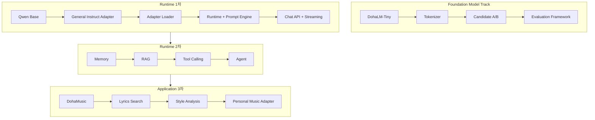

# DohaLM Roadmap

- 문서 상태: `review`
- 마지막 검토일: 2026-08-04
- 기준 문서: [README](../../README.md)
- 현재 상태: [Current Project Status](./current-project-status.md)
- 현재 실행 권한 영향: 없음

## 1. Roadmap 원칙

- Foundation Model 연구와 Runtime/Application 개발은 별도 트랙으로 관리합니다.
- 앞 단계의 설계 완료는 다음 단계의 구현·학습·배포 승인이 아닙니다.
- 현재 구현 상태는 이 문서가 아니라 [Current Project Status](./current-project-status.md)에서 판정합니다.
- Docker, Kubernetes, Cloud와 운영 배포는 이 Roadmap에서 제외합니다.

## 2. 트랙과 순서

두 첫 번째 트랙은 병행할 수 있지만 자동 lineage 관계는 없습니다. 특히 Candidate B weight를 Qwen Runtime의 Base로
간주하거나 Qwen Adapter를 Foundation Instruct로 간주하지 않습니다.

## 3. Foundation Model Track

| 단계 | 완료 조건 | 현재 상태 | 다음 결정 |
|---|---|---|---|
| DohaLM-Tiny | 승인 구조, forward/loss/generation, Trainer·resume·overfit | `implemented_verified` | 회귀 유지 |
| Tokenizer | 운영 artifact, ID·fingerprint, 품질 검증 | `implemented_verified` | 변경 시 새 version/ADR |
| Candidate A/B | 고정 budget·checkpoint·Full 평가·lineage | `implemented_verified` | Candidate B current baseline 유지 |
| Evaluation Framework | Quick/Full/EOS/stability/privacy/lineage | `implemented_verified` | 후속 모델에도 동일 분리 원칙 적용 |
| Foundation Instruct | Candidate B parent, data·SFT·평가 승인 | `design_complete` | 실행 승인 전 대기 |
| Foundation Chat / Scale-up | 선행 Instruct·자원·새 ADR | `planned` | 현재 우선순위 아님 |

## 4. Runtime/Application 1차 목표

| 순서 | 구성 | 완료 조건 | 현재 상태 |
|---:|---|---|---|
| 1 | Qwen Base | 고정 revision local load, generate/stream/unload GPU smoke | `implemented_verified` |
| 2 | General Instruct Adapter (QLoRA) | 선정된 Adapter가 Base 대비 평가와 runtime eligibility 통과 | `implemented_not_integrated` |
| 3 | Runtime | Provider lifecycle, timeout, cancellation, memory 회수 | `implemented_verified` |
| 4 | Adapter Loader | 명시적 경로·fingerprint·Base compatibility·fail-closed load/unload | `planned` |
| 5 | Chat API | schema, health/readiness/models, 오류·보안 경계 | `implemented_verified` |
| 6 | Streaming | SSE 순서, 취소, timeout, worker 정리 | `implemented_verified` |
| 7 | Prompt Engine | versioned template, role/system policy, token budget, test | `design_complete` |

1차 완료 판정에는 Base Qwen 경로뿐 아니라 **승인된 Adapter를 통한 end-to-end Chat·Streaming 검증**이 필요합니다.
현재 Web UI는 Base Qwen까지 검증됐지만 Adapter Loader가 없어 1차 전체는 완료가 아닙니다.

## 5. 2차 목표

1. **Memory**: 저장 범위, 사용자 격리, 삭제·보존과 prompt 주입 경계부터 설계
2. **RAG**: source ingestion, chunk·index lineage, citation과 retrieval evaluation 구현
3. **Tool Calling**: schema validation, 권한, timeout, 결과 provenance와 user confirmation 구현
4. **Agent**: 위 구성 위에서 제한된 workflow와 recovery를 구현

모두 `planned`입니다. Tool Calling 전략 문서가 존재해도 실행 Runtime이 구현된 것은 아닙니다.

## 6. 3차 목표 — DohaMusic

DohaMusic은 새 범용 Runtime을 만들지 않고 1차 General Instruct Runtime을 재사용합니다.

| 순서 | 구성 | 선행 조건 | 현재 상태 |
|---:|---|---|---|
| 1 | DohaMusic shell | 1차 Runtime 안정화 | `planned` |
| 2 | Lyrics Search | RAG, 가사 이용조건·인용 정책 | `planned` |
| 3 | Style Analysis | 평가 taxonomy와 저작권·모방 안전 경계 | `planned` |
| 4 | Personal Music Adapter | 사용자 데이터 동의·격리·삭제, Adapter Loader | `planned` |

## 7. 장기 후보

Code, SQL, Recruit, Game과 Vision/Multimodal은 삭제된 목표가 아니라 현재 1~3차 순서 밖의 장기 후보입니다.
별도 요구·데이터·평가·ADR이 생기기 전에는 `planned`보다 높은 상태를 부여하지 않습니다.

## 변경 이력

| 날짜 | 변경 내용 |
|---|---|
| 2026-08-04 | 기존 Model Family 혼합 구조를 Foundation, Runtime 1·2차, DohaMusic 3차 순서로 재구성 |
| 2026-07-28 | Base·Instruct·Chat·Domain 중심 장기 Family 초안 작성 |
