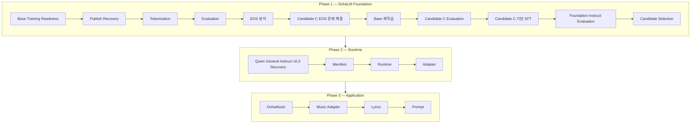

# DohaLM Roadmap

- 문서 상태: `review`
- 마지막 검토일: 2026-08-05
- 기준 문서: [README](../../README.md)
- 선행 문서: [Foundation Strategy](./foundation-model-strategy.md), [Current Project Status](./current-project-status.md)
- 현재 실행 권한 영향: 없음

## 1. Roadmap 원칙

- Foundation을 프로젝트의 최우선 Phase로 진행합니다.
- Runtime은 삭제하지 않고 Foundation 완료 이후 진행하는 실제 서비스용 병행 트랙으로 유지합니다.
- Application은 Runtime을 사용하며 Foundation이나 Runtime 자체의 완료 조건을 대신하지 않습니다.
- 앞 단계의 설계 완료는 다음 단계의 구현·학습·배포 승인이 아닙니다.
- 현재 구현 상태는 [Current Project Status](./current-project-status.md)에서만 판정합니다.
- Docker, Kubernetes, Cloud와 운영 배포는 이 Roadmap에서 제외합니다.

## 2. 공식 개발 순서



## 3. Phase 1 — DohaLM Foundation

Foundation Candidate B, Candidate C와 Foundation Instruct는 프로젝트의 핵심 목표입니다.

### 3.1 DohaLM Base 본훈련 준비

| 순서 | 작업 | 완료 경계 | 현재 상태 |
|---:|---|---|---|
| 1 | Base Training Readiness | identity·data·tokenizer·config·resource·approval 준비 | 기존 기반 구현·근거 존재, 후속 실행 별도 승인 |
| 2 | Publish Recovery | 실패 계보 보존, immutable recovery와 publish 계약 | 관련 계약·구현 상태는 Current Status 참조 |
| 3 | Tokenization | 승인 artifact·fingerprint·lineage·no-replace publish | 후속 실제 실행 별도 승인 |
| 4 | Evaluation | Quick·Full·position·stability·privacy·lineage 분리 | framework `implemented_verified` |
| 5 | EOS 분석 | teacher-forced·pure generation·decoding-assisted 분리 | Candidate B 한계 기록 완료, Candidate C 입력 |

Candidate B는 `implemented_verified` current Base baseline이며 Candidate C의 비교 기준입니다. Candidate A는 historical
baseline으로 보존합니다. 기존 상태나 artifact를 재명명하거나 덮어쓰지 않습니다.

### 3.2 Candidate C

```text
EOS 문제 해결 → Base 재학습 → Candidate C Evaluation
```

Candidate C는 `planned`입니다. EOS 해결 방식, 학습 budget, initialization, Dataset과 평가 threshold는 후속 설계·ADR·승인
전까지 확정하지 않습니다. Candidate B와 동일한 평가 분리·lineage 원칙을 적용해야 합니다.

### 3.3 Foundation Instruct

```text
Candidate C 기반 SFT → Evaluation → Candidate Selection
```

Foundation Instruct는 핵심 목표입니다. 현재 승인된 ADR-010과 구현 상태는 Candidate B 기반 설계 `design_complete`로
유지됩니다. Candidate C 기반 parent는 새로운 공식 목표이지만 자동 승인되지 않으며, 실제 SFT 전에 ADR-010을 대체하거나
개정하는 후속 ADR과 Dataset·학습·평가 승인이 필요합니다.

## 4. Phase 2 — Runtime

Runtime은 실제 서비스용 트랙입니다. Foundation 완료 이후 독립된 Qwen 계보로 진행하며 Foundation Candidate를 Qwen Base나
Adapter로 재명명하지 않습니다.

| 순서 | 구성 | 완료 조건 | 현재 상태 |
|---:|---|---|---|
| 1 | Qwen General Instruct v0.3 Recovery | evidence·identity·Approval·request·preflight·fresh recovery | synthetic 계약 일부 구현, 실제 실행 미승인 |
| 2 | Manifest | 단일 적격 Adapter와 Base·Tokenizer·평가 fingerprint 고정 | 실제 적격 후보 없음 |
| 3 | Runtime | Provider lifecycle, timeout, cancellation, memory 회수 | Base Qwen 경로 `implemented_verified` |
| 4 | Adapter | exact artifact load·generate·stream·cancel·unload·GPU 검증 | mock 통합, 실제 승인 Adapter 미검증 |

Memory, RAG, Tool Calling과 Agent는 Runtime 확장 후보이며 위 네 단계 이후 모두 `planned`입니다.

## 5. Phase 3 — Application

DohaMusic은 Phase 2 Runtime을 사용하는 Application입니다.

| 순서 | 구성 | 선행 조건 | 현재 상태 |
|---:|---|---|---|
| 1 | DohaMusic | 승인 Runtime과 Application 경계 | `planned` |
| 2 | Music Adapter | Adapter Loader, 음악 데이터 권리·평가 | `planned` |
| 3 | Lyrics | 합법적 source, 검색·인용·저작권 경계 | `planned` |
| 4 | Prompt | Runtime template·정책·version 계약 | `planned` |

세부 데이터·안전·평가 경계는 [Application 문서](./domain-model-strategy.md)를 따릅니다.

## 6. 장기 후보

Code, SQL, Recruit, Game과 Vision/Multimodal은 삭제된 목표가 아니라 공식 Phase 1~3 이후의 장기 후보입니다. 별도 요구,
데이터, 평가와 ADR이 생기기 전에는 `planned`보다 높은 상태를 부여하지 않습니다.

## 변경 이력

| 날짜 | 변경 내용 |
|---|---|
| 2026-08-05 | Foundation을 최우선 Phase로 재구성하고 Base 준비 → Candidate C → Foundation Instruct, 후속 Runtime, DohaMusic Application 공식 순서를 반영 |
| 2026-08-04 | Adapter Loader manifest·validator·lifecycle 설계 완료와 구현 미착수 상태 반영 |
| 2026-08-04 | 기존 Model Family 혼합 구조를 Foundation, Runtime 1·2차, DohaMusic 3차 순서로 재구성 |
| 2026-07-28 | Base·Instruct·Chat·Domain 중심 장기 Family 초안 작성 |
