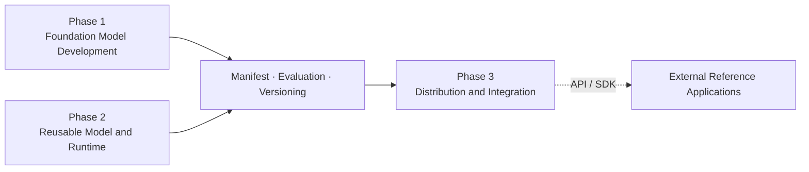

# DohaLM Roadmap

- 문서 상태: `review`
- 마지막 검토일: 2026-08-05
- 기준: [README](../../README.md), [Project Definition](./overview.md), [Current Status](./current-project-status.md)

## 1. Roadmap 원칙

- 현재 개발 우선순위는 Phase 1입니다.
- Phase 1과 Phase 2는 서로 다른 모델 계보를 가질 수 있으며 엄격한 직렬 단계가 아닙니다.
- Phase 2는 Runtime 코드뿐 아니라 reusable model artifact를 만듭니다.
- Phase 3는 승인된 model·Runtime을 API·SDK·release로 배포합니다.
- Reference Application은 별도 저장소에서 Phase 3 인터페이스를 소비합니다.

## 2. 전체 구조



이 연결은 Phase 1 model을 Qwen lineage의 parent로 강제하지 않습니다. 공통 출력 계약을 공유한다는 뜻입니다.

## 3. Phase 1 — Foundation Model Development

```text
Dataset → Tokenizer → DohaLM-Tiny → Base Pretraining → Evaluation → Foundation Base
```

1. Candidate A/B evidence와 Candidate B EOS 진단을 검토합니다.
2. Dataset·Tokenizer·Training Config를 검토하고 Candidate C readiness를 판정합니다.
3. Candidate C의 Dataset·Tokenizer·Config를 freeze합니다.
4. 별도 승인 후 GPU Smoke → Training → Evaluation → Candidate Selection을 수행합니다.
5. Foundation Instruct parent를 별도 결정한 뒤 SFT·Evaluation·Selection을 수행합니다.

현재 Candidate B가 baseline입니다. Candidate C contract design은 완료됐지만 readiness는 blocked이고 execution은 허용되지
않았습니다. Foundation Instruct는 planned이며 ADR-010과 차기 parent 목표 사이 후속 결정이 필요합니다.

## 4. Phase 2 — Reusable Model and Runtime

```text
Qwen Base / Instruct
  → Korean · General SFT
  → QLoRA Adapter / merged model
  → Evaluation
  → Versioned DohaLM Model
  → Inference Runtime
```

v0.3 recovery와 manifest·validator·loader·provider 이력은 유효합니다. 그러나 eligible candidate가 없어 실제 Adapter Runtime은
사용할 수 없습니다. 다음 진입은 recovery 자체 반복이 아니라 승인 가능한 artifact evidence와 candidate selection입니다.

## 5. Phase 3 — Distribution and Integration

```text
DohaLM model → runtime server → REST / Streaming → Python SDK
  → Integration Guide → Versioned Release
```

REST·Streaming MVP와 Base Qwen local E2E는 구현됐습니다. Python SDK는 `not_started`, Integration Guide와 local versioned
release는 `planned`입니다. Cloud deployment는 `out_of_scope`입니다.

## 6. Reference Applications

DohaMusic은 별도 저장소의 첫 Reference Application이며 `planned`입니다. UI·음악 비즈니스·가사 편집·개인화는 DohaMusic이,
모델 로딩·추론·streaming·prompt·Adapter·versioning은 DohaLM이 담당합니다. DohaWriter와 DohaCode는 후속 후보입니다.

## 7. 다음 공식 작업

현재 우선순위 안에서 다음 작업은 실제 Candidate B artifact를 사용하는 `EOS-DIAG-R3` 진입 가능성을 Gate와 승인 범위에 따라
판정하는 것입니다. 이는 Candidate C 학습 승인이나 Phase 2·3 구현 승인을 뜻하지 않습니다.

## 변경 이력

| 날짜 | 변경 내용 |
|---|---|
| 2026-08-05 | 세 Phase를 산출물 기준으로 재정의하고 Foundation·Qwen 계보의 비직렬 관계와 외부 Reference Application 연결 반영 |
