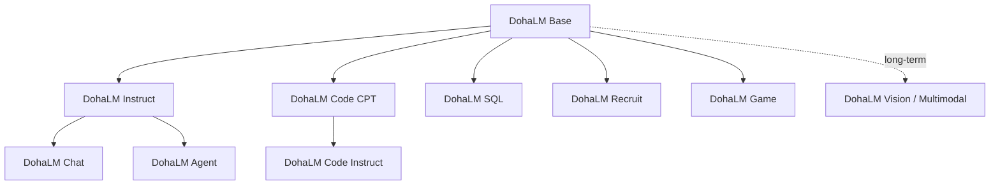
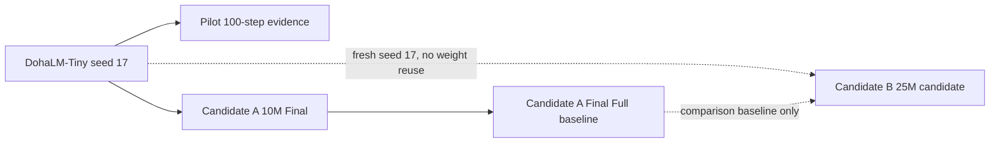

# DohaLM Model Lineage

- 문서 상태: `review`
- 마지막 검토일: 2026-07-28
- 관련 문서: [Foundation Strategy](./foundation-model-strategy.md), [Artifact Policy](../governance/artifact-and-configuration-policy.md)

## 1. 기본 원칙

- [제안] 승인된 Base artifact는 immutable parent다. 기존 weight, checkpoint와 manifest를 덮어쓰지 않는다.
- [제안] 모든 derivative는 parent identity 없이 생성할 수 없도록 fail-closed로 관리한다.
- [제안] 같은 이름의 결과 교체를 금지하며 새 model ID, version, run ID와 fingerprint를 만든다.
- [확정] 학습 완료와 evaluation·publication 승인은 별개다.

## 2. 가능한 lineage

예시는 lineage 가능성을 설명할 뿐 실제 모델 생성이나 승인을 뜻하지 않는다.

- `DohaLM Base Tiny v1 → DohaLM Instruct Tiny v1 → DohaLM Chat Tiny v1`
- `DohaLM Base Tiny v1 → DohaLM Code CPT Tiny v1 → DohaLM Code Instruct Tiny v1`
- `DohaLM Base Small v1 → DohaLM Recruit CPT Small v1 → DohaLM Recruit Instruct Small v1`

## 3. 필수 metadata

| Field | 의미 |
|---|---|
| `model_id`, `family`, `version`, `scale` | 모델 식별자 |
| `parent_model_id` | 직접 parent model |
| `parent_checkpoint_fingerprint` | parent weight identity |
| `derivation_type` | 파생 방식 |
| `dataset_lineage` | source·preprocess·split·PII identity |
| `tokenizer_identity` | tokenizer ID·fingerprint |
| `config_fingerprint` | resolved model/training config |
| `training_run_id` | 실행 identity |
| `evaluation_result` | 동일 identity 평가 결과 |
| `approval_state` | 학습·평가 승인 상태 |
| `publication_state` | 공개·재배포 상태 |
| `superseded_state` | 대체 여부와 후속 모델 |

`derivation_type` 후보는 `base_pretraining`, `continual_pretraining`, `supervised_fine_tuning`, `instruction_tuning`, `preference_optimization`, `domain_adaptation`, `tool_calling_tuning`, `multimodal_alignment`다.

## 4. 현재 lineage

- [확정] Candidate B는 Candidate A checkpoint를 parent weight로 사용하지 않는다.
- [확정] Candidate A Final Full은 Candidate B의 공식 comparison baseline이지 initialization parent가 아니다.
- [확정] Candidate B Run 0002 training은 완료됐고 추가 training과 publication은 승인되지 않았다.
- [확정] Candidate B의 official Base baseline 여부는 `false`, reassessment는 `awaiting_separate_approval`,
  derivative parent eligibility는 `proposed`다.
- [확정] Base·Instruct·Chat·Agent의 종료 의미는 [EOS Success Policy](../evaluation/eos-success-policy.md)와
  [Model Family Roadmap](./model-family-roadmap.md)에 따라 분리한다.

## 변경 이력

| 날짜 | 변경 내용 |
|---|---|
| 2026-07-28 | Base immutable 원칙, 필수 lineage metadata와 현재 Candidate 관계 초안 작성 |
