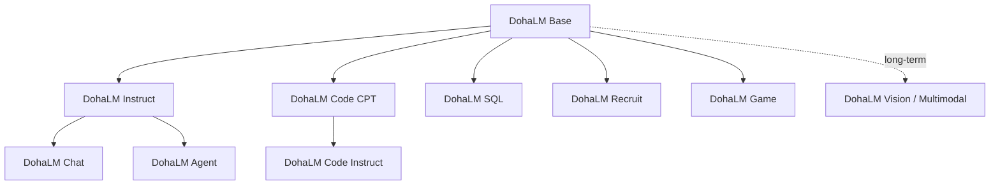
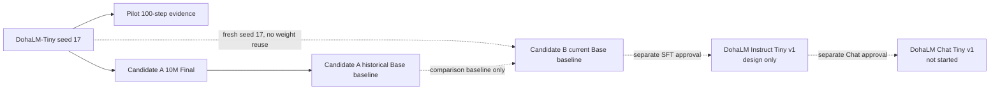

# DohaLM Model Lineage

- 문서 상태: `review`
- 마지막 검토일: 2026-08-04
- 관련 문서: [Foundation Strategy](./foundation-model-strategy.md), [Artifact Policy](../governance/artifact-and-configuration-policy.md)

## 1. 기본 원칙

- [제안] 승인된 Base artifact는 immutable parent다. 기존 weight, checkpoint와 manifest를 덮어쓰지 않는다.
- [제안] 모든 derivative는 parent identity 없이 생성할 수 없도록 fail-closed로 관리한다.
- [제안] 같은 이름의 결과 교체를 금지하며 새 model ID, version, run ID와 fingerprint를 만든다.
- [확정] 학습 완료와 evaluation·publication 승인은 별개다.

## 2. 가능한 lineage



예시는 lineage 가능성을 설명할 뿐 실제 모델 생성이나 승인을 뜻하지 않는다.

- `DohaLM Base Tiny v1 → DohaLM Instruct Tiny v1 → DohaLM Chat Tiny v1`
- `DohaLM Base Tiny v1 → DohaLM Code CPT Tiny v1 → DohaLM Code Instruct Tiny v1`
- `DohaLM Base Small v1 → DohaLM Recruit CPT Small v1 → DohaLM Recruit Instruct Small v1`

## 3. 필수 metadata

| Field | 의미 |
|---|---|
| `model_id`, `family`, `version`, `scale` | 모델 식별자 |
| `parent_model_id` | 직접 parent model |
| `parent_checkpoint_fingerprint` | parent weight identity |
| `derivation_type` | 파생 방식 |
| `dataset_lineage` | source·preprocess·split·PII identity |
| `tokenizer_identity` | tokenizer ID·fingerprint |
| `config_fingerprint` | resolved model/training config |
| `training_run_id` | 실행 identity |
| `evaluation_result` | 동일 identity 평가 결과 |
| `approval_state` | 학습·평가 승인 상태 |
| `publication_state` | 공개·재배포 상태 |
| `superseded_state` | 대체 여부와 후속 모델 |

`derivation_type` 후보는 `base_pretraining`, `continual_pretraining`, `supervised_fine_tuning`, `instruction_tuning`, `preference_optimization`, `domain_adaptation`, `tool_calling_tuning`, `multimodal_alignment`다.

## 4. 현재 lineage



- [확정] Candidate B는 Candidate A checkpoint를 parent weight로 사용하지 않는다.
- [확정] Candidate A Final Full은 Candidate B의 historical comparison baseline이지 initialization parent가 아니다.
- [확정] Candidate B Run 0002 training은 완료됐고 추가 training과 publication은 승인되지 않았다.
- [확정] Candidate B는 ADR-009의 현재 official Base baseline이며 Candidate A는 historical baseline이다.
- [확정] Candidate B derivative parent eligibility는 `approved_experimental`이다. Instruct·Chat·Domain 모델은
  아직 생성되지 않았고 실제 학습·publication은 `not_approved`다.
- [확정] ADR-010은 `Candidate B Base → Instruct Tiny v1 → Chat Tiny v1` lineage를 승인했다. 현재 Instruct는
  `design_completed`, Chat은 `not_started`이며 두 model artifact 모두 생성되지 않았다.
- [확정] Base·Instruct·Chat·Agent의 종료 의미는 [EOS Success Policy](../evaluation/eos-success-policy.md)와
  [Model Family Roadmap](./model-family-roadmap.md)에 따라 분리한다.

## 5. Runtime Adapter lineage

Qwen 기반 General Instruct Adapter는 위 Foundation lineage와 별도다.

```text
Qwen/Qwen2.5-1.5B-Instruct fixed revision
  → Runtime General Instruct QLoRA Adapter
  → fail-closed Adapter Loader
  → Chat API / Streaming
```

- Qwen Base와 Adapter는 Candidate A/B의 parent 또는 child가 아니다.
- v0.1/v0.2 학습·평가 이력이 있어도 현재 Adapter Loader와 deployment eligibility는 미완료다.
- Runtime Adapter를 `DohaLM Instruct Tiny v1`로 재명명하지 않는다.
- 자세한 상태는 [Instruct Strategy](../instruct/instruct-strategy.md)와 [Current Project Status](./current-project-status.md)를 따른다.

## 변경 이력

| 날짜 | 변경 내용 |
|---|---|
| 2026-08-04 | Qwen 기반 Runtime Adapter를 Foundation lineage와 분리 |
| 2026-07-28 | ADR-010 Instruct·Chat 설계 lineage와 미생성 상태 반영 |
| 2026-07-28 | Base immutable 원칙, 필수 lineage metadata와 현재 Candidate 관계 초안 작성 |
